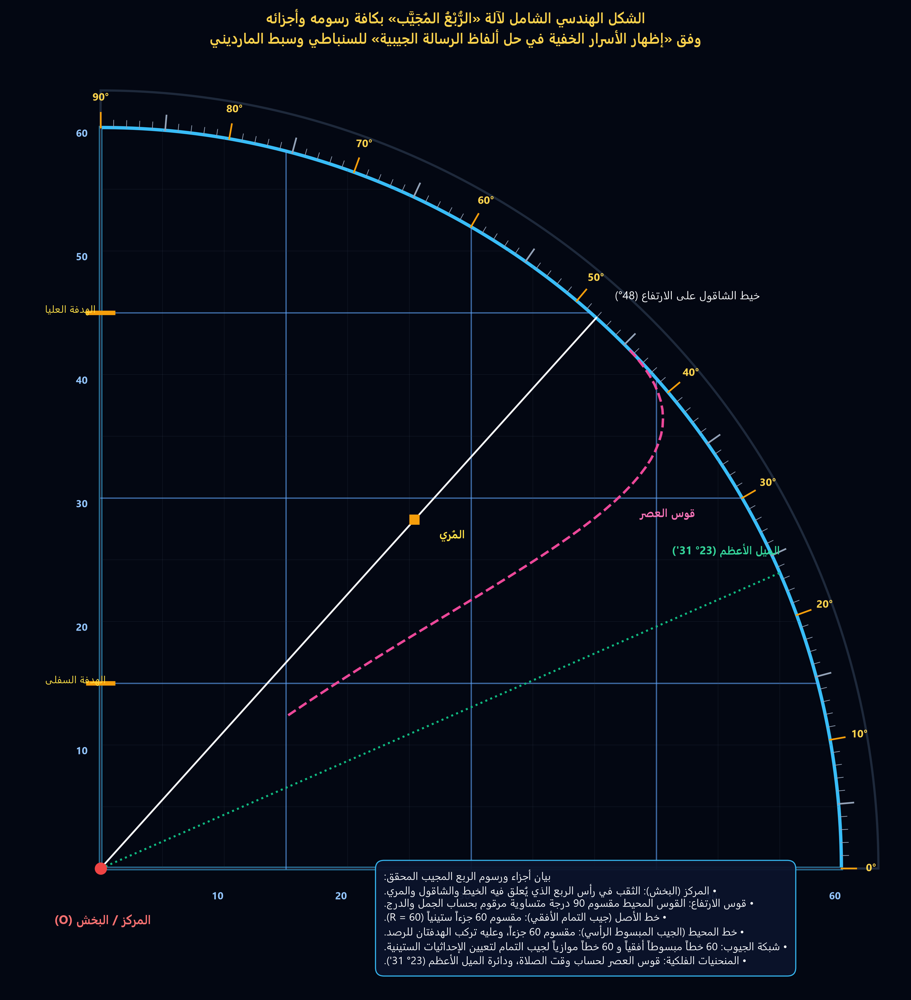
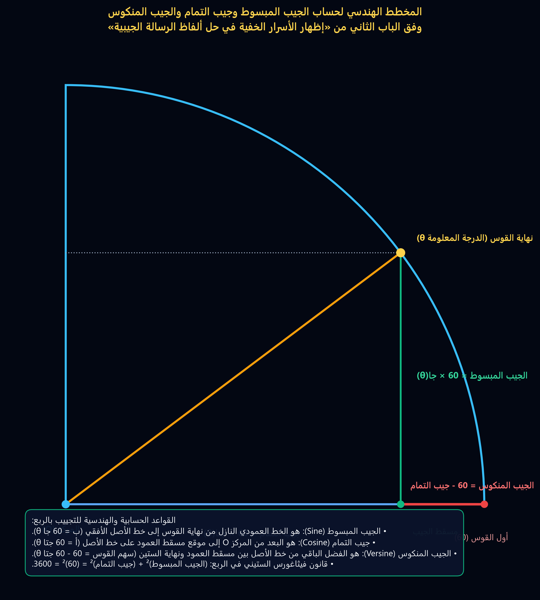
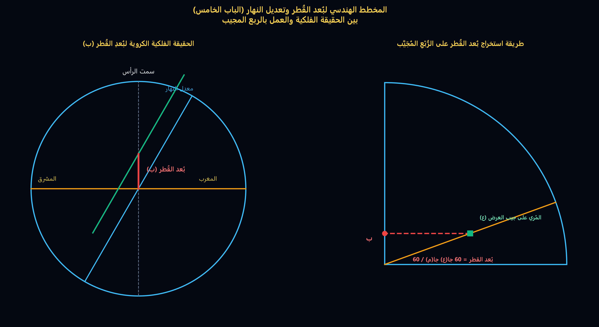
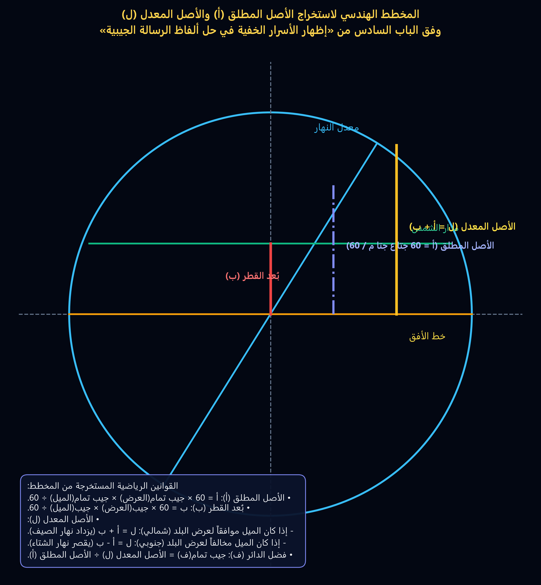
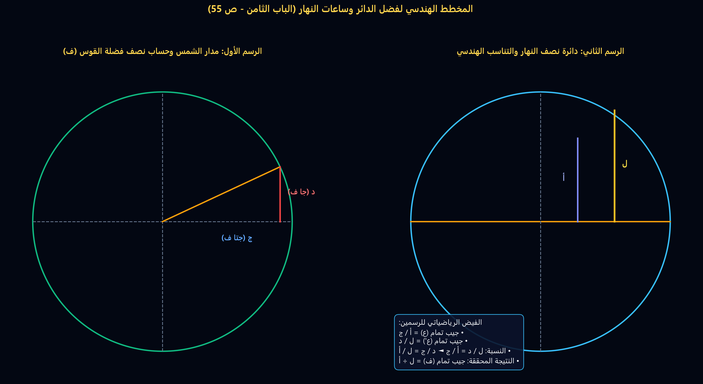
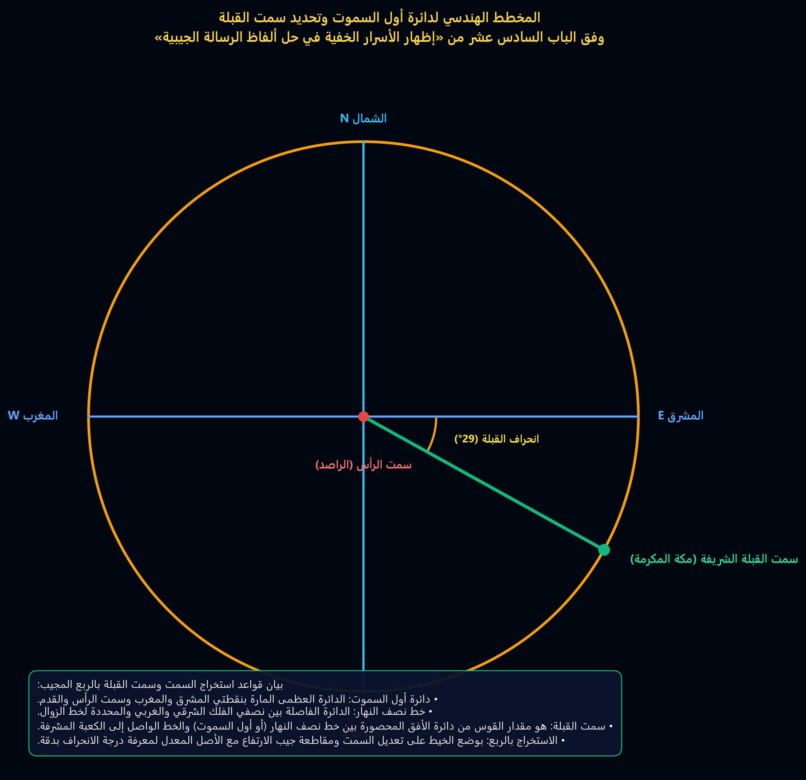

---
### [صفحة 1]

**إِظْهَارُ الأَسْرَارِ النَّافِعَةِ**

**فِي حَلِّ أَلْفَاظِ الرِّسَالَةِ الجَيْبِيَّةِ**

تَأْلِيفُ

**الشَّيْخِ أَحْمَدَ بنِ أَحْمَدَ بنِ عَبْدِ الحَقِّ السُّنْبَاطِيِّ**

شَرْحُ

**الرِّسَالَةِ الفَتْحِيَّةِ فِي الأَعْمَالِ الجَيْبِيَّةِ**

---
### [صفحة 2]

**المخطوطات**

كـان الاِعتمادُ في تفريغِه على ثلاثِ مخطوطاتٍ، أثْبتُّ فيه ما اتّفقت عليه، واجتهدت في ترجيحِ المختلفِ فيه واختيارِ ما رأيته أنسب للسياق، مع إثباتِ الاختلافِ في الحواشي. وهي:

• مخطوطة محفوظة في **جامعة الملك سعود** بخلّ كامل بن مصطفى توفيق سنة 1338هـ. وعلامتها في الحواشي: ’أ‘.

• مخطوطة محفوظة في **جامعة متشغن**، وكانت من مقتنيات الشيخ عبد الملك بن عبد الوهاب بن صالح الفَتْنِيّ الهنديّ الأصل الطائفيّ المولد المكّيّ المنشأ المصريّ المدفن المتوفّى سنة 1909م الموافق لسنة 1327هـ. وذلك بدليل ما كتب أوّل الكتاب: "**من منّ الله تعالى عليّ، عبد الملك بن عبد الوهاب الفَتْنِيّ**". ثم وصلت إلى يد المستشرق ماكس مايرهوف سنة 1933م ومنه إلى مكتبة جامعة متشغن في الولايات المتحدة الأمريكية. وعلامتها في الحواشي: ’ب‘.

• مخطوطة محفوظة في معهد الثقافة والدراسات الشرقية في جامعة طوكيو اليابان. بخط حسين حاجي زاده سنة 1277هـ. وعلامتها في الحواشي: ’ج‘.

---
### [صفحة 3]

**أَوَّلُ مَخْطُوطَةِ جَامِعَةِ المَلِكِ سُعُودٍ**

***

حِجْمِي صَغِيرٌ وَقَدْرِي قَدْ سَمَا عِظَمًا   ...   وَرُبَّ دَائِرَةِ الدُّنْيَا احْتَاطَ بِهِ

وَإِنْ تَفَكَّرْتَ فِي أَمْرِي تَرَى عَجَبًا   ...   اَللهُ رَبِّي عَلِمَ مِنِّي مَعَ تَقَلُّبِهِ

شَرْحُ رِسَالَةِ أَبِي مَدْيَنِي فِي عَمَلِ بِرُبْعِ المَجِيبِ

لِلْمُؤَلِّفِ السِّنْبَاطِيِّ

**هَذَا شَرْحٌ عَلَى رِسَالَةِ العَالِمِ العَلاَّمَةِ**

**مُحَمَّدِ بْنِ أَحْمَدَ بَدْرِ الدِّينِ المَارِدِينِيِّ**

**لِلشَّيْخِ الفَاضِلِ أَحْمَدَ بْنِ**

**عَبْدِ الحَقِّ السِّنْبَاطِيِّ**

**الشَّافِعِيِّ**

**مَذْهَبًا**

**فَائِدَةٌ:** اعْلَمْ أَنَّ البُعْدَ مِنَ الشَّرَطَيْنِ إِلَى البُطَيْنِ ۱۲ دَرَجَةٍ وَمِنَ البُطَيْنِ إِلَى الثُّرَيَّا ۱۳ دَرَجَةٍ وَمِنَ الثُّرَيَّا إِلَى الدَّبَرَانِ ۱۳ دَرَجَةٍ وَمِنَ الدَّبَرَانِ إِلَى الهَقْعَةِ ۱۳ دَرَجَةٍ وَمِنَ الهَقْعَةِ إِلَى الهَنْعَةِ ۱۳ دَرَجَةٍ وَمِنَ الهَنْعَةِ إِلَى الذِّرَاعِ ۱۳ دَرَجَةٍ وَمِنَ الذِّرَاعِ إِلَى النَّثْرَةِ ۱۳ دَرَجَةٍ وَمِنْهَا إِلَى الطَّرْفِ ۱۳ دَرَجَةٍ وَمِنْهَا إِلَى الجَبْهَةِ ۱۳ دَرَجَةٍ وَمِنْهَا إِلَى الزُّبْرَةِ ۱۳ دَرَجَةٍ وَمِنْهَا إِلَى الصَّرْفَةِ ۱۳ دَرَجَةٍ وَمِنْهَا إِلَى العَوَّاءِ ۱۳ دَرَجَةٍ وَمِنْهَا إِلَى السِّمَاكِ ۱۳ دَرَجَةٍ وَمِنْهُ إِلَى العَفْرِ ۱۳ دَرَجَةٍ وَمِنْهُ إِلَى الزُّبَانَى ۱۳ دَرَجَةٍ وَمِنْهَا إِلَى الإِكْلِيلِ ۱۳ دَرَجَةٍ وَمِنْهُ إِلَى القَلْبِ ۱۳ دَرَجَةٍ وَمِنْهُ إِلَى الشَّوْلَةِ ۱۳ دَرَجَةٍ وَمِنْهَا إِلَى النَّعَائِمِ ۱۳ دَرَجَةٍ وَمِنْهَا إِلَى البَلْدَةِ ۱۳ دَرَجَةٍ وَمِنْهَا إِلَى الذَّابِحِ ۱۳ دَرَجَةٍ وَمِنْهُ إِلَى بَلْعٍ ۱۳ دَرَجَةٍ وَمِنْهُ إِلَى السُّعُودِ ۱۳ دَرَجَةٍ وَمِنْهُ إِلَى الأَخْبِيَةِ ۱۳ دَرَجَةٍ وَمِنْهُ إِلَى المُقَدَّمِ ۱۳ دَرَجَةٍ وَمِنْهُ إِلَى المُؤَخَّرِ ۱۳ دَرَجَةٍ وَمِنْهُ لِبَطْنِ الحُوتِ ۱۳ دَرَجَةٍ وَمِنْهُ إِلَى الشَّرَطَيْنِ ۱۲ دَرَجَةٍ.

---
### [صفحة 4]

**إِظْهَارُ الأَسْرَارِ الخَفِيَّةِ**

**أَوَّلُ مَخْطُوطَةِ جَامِعَةِ مِتْشِغِنْ**

***

بسم الله الرحمن الرحيم

الحمدُ للهِ ربِّ العالمينَ، وصلى اللهُ على سيِّدِنا محمدٍ خاتمِ النبيِّينَ والمرسلينَ، وعلى آلِهِ الطيبينَ الطاهرينَ، وصحابَتِهِ أجمعينَ **وبعـدُ** فيقولُ الفقيرُ إلى اللهِ تعالىٰ أحمدُ بنُ أحمدَ بنِ أحمدَ السُّبَاطِيُّ الشَّافِعِيُّ: هٰذَا تَوْضِيحٌ لَطِيفٌ علَى الرِّسالَةِ الموضوعَةِ في العَمَلِ بالرُّبْعِ المُجَيَّبِ لتأليفِ الشيخِ العلَّامَةِ بَدْرِ الدِّينِ المَارِدِينِيِّ **قالَ المُصَنِّفُ رحمه الله:** بسم الله الرحمن الرحيم الحمد لله رب العالمين **ويَعْنِي** والسلامُ على سيِّدِنا محمدٍ وآلِهِ وصَحْبِهِ أجمعينَ **وبعـدُ فهٰذِهِ رسالَةٌ في العملِ بالرُّبْعِ المُجَيَّبِ** أيضاً **الرُّبْعُ المُعَصَّصُ والمُقَعَّصُ وسَمَّاهُ الدُّسْتُورُ وَاشْتَمَلَتْ علَى مقدِّمَةٍ وعشرينَ باباً فالمقدّمَةُ** **في تسميَةِ رُسُومِهِ فأَوَّلُها فِي الذِّكْرِ المَرْكَزُ وَهُوَ البَخْشُ الذي يُجْعَلُ في الخَيْطِ سمِّيَ بذٰلِك لِأَنَّهُ** مركزُ الدَّائِرَةِ التي ذُكِرَ الرُّبْعُ رُبُعُها **وثانِيها قَوْسُ الأرْتِفاعِ وهُوَ القَوْسُ المحِيطُ برَسْمِ الرُّبْعِ وهو** **مقسُومٌ تسعينَ قِسْماً أيْ أجزاءً متساويَةً في المِساحَةِ يُسَمَّى كلُّ قِسْمٍ مِنها دَرَجَةً مَكْتُوبٌ أعدادُها** **أي أعدادُ تسعينَ المَخْرُوجِ للجُمَّلِ ثَمانِيةً عشَرَ حَيْثُ مَرْسُومٌ تَحْتَها تَحْتَ كلِّ سِتّينَ مَكْتُوبٌ فيهِ عَدَدُ ما** فَوْقَه معَ ما بَعْدَ مَخْرَجِ للجُمَّلِ **طِرَاوَةٌ لَهُ إلىٰ آخِرِهِ بالمِدادِ الأسْوَدِ غَالِباً وأحكامٌ أُخْرَى إلَىٰ أوَّلِهِ بالْمِدَادِ** الأَحْمَرِ غالِباً ففي البيتِ الأوَّلِ مَكْتُوبٌ بالأسْوَدِ طِرَا وَفي الأوَّلِ عكْسُهُ وَفي الثاني مَكْتُوبٌ طِرَا بالأسْوَدِ و قد بالْأحمَرِ عكْساً **وأوَّلُهُ أيْ أوَّلُ قَوْسِ الأرْتِفاعِ مِنْ جِهَةِ يَمِينِ النَّاظِرِ فيهِ** عندَ وَضْعِ الرُّبْعِ بينَ يَدَيْهِ بِحَيْثُ تكونُ الهَدَفَتانِ فيهِ عنْ يَمِينِهِ **وثانِيهِ** **قَوْسُ الأرْتِفاعِ عنْ يَمِينِهِ** والخَيْطُ الأيْمَنُ بالنسبةِ للنَّاظِرِ فِي الرُّبْعِ عندَ وَضْعِهِ بينَ يدَيْهِ بالْحَيْثِيَّةِ المذْكورَةِ **والأَصْلُ مِنَ المَرْكَزِ** **إلىٰ أوَّلِ قَوْسِ الاِرْتِفاعِ المـُتَقَدِّمِ بيَانُهُ يُسَمَّى جَيْبَ التَّمَامِ إذْ بهِ يُعْرَفُ جَيْبُ تَمَامِ كُلِّ قَوْسٍ وَخَطُّ المـُحِيطِ** المـُنْحَرِفُ **إلىٰ أوَّلِ قَوْسِ الاِرْتِفاعِ المـُتَقَدِّمِ بيَانُهُ يُسَمَّى جَيْبَ كَتَّامِ إذْ بِهِ يُعْرَفُ جَيْبُ تَمامِ كُلِّ قَوْسٍ وَخَطُّ المـُحِيطِ المـُنْحَرِفِ** لأنّهُ بمنزلةِ وسمِّي خطّ الطلوعِ لأنّ طلوعَ الكوكبِ المعتبرِ في تلكَ الخِطَّةِ **إلىٰ قَوْسِ الأرْتِفاعِ يُسَمَّى جَيْبَ المـَبْسُوطِ والمـُخَطُّ الأيْسَرُ بالنسبةِ للنَّاظِرِ فِي الرُّبْعِ عندَما**

---
**الهوامش والحواشي:**

*(الحواشي والتعليقات الجانبية المكتوبة في هامش المخطوطة)*:

**[1]** في الهامش الأيمن العلوي: مَصْغَرٌ مُطْلَقٌ / خَيْطٌ غَيْرُ صَغِيرٍ أَوْ صَغِيرٌ مَجْدُولٌ.

**[2]** في الهامش الأيسر السفلي: وَخَطُّ المَشْرِقِ وَالمَغْرِبِ لِأَنَّهُ بِمَنْزِلَتِهِ وَسُمِّيَ خَطَّ الطُّلُوعِ لِأَنَّ طُلُوعَ الكَوْكَبِ المـُعْتَبَرِ فِي تِلْكَ الحِطَّةِ.

---
### [صفحة 5]

**أَوَّلُ مَخْطُوطَةِ جَامِعَةِ طُوكْيُو**

---
### [صفحة 6]

**تراجم**

**سبط المارديني (826 - 912هـ/1422 - 1506م).**

هو الشيخ أبو عبد الله بدر الدين محمد بن محمد بن أحمد الدمشقيّ الأصل القاهريّ المنشإ سبط الشيخ جمال الدين عبد الله بن خليل بن يوسف بن عبد الله المارديني وهو والد أمّه وبه اشتهر فكان يلقّب بسبط المارديني. قال الحافظ السخاويّ في «الضوء اللامع»:

"محمد بن محمد بن أحمد بن محمد بن أحمد بن محمد بن أحمد بن محمد البدر الدمشقيّ الأصل القاهريّ الشافعيّ سبط الجمال عبد الله المارداني، أمّه فاطمة ويُعرف بالمارديني. ولد في ليلة رابع عشر ذي القعدة سنة ستّ وعشرين وثمانمائة بالقاهرة ونشأ بها فحفظ القرآن وجوّده على النّور إمام الأزهر، بل تلاه عليه ببعض الرّوايات، وألفيّة النّحو وبعض المنهاج وأخذ عن ابن المجديّ الفرائض والحساب والميقات ولازم دروسه وكذا لازم العلاء القلقشنديّ في الفرائض والفقه، ومِمّا أخذه عنه الفصول لابن الهائم وتقسيم الحاوي وبهجته والمنهاج والمهذّب، بل وقرأ عليه البخاريّ والتّرمذيّ وغيرهما وحضر أيضا دروس القاياتي والبوتيجي والمحلّي والعلم البلقيني والشروانيّ والخواص وقرأ في العربيّة على الكريم العَقَبيّ، وسمع على شيخنا والصالحيّ والرشيديّ وغيرهم بالقاهرة وأبي

---
### [صفحة 7]

الفتح المَرَاغِيُّ بمكَّةَ وشَمسِ الدِّينِ بنِ الفَقِيهِ حَسَنٍ دِميَاطَ في آخَرِينَ وَكانَ أَوَّلَ اشْتِغَالِهِ في سنةِ تسعٍ وثلاثينَ، وحَجَّ غيرَ مرَّةٍ وجاوَرَ في الرَّحبِيّةِ المَزْهَرِيّةِ وكذا زارَ بيتَ المَقدِسِ غيرَ مرَّةٍ أيضا منها في سنةِ تسعينَ معَ أبي البَقاءِ بنِ الجِيعَانِ. ودخلَ الشَّامَ مرَّتينِ وحماةَ فما دونَها وتَمَيَّزَ في الفُنونِ وعُرِفَ بالذَّكاءِ معَ حُسنِ العِشْرَةِ والتَّواضُعِ والرَّغبةِ في المُمَازَحَةِ والنُّكْتَةِ والنَّادِرَةِ وامتَهانِ نفسِهِ وتَركِ التَّأنُّقِ في أمرِهِ وأُشِيرَ إليهِ بالفَضِيلةِ فتصدَّى للإِقراءِ وانتَفَعَ به الفُضَلاءُ في الفَرائِضِ والحِسابِ والمِيقاتِ والعَربيّةِ ونَحْوِها. ومِمَّن أخَذَ عنه النَّجْمُ بنُ حَجِي وصار بأُخْرَةٍ فرِيدًا في فنُونٍ وباشَر الرِّياسَةَ في أَمَاكِنَ بل تصدَّر بجامِعِ طُولُونَ برغبةِ نورِ الدِّينِ بنِ النَّقَّاشِ له عنه وعَمِلَ فيهِ اجلاسًا في صَفَرٍ سنةَ تسعٍ وسَبعينَ، وكتبَ في المِيقاتِ مقَدِّمَاتٍ جَمَّةً تزِيدُ كما أخبرَنِي علَى مائَتينِ منها «**المَنصُورِيّة**«، كأنَّه عملها لجماعة المنصورية، و«**السّر المودوع في العمل بالربع المقطوع**» وعمل متنًا في الفرائض سمّاه «**كشف الغوامض**» واختصره في نحو نصف حجمه بل وشرحه وشرح فيه كلًّا من تصانيف أربعة لابن الهائم «الفصول» و«التحفة القدسية» و«المقنع» وسّمَاه «القول المبدع» والألفية المسماة «**كفاية الحفاظ**» مع توضيح للإلفية أيضا وكذا شرح «الجعبرية» و«الرحبية» و»الأشنهية» ولكنه لم يكمل ومنظومة الموفّق الحنبليّ والحوفيّ ورتّب مجموع الكَلائِيّ مع اختصاره

---
### [صفحة 8]

وَالإِتْيَانِ فِيهِ بِزَوَائِدَ مُهِمَّةٍ، وَلَهُ فِي الحِسَابِ مُقَدَّمَةٌ سَمَّاهَا «**تُحْفَةَ**

**الأَحْبَابِ**» فِي الحِسَابِ المَفْتُوحِ وَاخْتَصَرَهَا وَشَرَحَ فِيهِ مِن تَصَانِيفِ ابْنِ

الهَائِمِ «الحَاوِي« وَ»اللُّمَعَ» وَفِي الجَبْرِ وَالمُقَابَلَةِ ثَلاَثَةَ شُرُوحٍ عَلَى

«اليَاسَمِينِيَّةِ» وَشَرَحَ فِي النَّحْوِ الشُّذُورَ وَالقَطْرَ وَالتَّوْضِيحَ وَلَكِنَّهُ لَمْ يُكْمِلْ

وَجَرَّدَ شَرْحَ شَوَاهِدِهِ مِن شَوَاهِدِ العَيْنِيِّ إِلَى غَيْرِ ذَلِكَ مِنَ المُهِمَّاتِ، وَنَازَعَ

فِي مَسْأَلَةِ الجَهْرِ بِالتَّسْمِيعِ وَخَالَفَ فِي ذَلِكَ الزَّيْنَ زَكَرِيَّا وَتَنَافَسَ مَعَهُ

بِسَبَبِهَا وَكَذَا انْتَقَدَهُ فِي شَرْحِهِ لِلْفُصُولِ وَنَازَعَ ابْنَ السَّيِّدِ عَفِيفَ الدِّينِ

فِي دَعْوَاهُ تَقْدِيمَ أَذَانِ المَغْرِبِ قَبْلَ تَمَكُّنِ الغُرُوبِ وَكَلَّمَ المُحْتَسِبَ بِكَلِمَاتٍ

مُنَاسِبَةٍ كَمَا أَنَّهُ دَارَ بَيْنَهُ وَبَيْنَ ابْنِ عَاشِرٍ شَيْخِ التُّرْبَةِ الأَشْرَفِيَّةِ قَايْتْبَايَ

مُنَاقَشَاتٌ وَبِاسْمِهِ بَعْضُ وَظَائِفِ الحَنَابِلَةِ. وَبِالجُمْلَةِ فَفَضِيلَتُهُ مُنْتَشِرَةٌ

وَمَحَاسِنُهُ مُقَرَّرَةٌ وَلَكِنَّهُ لَمْ يُنْصِفْ فِي تَقْرِيرِ شَيْءٍ يُنَاسِبُهُ كَمَا هُوَ الغَالِبُ

فِي المُسْتَحَقِّينَ". ا.هـ. [1]

***

---
**الهوامش والحواشي:**

**[1]** الضوء اللامع لأهل القرن التاسع (ج 9 | ص 35-36) (ط: مكتبة الحياة-بيروت)

---
### [صفحة 9]

**أحمد بن أحمد السُّنباطي (... - 999هـ/ ... - 1590م).**

هو الشيخ شهاب الدين أحمد بن أحمد بن عبد الحق السنباطي الشافعي الأشعري وهو السنباطي الابن شارح الشاطبية. والده الشيخ أحمد بن عبد الحق السنباطي الواعظ المشهور الذي جاور مكّة مع والده ثم رجع إلى مصر بعد وفاته في مكّة. ترجم له الشيخ عبد الفتّاح السيّد عجمي المرصفي في «هداية القاري» فقال ما نصه:

"أحمد بن أحمد بن عبد الحقّ السنباطيّ الفقيه المؤلّف الشافعيّ، له نظم ونثر وله تأليف حسنة، من ذلك نظمه الذي جمع فيه سبعة عشرة علماً. أخذ عن جماعة كالمرصفي وغيره، لقيته بمصر سنة ست وثمانين وتسعمائة من الهجرة وقرأت عليه شيئاً من منظومته المذكورة وأجاز لي كلّ ما يحمل، وتوفّي سنة تسع وتسعين وتسعمائة والله أعلم". اهـ بلفظه. هذا ما ذكره العلامة أحمد بن محمد المكناسيّ الشهير بابن القاضي في كتابه «ذيل وفيات الأعيان« المسمّى «درة الحجال في أسماء الرجال» [الجزء الأوّل ص 168 تحت رقم 201]. وجاء في »معجم المؤلفين» لكحالة [الجزء الأول ص 149] ما نصّه: "أحمد السنباطي 000 - 995هـ - 000 - 1586م هو أحمد بن أحمد بن عبد الحقّ

---
### [صفحة 10]

السنباطي المصريّ الشافعيّ شهاب الدين، عالم مشارك في أنواع من العلوم، من تصانيفه: **«توضيح على رسالة المارديني في العمل بالربع المجيب«**، **«شرح البسملة»** للشيخ زكريّا الأنصاريّ، و**«روضة الفهوم بنظم نقاية العلوم»** للسيوطيّ، ثم شرحه وسَمّاه **«فتح الحيِّ القيّوم بشرح روضة الفهوم»**، **«وإظهار الأسرار الخفية في حل الرسالة الجيبية»**، **«شرح القصيدة الهمزية في المدائح النبوية»**" اهـ. أقول: ولم يذكر المترجمون له ذكراً لشرحه على الشاطبيّة فيما وقفت عليه علماً بأنه شرح مشهور في عالم المخطوطات في جلّ الجهات وهو شرح نفيس أجاد فيه وأفاد وقد انتفعت به كثيراً وبمكتبتي منه ثلاث نسخ خطيّة، ومن وقف على هذا الشرح عرف مقدار الرجل وسعة اطلاعه وطول باعه في علم القراءات والتجويد  قلت: وقد ترجم الشيخ نجم الدين الغزي للمترجم له في كتابه **»الكواكَب السائر بأعيان المائة العاشرة»** كما ترجم لوالده وجدّه أيضاً. فأما ترجمة المترجم

---
### [صفحة 11]

له هنا ففي [الجزء الثالث ص 117]، وأما ترجمة والده الشيخ أحمد بن عبد الحق السنباطي ففي [الجزء الثاني ص 111] وقد ترجم له ترجمة واسعة وأفاد أنّه توفي في أواخر شهر صفر سنة خمسين وتسعمائة من الهجرة. وأما ترجمة جدّه العلاّمة الكبير الشيخ عبد الحق بن محمد السنباطي ففي [الجزء الأول ص 221] وهي ترجمة واسعة أفاد فيها أنّه توفي بمكة المشرفة ليلة الجمعة غرة رمضان المبارك سنة إحدى وثلاثين وتسعمائة من الهجرة، وقد جاوز التسعين وصُلِّي عليه عقب صلاة الجمعة عند باب الكعبة بإمامة ولده العلامة الشيخ أحمد والد المترجَم له رحم الله الجميع ورحمنا معهم بفضله وكرمه آمين". ا.هـ. ⁽¹⁾

$$\text{* * *}$$

---
**الهوامش والحواشي:**

**[1]** هداية القاري إلى تجويد كلام الباري (جـ 2 | صـ 778-779) (ط: مكتبة طيبة-المدينة المنورة)

---
### [صفحة 12]

**ابن أبي الخَيْرِ الأَرْمَيُونِيُّ (... - 1002هـ/ ... - 1594م).**

وهو محمّدُ بنُ عموش المصريُّ المالكيُّ المعروفُ بابنِ أبي الخيرِ الحسنِيِّ الأَرْمَيُونِيِّ وهو شيخُ الشارح السنباطيِّ الذي وضعه حال قراءته عليه كما في المقدمة. وبعض المترجمين يخلطون بينه وبين أبي الخير محمّد بن عبد الله الأَرْمَيُونِيِّ[1] المالكيِّ المتوفى سنة 871 هـ فينسبون له كتبه وهو خطأٌ، ولعلَّه جَدُّه فنُسِبَ إليه والله أعلم. قال الباباني في «هدية العارفين»:

"محمد بن عموش الرشيديُّ المصريُّ المالكيُّ الفرضيُّ الميقاتيُّ المعروف بابن أبي الخير الحسنيّ توفّي في حدود سنة اثنتين وألف، صنَّف **«راحة الفؤاد في تيسير الزاد«** وهو شرح «زاد المسافرين» لابن المجدي. **«الريّ والإشباع في شرح كشف القناع»**. **«المنهل الساكب في تحرير الكواكب»**. **«النجوم الشارقات في ذكر بعض الصنائع المحتاج إليها في علم الميقات»**. **«نزهة الأفكار في عمل الليل والنهار»**. **»نزهة الخاطر في وضع الحدود على زاد المسافر»**". ا.هـ.[2]

---
**الهوامش والحواشي:**

**[1]** الضوء اللامع لأهل القرن التاسع (جـ 8 | صـ 119) (ط: مكتبة الحياة-بيروت)

**[2]** هدية العارفين أسماء المؤلفين وآثار المصنفين (جـ 2 | صـ 260) (ط: دار إحياء التراث العربي-بيروت)

---
### [صفحة 13]

> ### [🌌 شكل هندسي رقم 1: آلة الرُّبْعُ المُجَيَّب الشاملة بكافة رسومها وأجزائها]
> 
> **بيان الشكل الهندسي المحقق:** الرسم الشامل لآلة الربع المجيب: المركز والبخش، قوس الارتفاع (90 درجة)، خط الأصل (جيب التمام 60)، خط المحيط (الجيب المبسوط 60)، شبكة الجيوب الستينية، قوس العصر، ودائرة الميل الأعظم.

**المقدمة**

**بسم الله الرحمن الرحيم**

الحمد لله ربّ العالمين، وصلّى الله على سيّدنا محمّد خاتم النبيّين والمرسلين، وعلى آله الطيّبين الطاهرين، وصحابته أجمعين، وبعد فيقول العبد الفقير إلى الله تعالى أحمدُ بن أحمد بن عبد الحق السنباطي الشافعي: هذا توضيح لطيف على الرسالة الموضوعة في العمل بالربع المجيب تأليفِ الشيخ العلامة بدر الدين المارديني رحمه الله وضعته عليها حين قراءتي لها على شيخنا العلامة المفنن الشريف محمد بن أبي الخير الأرميونيّ المالكيّ أطال الله بقاه والله المسؤول أن ينفع به كما نفع بأصله.

(**قال المصنف**) رحمه الله تعالى (**بسم الله الرحمن الرحيم**) أي ألف (**الحمد لله رب العالمين**) أي مالك جميع عوالم المخلوقات (**والصلوة والسلام على سيدنا**) معاشر الموجودات (**محمد ءاله وصحبه أجمعين، وبعد فهذه رسالة في العمل بالربع المجيب**) ويسمى أيضا بالربع المقَصّص والمقَصّص وربع الدستور (**مشتملة على مقدمة وعشرين بابًا. فالمقدمة في تسمية رسومه، فأوّلها**) في الذكر (**المركز **[1]** وهو البخش الذي**) يجعل (**فيه الخيط**)، سمّي بذلك لأنّه مركز الدائرة التي ذلك الربع ربعها. (**و**) ثانيها

---
### [صفحة 14]

(**قوسُ الارتفاعِ**⁽²⁾) و (**هو**) القوسُ (المحيطُ برسومِ الربعِ وهو مقسومٌ «**ص**«) 90 (**قسمًا**)، أي أجزاءً (**متساويةً**) في المساحةِ، يسمَّى كلُّ قسمٍ منها درجةً (**مكتوبٌ أعدادُها**)، أي أعدادُ قسمتهِ، بحروفِ الجُمَّلِ في ثمانيةَ عشرَ بيتًا مرسومةً تحتها، تحتَ كلِّ خمسةٍ بيتٌ مكتوبٌ فيه عددُ ما فوقه مع ما قبله بحروفِ الجُمَّلِ (**طَرْدًا**)، من أوَّلِهِ إلى آخرهِ بالمدادِ الأسودِ غالبًا، (**وعكسًا**)، من ءاخرهِ إلى أوَّلِهِ بالمدادِ الأحمرِ غالبًا. ففي البيتِ الأوَّلِ مكتوبٌ «**هـ**» بالأسودِ طردًا و«**ص**» بالأحمرِ عكسًا، وفي الثاني مكتوبٌ «**ي**» بالأسودِ طردًا و»**فهـ**» بالأحمرِ عكسًا وهكذا. (**وأَوَّلُه**) أي أوَّلُ قوسِ الارتفاعِ (**من جهةِ يمينِ الناظرِ فيه**) عندَ وضعِ الربعِ بين يديهِ، بحيثُ تكونُ الهدفَتانِ فيه عن يمينهِ وقوسُ الارتفاعِ ممَّا يليهِ. (**والخطُّ الأيمنُ**) بالنسبةِ للنَّاظرِ في الربعِ عندَ وضعهِ بين يديهِ بالحيثيةِ المذكورةِ (**الواصلُ من المركزِ إلى أوَّلِ قوسِ الارتفاعِ**) المتقدَّمِ ذكرهُ (**يسمَّى جيبَ التمامِ**⁽³⁾) إذ به يُعرَفُ جيبُ تمامِ كلِّ قوسٍ. (**والخطوطُ المستقيمةُ**) الحمرُ والسُّودُ، بينَ كلِّ أسودينِ أربعةٌ حُمرٌ، (**النَّازلةُ منه**)، أي من هذا الخطِّ الأيمنِ المسمَّى بجيبِ التَّمامِ، منتهيةً (**إلى القوسِ**)، أي قوسِ الارتفاعِ، (**تسمَّى الجيوبَ المنكوسةَ**⁽⁵⁾. **والخطُّ الأيسرُ**) بالنسبةِ للنَّاظرِ في الرُّبعِ عندما ذكرَ أيضًا (**الواصلُ من المركزِ إلى آخرِ القوسِ**)، أي قوسِ الارتفاعِ، (**يسمَّى الستّينيَّ**⁽⁴⁾) لأنَّ أجزاءَه لا تكونُ إلا ستّينَ،

---
### [صفحة 15]

بخلاف جيب التمام فقد تكون أجزاؤه غير ستّين لكنّه خلاف الغالب، ويسمّى أيضا خطّ الزوال وخطّ نصف النّهار وخطّ نصف السّماء

والجيب الأعظم. (**والخطوطُ المستقيمةُ**) الحمرُ والسود، بين كلّ أسودين أربعة حمر، (**النّازلة منه**)، أي من هذا الخط المسمّى بالستّيني، منتهية (**إلى القوس**)، أي قوس الارتفاع، (**تسمّى الجيوب المبسوطة ⑥. وابتدءُ**) عِدّة (**الجيوب**) منكوسةً كانت أو مبسوطةً (**من المركز**)، وهذا في عددها المستوي أما المعكوس فابتداؤه من طرفَي قوس الارتفاع. وعدد كلّ من الجيوب المبسوطة والمنكوسة ستّون، بها قُسِم كلٌّ من جيب التمام

---
### [صفحة 16]

وَالسِّتِّينِيِّ، فَكُلٌّ مِنْهُمَا مَقْسُومٌ سِتِّينَ قِسْمًا مُتَسَاوِيَةً بِعَدَدِ الجُيُوبِ النَّازِلَةِ مِنْهُ، مَكْتُوبٌ أَعْدَادُ قِسْمِهِ بِحُرُوفِ الجُمَّلِ فِي اثْنَيْ عَشَرَ بَيْتًا مَرْسُومَةً بِجَانِبِهِ، بِجَانِبِ كُلِّ خَمْسَةٍ بَيْتٌ مَكْتُوبٌ فِيهِ عَدَدُ مَا بِجَانِبِهِ مَعَ مَا قَبْلَهُ طَرْدًا بِالْمِدَادِ الأَسْوَدِ غَالِبًا، وَعَكْسًا بِالْمِدَادِ الأَحْمَرِ غَالِبًا. (**وَلَا يُحْتَاجُ لِـ**)وَضْعِ (**غَيْرِ ذَلِكَ**) المَذْكُورِ مِنَ الرُّسُومِ فِيهِ. وَمَا يُوَضَعُ فِي بَعْضِ الأَرْبَاعِ مِنْ **دَائِرَةِ المَيْلِ**⑦، وَهِيَ الآخِذَةُ مِنْ أَرْبَعَةٍ وَعِشْرِينَ مِنْ أَوَّلِ السِّتِّينِيِّ إِلَى أَرْبَعَةٍ وَعِشْرِينَ مِنْ أَوَّلِ جَيْبِ التَّمَامِ، **وَدَائِرَةِ التَّجْيِيبِ**⑧⁽¹⁾، وَهِيَ الآخِذَةُ مِنَ المَرْكَزِ إِلَى قَوْسِ الارتِفَاعِ، **وَقَوْسِ ارْتِفَاعِ العَصْرِ**⑨⁽²⁾، وَهُوَ الخَطُّ الآخِذُ مِنْ أَوَّلِ قَوْسِ الارتِفَاعِ القَاطِعُ لِغَالِبِ الجُيُوبِ الوَاصِلُ إِلَى السِّتِّينِيِّ⁽³⁾ عِنْدَ اثْنَيْنِ وَأَرْبَعِينَ وَثُلُثٍ، فَمُسْتَغْنًى عَنْ وَضْعِهِ بِوَضْعِ هَذِهِ الرُّسُومِ المَذْكُورَةِ كَمَا سَيَظْهَرُ لَكَ، لَكِنَّهَا مِنْ مَحَاسِنِ الربعِ، وَسَيَأْتِي بَيَانُ كَيْفِيَّةِ العَمَلِ بِهَا فِي أَبْوَابِهَا. (**وَأَمَّا الخَيْطُ**⑩) الَّذِي يُجْعَلُ فِي مَرْكَزِ الربعِ (**وَالمُرِيُّ**⑪)، بِضَمِّ المِيمِ، الَّذِي يُعْقَدُ فِيهِ، مُخَالِفٌ لِلْخَيْطِ فِي الَّلَوْنِ اسْتِحْسَانًا، (**وَالشَّاقُولُ**⑫)، بِالشِّينِ المُعْجَمَةِ المُبْدَلِ مِنَ الثَّاءِ المُثَلَّثَةِ، الَّذِي يُعَلَّقُ فِي طَرَفِ الخَيْطِ عِنْدَ أَخْذِ الارتِفَاعِ مِنْ نَحَاسٍ أَوْ رَصَاصٍ أَوْ

---
**الهوامش والحواشي:**

⁽¹⁾ وهما دائرتان في الغالب، وقد أشرت إليهما على الربع تحت رقم 8.

⁽²⁾ وهو قوسان: والمذكور قوس العصر الأوّل (الجمهور) الواصل إلى الستّينيّ عند جيب ثُمن الدّور. وقوس العصر الثاني (الحنفيّ) الواصل عند جيب قوس ظلّ مبسوط بقدر قامتين. وذلك ارتفاع العصر حالة كون الغاية تسعين.

---
**الهوامش والحواشي:**

---
### [صفحة 17]

حَدِيدٍ، (**وَالْهَدَفَتَانِ** ⑬) الْخَارِجَتَانِ عَنْ شَكْلِ الرُّبْعِ فِي جَهَةِ جَيْبِ التَّمَامِ،

(**فَمَعْلُومٌ**) أَيْ مَشْهُورٌ ظَاهِرٌ كُلٌّ مِنْهُمَا فَلَا حَاجَةَ لِلْإِطَالَةِ بِذِكْرِهِ.

---
### [صفحة 18]

**الباب الأوّل**

(**في معرفة أخذ الارتفاع**) وهو بُعْدُ الشَّمس، أو الكوكب، عن دائرة أفق البلد مما وازاها منه في الجهة التي هو بها، من مشرق أو مغرب أو شمال أو جنوب. وهو قوسٌ من دائرة عظيمة تمرّ بقطبي الأفق ومركز الشمس، أو الكوكب، فيما بين المركز والأفق.

---
### [صفحة 19]

(**وطريقه**)، أي أخذ الارتفاع، (**أن تمسك الرُّبْع بيدك وتُعلّق في خيطه شاقولا**)، لكيلا يحرّكه الهواء، (**وتجعل الشمس عن يسارك، والطرف الخالي عن الهدفين مواجها للشمس**)، ويكون وجه الربع لا مظلما ولا نيرا، والخيط لا داخلا في الربع ولا خارجا عنه، (**ثم تحرك يديك**) بالربع (**حتى تستَرَ الهدفَةُ السفلى**) التي من جهة الأرض، والحالة هذه، (**بظلّ**)

---
### [صفحة 20]

الهدفةِ (**العليا**) التي من جَهَةِ الشمسِ استتارًا معتدلا ليسَ فيهِ نقصٌ ولا زيادةٌ. (**فما حازَه الخيطُ**)، والحالَةُ هذِهِ، من دَرَجِ قوسِ الارتفاعِ (**من جهة الخطِّ الخالي عن الهَدَفَتَيْنِ**)، وهوَ السِّتِّيني، (**فهوَ الارتفاعُ**) أي مقدارُ ارتفاعِ الشمسِ في ذلكَ الوقتِ. هذا طريقُ أخذِ ارتفاعِ الشمسِ إذا كانت غيرَ مستترةِ الشَّعاعِ. أمّا أخذُ ارتفاعِ الكوكبِ أو الشمسِ إذا كانت مستترةَ الشَّعاعِ بغيمٍ ونحوِهِ فطريقُه أن تجعلَ الرَّبْعَ بين بصَرِكَ والكوكبِ أو الشمسِ، وغَمِّضْ إحدى عينيكَ، ثمَّ حَرِّكْ يديكَ حتى ترى الكوكبَ أو الشمسَ على هدفتيِ الربعِ معًا على خطٍّ مستقيمٍ، فما حازَهُ الخيطُ، والحالةُ هذهِ، من دَرَجِ القوسِ من جَهَةِ الخَطِّ الخالي عن الهدفةِ فهو مقدارُ الارتفاعِ والله أعلمُ.

---
### [صفحة 21]

**الباب الثاني**

(**في معرفة جيب القوس وقوس الجيب**). القوسُ هنا قطعةٌ من دائرةٍ لا تزيد على ربعها. والجيبُ خطٌّ يخرج من طرفِ قوسٍ من دائرةٍ عمودًا على قُطْرِ تلك الدائرةِ المارِّ بالطرفِ الآخر منها. فإذا عرفت مقدار القوسِ دُونَ جيبها وأردت معرفة مقدارهِ (**عُدَّ من أول القوس**)، أي قوسِ الارتفاع، (**بقدر**) دَرَجِ (**القوس**) المعلومة (**المطلوبِ جيبُها**)، أي مقدارُ جيبها المجهول، (**ثم ادخل**) من نهاية العدد (**في**) الجيب الملاصق للنهاية من (**الجيوب المبسوطة**)، بأن تُمِرَّ ببصرك عليه (**إلى الستيني تجد من أعداده المستوية جيب تلك القوس**) أي مقدار جيبها. وليس هو الجيب المدخول فيه بل هو الجيب الملاصق للنهاية من الجيوب

---
### [صفحة 22]

> ### [📐 شكل هندسي رقم 2: حساب الجيب المبسوط وجيب التمام والجيب المنكوس]
> 
> **بيان الشكل الهندسي المحقق:** المثلث الستيني القائم في الربع المجيب: الجيب المبسوط (60 جا θ)، جيب التمام (60 جتا θ)، والجيب المنكوس (60 - جيب التمام).

المَنْكُوسَةِ(1)، وَإِنَّمَا دَخَلْتَ فِي الجُيُوبِ المَبْسُوطَةِ لِتَجِدَ مِقْدَارَ جَيْبِهِ مَكْتُوبًا، ثُمَّ يَدُلُّ عَلَى ذَلِكَ تَعْرِيفُ الجَيْبِ السَّابِقِ. **مَثَلًا**، لَوْ كَانَتِ

[نصوص الشكل التوضيحي: اقرأ مقدار الجيب هـنا - الستيني - الجيب المنكوس - الجيب المبسوط]

القَوْسُ المَعْلُومَةُ عَشَرَةً، كَأَنْ أَخَذْتَ ارْتِفَاعًا فَوَجَدْتَهُ عَشَرَةً، وَأَرَدْتَ مَعْرِفَةَ مِقْدَارِ جَيْبِهَا فَعُدَّ مِنْ أَوَّلِ قَوْسِ الِارْتِفَاعِ عَشَرَةً، ثُمَّ ادْخُلْ مِنْ نِهَايَةِ العَشَرَةِ فِي الجَيْبِ المُلَاصِقِ لَهُ مِنَ الجُيُوبِ المَبْسُوطَةِ إِلَى السِّتِّينِيِّ تَجِدْ مِنَ

---
**الهوامش والحواشي:**

**[1]** في أ: المبسوطة. ويرجع المعنى إلى الجيب المدخول فيه. وفي ب: المنكوسة، فيرجع إلى الجيب المطلوب.

---
### [صفحة 23]

أَعْدَادُهُ المَسْتَوِيَةُ عَشَرَةً وَثُلُثًا وَذَلِكَ مِقْدَارُ جَيْبِ تِلْكَ القَوْسِ. (**وَاعْلَمْ أَنَّهُ**)، أَيِ الجَيْبُ مَبْسُوطًا كَانَ أَوْ مَنْكُوسًا، (**لَا يَزِيدُ**) مِقْدَارُهُ (**عَلَى سِتِّينَ**) لِأَنَّ نِهَايَةَ القَوْسِ تِسْعُونَ وَمِقْدَارَ جَيْبِهَا سِتُّونَ. (**وَإِنْ**) عَرَفْتَ مِقْدَارَ الجَيْبِ دُونَ القَوْسِ وَأَرَدْتَ مَعْرِفَةَ مِقْدَارِهِ، وَعَلِمْتَ بِهِ طَرِيقَهُ بِأَنْ (**عَدَدْتَ مِنْ مُسْتَوِي السِّتِّينِيِّ**)، أَيْ مِنْ عَدَدِهِ المَسْتَوِي، (**بِقَدْرِ الجَيْبِ المَطْلُوبِ قَوْسُهُ**)، أَيْ مِقْدَارُ قَوْسِهِ المَجْهُولِ، (**وَنَزَلْتَ مِنْ نِهَايَتِهِ**)، أَيْ نِهَايَةِ العَدَدِ فِي الجَيْبِ المُلَاصِقِ لَهُ مِنَ الجُيُوبِ المَبْسُوطَةِ، (**إِلَى القَوْسِ**)، أَيْ قَوْسِ الٱرْتِفَاعِ، (**وَجَدْتَ مِنْ أَوَّلِهِ**) إِلَى المَحَلِّ المَنْزُولِ إِلَيْهِ مِنْهُ (**قَوْسَ ذَلِكَ الجَيْبِ**) المَعْلُومِ لَكَ. **مَثَلًا**، لَوْ كَانَ الجَيْبُ المَعْلُومُ مِقْدَارُهُ عَشَرَةً وَأَرَدْتَ مَعْرِفَةَ قَوْسِهِ فَعَدَدْتَ مِنْ مُسْتَوِي السِّتِّينِيِّ عَشَرَةً وَنَزَلْتَ مِنْ نِهَايَتِهَا فِي الجَيْبِ المُلَاصِقِ لِلنِّهَايَةِ مِنَ الجُيُوبِ المَبْسُوطَةِ إِلَى قَوْسِ الٱرْتِفَاعِ، وَجَدْتَ مِنْ أَوَّلِهِ إِلَى المَحَلِّ المَنْزُولِ إِلَيْهِ مِنْهُ تِسْعَةً وَثُلُثَيْنِ، وَذَلِكَ هُوَ قَوْسُ ذَلِكَ الجَيْبِ المَعْلُومِ لَكَ وَاللهُ أَعْلَمُ.

✳ ✳ ✳

---
### [صفحة 24]

**الباب الثالث**

**في معرفةِ الميلِ الأوَّلِ وغايةِ الارتفاعِ لكلِّ يومٍ فُرِضَ**. الميلُ الأوَّلُ بُعْدُ الشمسِ عن مدارِ الاعتدالِ، وهو مدارُ الحملِ والميزانِ. واحْتُرِزَ بالميلِ الأوَّلِ عن الميلِ الثاني فإنّه غيرُ محتاجٍ إليه فيما يتعلقُ بالأوقاتِ، وهو أيضا بعدُ الشمسِ عن مدارِ الاعتدالِ، إلّا أنّ الفرقَ بينهما أنّ الميلَ الأوَّلَ قوسٌ من دائرةٍ عظيمةٍ تمرُّ بقطبي معدّلِ النّهارِ ومركزِ الشمسِ

---
### [صفحة 25]

فِيمَا بَيْنَ دَائِرَةِ مَعْدِلِ النَّهَارِ وَمَرْكَزِ الشَّمْسِ، وَالمَيْلُ الثَّانِي قَوْسٌ مِنْ دَائِرَةٍ عَظِيمَةٍ تَمُرُّ بِقُطْبَيْ فَلَكِ البُرُوجِ وَبِمَرْكَزِ الشَّمْسِ فِيمَا بَيْنَ دَائِرَةِ مَعْدِلِ النَّهَارِ وَمَرْكَزِ الشَّمْسِ. وَيَسْتَوِيَانِ عِنْدَ النِّهَايَةِ لِأَنَّ كِلَا مِنْهُمَا، وَالحَالَةُ هَذِهِ، قَوْسٌ مِنَ الدَّائِرَةِ المَارَّةِ بِالأَقْطَابِ. وَغَايَةُ الارتفاعِ عبارةٌ عَنِ ارتفاعِ الشمسِ إذا كانت على دائرةِ نصفِ النهارِ وذلكَ وقتَ الاستواءِ وهو قوسٌ من دائرةِ نصفِ النهارِ فيما بينَ مركزِ الشمسِ والأفقِ.

---
### [صفحة 26]

فإذا أردت معرفة الميل الأوّل ليوم فرضته فـ(**ضع الخيط على السَّتّيني**) وضعًا صحيحًا، بحيث ينطبق عليه من المركز إلى آخر قوس الارتفاع.

(و**علّم بالمُرِي على أربعة وعشرين**) جزءًا (**من أجزائه المستوية**)، بأن تَعُدّ من أوله إلى أربعة وعشرين منها، وتُعَلِّم بالمري عليه. (**ثم**) بعد التعليم، (**انقل الخيط**) من موضعه والمري ثابت فيه (**إلى بُعد الدرجة**)، أي مقدار بُعد درجة الشّمس، (**عن أَقرب الاعتدالين**)، رأس الحمل ورأس الميزان، (**إليها**)، أي إلى الدرجة، (**من أوّل القوس**)، أي قوس الارتفاع، وذلك بأن تعرف درجة الشمس في اليوم المفروض، بطريق الأُسِّ المذكور في رسالة المقنطرات أو غيره، ثم أقربِ الاعتدالين المذكورين إلى تلك الدَّرجة بأن تنظر إليها بعد معرفتها، فإن وجدتها من ثلاثة الحمل أو من ثلاثة الجدي فاعتدالُ رأس الحمل[1] أقرب إليها من اعتدال رأس الميزان، وإن وجدتها من ثلاثة الميزان أو من ثلاثة السرطان فاعتدال رأس الميزان أقرب إليها من اعتدال رأس الحمل. فإذا عرفت أقربهما إليه فاعرف بُعدهما عنه، ثم انقل الخيط والمُرِي ثابت فيه إلى مقدار بُعدها عن أقربهما إليها من أوّل قوس الارتفاع. **مثلا**، لو كانت الدرجة آخر الثور انقله إلى

---
**الهوامش والحواشي:**

**[1]** هذا، وليعلم أن الاعتدالين والانقلابين في تغيّر دائم بطيء، فإن الاعتدال الربيعيَّ اليوم في رأس الحوت لا في رأس الحمل في الحقيقة، إلا أنّ كون رأس الحمل هو الاعتدال الربيعيّ، ورأس الميزان هو الاعتدال الخريفيّ، ورأس السرطان هو الانقلاب الصيفيّ ورأس الجدي هو الانقلاب الشتويّ ما زال معتمدًا (اصطلاحًا لا من حيث الواقع والحقيقة).

---
### [صفحة 27]

ستين من أول القوس إذ أقربُ الاعتدالين إليها ءاخر الثور رأس الحمل كما عرفت وبُعدها عنه ستون. (**ثم**) بعد نقلك إلى ذلك (**انزل من**) محل (**المُرِي**) حينئذ في الجيوب المبسوطة، ولو بين الجيبين منهما، (**إلى**) (**القوس**)، أي قوس الارتفاع، (**تجد من أوَّله**) إلى المحل المنزول إليه من القوس (**الميلَ الأوَّل**). هذا إذا لم يكن في الربع دائرة الميل فإن كانت فيه استغنيت عن التعليم بالمري على أربعة وعشرين، بل ضع الخيط على بعد الدرجة عن أقرب الاعتدالين ابتداء ثم انزل من محل تقاطع

---
### [صفحة 28]

الخيط والدائرة إلى القوس تجد من أوله الميل الأول. ولو استوى الاعتدالان قُرْبًا إلى الدرجة بأن كانت آخر الجوزاء أو آخر القوس فالـميل حينئذ هو الميل الأعظم وهو أربعةٌ وعشرون، فانزل من أربعة وعشرين من السِّتّيني في الجيوب المبسوطة تجد ذلك. ولو كانت الدرجة رأس الاعتدالين انعدم الميل كما هو ظاهر. وإذا أردت معرفة الغاية لليوم فرضْتَهُ فاستخرج الميل الأول بطريقه المذكور، ثمّ **(زده على تمام عرض البلد، إن كان)** الميل **(شماليًّا، وانْقُصْه)**، أي وانقص الميل من تمام العرض، **(إن كان)** الميل **(جنوبيًّا، فما كان)** في الحالين **(فهو الغاية في ذلك الوقت)** المفروض. والميل تابع لجهة الدرجة، فإن كانت شماليّةً فشماليٌّ أو جنوبيّةً فجنوبيٌّ. والمراد بتمام عرض البلد العددُ الذي يتمُّه تسعين، بأن تُسقِط العرض من تسعين فما فضل فهو تمامُه. وكذا المراد بتمام الشيء حيث وقع في كلامهم فهو ما يُتِمُّ ذلك الشيء تسعين، بأن تسقط ذلك الشيء من تسعين فما فضل فهو تمام ذلك الشيء فافهم ذلك هنا تستغن عن إعادته فيما يأتي.

---
### [صفحة 29]

(**تنبيه**): ما تقدَّم من أنَّ الغاية، فيما إذا كان الميل شماليًّا، ما اجتمع من الميل وتمام العرض محلُّه إذا جمعتهما ولم يزد المجتمع على تسعين. (**فإن** جمعت)هما، والحالة هذه، (**وزاد المجتمع**) منهما (**على تسعين**)، وذلك إنما يقع في البلاد التي عرضها أقلّ من الميل الأعظم، كمكة فإنّ عرضها أحد وعشرون، (**فتمام الزائد**) على تسعين (**هو الغاية**) في ذلك اليوم المفروض. ففي مكة **مثلا**: لو كان الميل في اليوم المفروض ثلاثةً وعشرين

---
### [صفحة 30]

وزدته على تسعة وستين، تمام عرض مكة، لزاد المجتمع على تسعين باثنين، فتمام هذا الزائد، وهو ثمانية وثمانون، هو الغاية في ذلك اليوم المفروض. (**وهي**)، أي الغاية، (**موافقةً**) في جهتها (**لجهة عرض البلد في هذه الحالة فقط**)، أي في حالة ما إذا جمعت وزاد المجتمع على تسعين لا في غيرها، في حالة النَّقص وحالة الجمع مع عدم زيادة المجتمع على تسعين، فهي في الحالتين المذكورتين مخالفةٌ عرض البلد. لكن لو جمعت وساوى المجتمعُ تسعين لا تكون مخالفةً للعرض إلا إذا كانت

---
### [صفحة 31]

قبل المساواة مخالفة، فإن كانت قبله موافقةً فهي عنده موافقة. فحكمها حالة المساواة كحكمها قبله. وهذا بالنسبة لمن عرف جهة عرض البلد، وسيأتي بيانها. فمن لم يعرفها وعرف جهة الميل، فالغاية موافقة لها فيما إذا كانت جهة الميل جنوبية وكذا إذا كانت شمالية وزاد الميل على عرض البلد، فإن كان أقل منه فالغاية مخالفة لجهته، والحالة هذه. وقد تقدم بيان جهة الميل، فمن لم يعرفه فليستقبل مشرق الشمس في اليوم المفروض وقت الزوال، فإن كانت الشمس عن يمينه فالغاية جنوبية وإلا فشمالية والله أعلم.

---
### [صفحة 32]

**الباب الرابع**

(في **معرفة عرض البلد**). هو بُعد سمتها عن مدار الاعتدال. فإن كان إلى جهة القطب الشماليِّ، كعروض الأقاليم السَّبعة، كان شماليًّا. وإن كان إلى جهة القطب الجنوبيِّ كان جنوبيًّا، وسكّانه قليلون. فالبلد الذي لا بُعد لسمتها عن مدار الاعتدال لا عرض لها. إذ هي، والحالة هذه، بخطِّ الاستواء. وليلُ تلك البلد ونهارها معتدلان. فإن كان للبلد عرض وأردت معرفته فـ(**استخرج الغاية بالرصد**) بأن تلازم أخذ ارتفاع الشمس قبل الزوال مرة بعد مرة إلى أن يأخذ في النقص فما كان قبل النقص فهو الغاية في ذلك اليوم فاحفظها. (**ثم إن لم يكن ميل**) في ذلك اليوم، بأن كان أحد يومي الاعتدال، (**فتمامها**)، أي فتمام تلك الغاية إلى تسعين، (**هو عرض البلد**) المطلوب. (**وإن كان ميلٌ**) في ذلك اليوم، بأن كان غير يومي الاعتدال، فاستخرجه ثم (**زده على تمامها**)، أي الغاية المحفوظة، (**إن كان**) ذلك الميل (**مخالفا للغاية في الجهة. وخذ الفضل**) بين الميل وتمام الغاية، وهو الباقي بعد إسقاط الأقل من الأكثر، (**إن كان**) الميل (**موافقا**) للغاية في الجهة. (**فما كان**) في الحالين (**فهو عرض البلد**). وقد تقدم ما يعرف به جهة كلِّ من الميل والغاية. لكن لا تعرف جهة الغاية، والحالة هذه، إلا باستقبال مشرق الشمس وقت الزوال كما هو ظاهر. **مثال** ما إذا لم يكن ميل: استخرجنا الغاية بالرصد

---
### [صفحة 33]

فوجدناها ستين درجةً جنوبيّةً فتمامها ثلاثون فذلك عرض البلد. **ومثال** ما إذا كان ميلٌ وهو مخالف للغاية في الجهة: استخرجنا الغاية بالرصد فوجدناها سبعين درجةً جنوبيّةً فتمامها عشرون ثم استخرجنا الميل فوجدناه عشر درجات شماليًّا زدناه على العشرين حصل ثلاثون فذلك عرض البلد. **ومثال** ما إذا كان ميلٌ وهو موافق للغاية في الجهة: استخرجنا الغاية بالرصد فوجدناها خمسين درجة جنوبيّةً فتمامها أربعون

---
### [صفحة 34]

ثم استخرجنا الميل فوجدناه عشر درجات ثم أسقطنا العَشَرَ من الأربعين بقي ثلاثون فذلك عرض البلد والله أعلم.

✵ ✵ ✵

---
### [صفحة 35]

**الباب الخامس**

(**في معرفة بُعدِ القُطر**). هو بُعْدُ قطرِ مدارِ الشمسِ في اليومِ المفروضِ عن أفقِ البلدِ. وذلك لأنَّ للشمسِ مدارًا في اليومِ والليلةِ يُرسم بمركزِها من الشروقِ مثلا إلى الشروقِ الثاني، ولهذا المدارِ قطرٌ وهو خطٌّ مستقيمٌ من المشرقِ إلى المغربِ ينصفه. فإذا كانتِ الشمسُ في البروجِ الشماليَّةِ كان قطرُ مدارِها فوقَ أفقِ البلدِ، فكان الظاهرُ من المدارِ فوقَ الأفقِ

---
### [صفحة 36]

أكثر من النِّصف فيكون النّهار أطول من اللّيل. وإذا كانت في البروج الجنوبيّة كان قطر المدار تحت الأفق، وكان ما تحت الأفق منه أكثر من النِّصف فيكون اللّيل أطول من النّهار. وإن كانت في أوّل الحمل أو الميزان كان قطر المدار مسامتًا للأفق فكان الظّاهر منه قدر الخفيّ فيتساوى اللّيل والنّهار. فإذا أردت معرفة بُعد القطر عن الأفق فاستخرج جيب العرض والميل الأوّل واحفظهما ثمّ (**ضع الخيط على السِّتّينيِّ**)

---
### [صفحة 37]

وضْعًا صَحِيحًا، (**وَعَلِّمْ**) بالمُرِيِّ (**عَلَى**) قدرِ (**جَيْبِ**) قوسِ (**العَرْضِ**) المَحْفُوظِ مِنْ أَعْدَادِ السِّتِّينِيِّ المَسْتَوِيَةِ، (**ثُمَّ انْقُلِ الخَيْطَ**) مِنْ مَوْضِعِهِ والمُرِيُّ ثَابِتٌ فِي مَحَلِّهِ (**إِلَى**) قَدْرِ (**المَيْلِ**) الأَوَّلِ المَحْفُوظِ (**مِنْ أَوَّلِ القَوْسِ**)، أَي قوسِ الارتفاعِ، بأَنْ تَعُدَّ بقَدرِه من أَوَّلِ القَوس وتَضَعَ الخَيطَ عليهِ (**تَجِدِ المَرِيَّ**)، والحالَةُ هذِه، (**واقِعًا على بُعْدِ القُطْرِ**) في ذلكَ اليومِ المَفْرُوضِ (**من الجُيُوبِ المَبْسُوطَةِ**). وإِن شِئْتَ فَانقُلِ الخَيْطَ بعدَ التعليمِ بالمُرِيِّ على جَيْبِ العَرْضِ إلى المَيْلِ من مَعْكُوسِ القَوْسِ تجدِ المُرِيَّ على بُعْدِ القُطْرِ من الجُيُوبِ المَنْكُوسَةِ. **مثال** ذلكَ: استخرجْنَا المَيْلَ فوَجَدْنَاهُ خَمْسَةَ عشَرَ، وجَيْبَ العَرْضِ فوَجَدْنَاهُ ثَلاثِينَ، فوضَعْنَا الخَيْطَ على السِّتِّينِيِّ وعَلَّمْنَا على ثَلاثِينَ من أعدادِهِ المَستويَةِ، ثم نقلنَا الخيطَ إلى قَدْرِ خَمْسَةَ عشَرَ من أَوَّلِ قوسِ الارتفاعِ، أو من مَعْكُوسِهِ، وجدْنَا المُرِيَّ واقِعًا على ثَمانِيَةٍ من الجُيُوبِ المبْسُوطَةِ في الأوَّلِ أو المَنْكُوسَةِ في الثَّانِي، وذلكَ بُعْدُ القُطْرِ. وإذا لم يكُن مَيْلٌ، كما في يَومَيِ الاعتِدالِ، انعدَمَ بُعْدُ القُطْرِ كما هو ظاهِرٌ واللَّهُ أعلَمُ.

***

---
### [صفحة 38]

> ### [☀️ شكل هندسي رقم 3: بُعد القُطر في الفلك وعلى الربع المجيب]
> 
> **بيان الشكل الهندسي المحقق:** الجمع بين الحقيقة الفلكية الكروية لبُعد القطر (ب) وطريقة استخراجه عملياً بوضع الخيط على الميل (م) والمري على جيب العرض (ع).

**الرُّبُعُ:**

* **العناصر على الشكل:**

* الزاوية: **م**

* الوتر: 60 ، **جيب (ع)**

* الضلع الأفقِي: **ب**

* **العَلاَلاَقَاتُ الحِسَابِيَّةُ:**

$$\text{جيب (م)} = \frac{\text{ب}}{60 \text{ جيب (ع)}}$$

◄ **ب = 60 جيب (ع) جيب (م)**

---
**الهوامش والحواشي:**

الحَقِيقَةُ:

* العناصر على الشكل:

* دَائِرَةُ نِصْفِ النَّهَارِ

* خَطُّ نِصْفِ النَّهَارِ

* الأبعاد والأقطار: 60 ، 60 ، ع ، ب ، ع ، م ، م

* مِفْتَاحُ الرَّسْمِ:

* م = المَيْلُ

* ع = العَرْضُ

* ب = بَعْدُ القُطْرِ

* العَلاَلاَقَاتُ الحِسَابِيَّةُ:

$$\text{جيب (ع)} = \frac{\text{ب}}{\text{ع}}$$

$$\text{جيب (م)} = \frac{\text{ع}}{60}$$

◄ ب = 60 جيب (ع) جيب (م)

---
### [صفحة 39]

**الباب السادس**

(**في معرفة الأصل الحقيقيّ**). وهو خطٌّ يخرج من موضع غاية ارتفاع الشمس في الدرجة المفروضة عمودًا على خطٍّ موازٍ لخطّ نصف النهار مارًّا بمركز المدار، فيما بينه وبين موضع غاية الارتفاع. فعلى هذا فالأصل الحقيقيّ هو جيب الغاية مع بعد القطر في الجنوب، أو إلّا بعد القطر في الشمال. لأنّ جيب الغاية خطّ يخرج من موضع الغاية في سطح

---
### [صفحة 40]

دائرة نصف النهار عمودا على خط نصف النهار فيما بينه وبين موضع الغاية. فإذا أردت معرفة الأصل الحقيقيّ فاستخرج جيبَ تمام العرض وتمامَ الميل واحفظهما، ثم (**ضع الخيط على الستيني**) وضعا صحيحا (**وعلّم**) بالمري (**على**) مقدار (**جيب تمام العرض**) المحفوظ من أعداده المستوية، (**ثم انقل الخيط**) من موضعه والمري ثابت في محلّه (**إلى**) مقدار (**تمام الميل**) المحفوظ من أوّل قوس الارتفاع، أو إلى الميل نفسه من آخر قوس الارتفاع، ثم عدّ من أوّل الجيوب المبسوطة إلى المري (**فما حازه المري من الجيوب المبسوطة**)، والحالة هذه، (**فهو الأصل الحقيقيّ**).

---
### [صفحة 41]

**ويسمّى الأصل المطلق**). **مثال** ذلك: استخرجنا جيب تمام العرض فوجدناه اثنين وخمسين وتمام الميل فوجدناه سبعين فوضعنا الخيط على الستيني وعلّمنا على اثنين وخمسين من أعداده المستوية ثم نقلنا الخيط إلى السبعين من أوّل القوس أو إلى عشرين من آخره وجدنا المري حائزًا تسعة وأربعين ودقائق من الجيوب المبسوطة. وذلك هو الأصل المطلق ولو لم يكن ميل فجيب تمام العرض(1) هو الأصل المطلق والله أعلم.

✽ ✽ ✽

---
**الهوامش والحواشي:**

**(1) وهو جيب الغاية والحالة هذه.**

---
### [صفحة 42]

> ### [🌐 شكل هندسي رقم 4: الأصل المطلق (أ) والأصل المعدل (ل)]
> 
> **بيان الشكل الهندسي المحقق:** استخراج الأصل المطلق (أ = 60 جتا ع جتا م / 60) والأصل المعدل (ل = أ ± ب) على دائرة نصف النهار.

**الرُّبْعُ:**

* **الكتابة على الرسم:**

* الوَتَرُ: $60 \text{ جَيْبُ تَمَامِ (عَ)}$

* الضِّلْعُ الأُفُقِيُّ: $\text{أَ}$

* الزَّاوِيَةُ: $\text{مَ}$

* **المُعَادَلَاتُ:**

$$\text{جَيْبُ تَمَامِ (مَ)} = \frac{\text{أَ}}{60 \text{ جَيْبُ تَمَامِ (عَ)}}$$

$$\Leftarrow \mathbf{\text{أَ} = 60 \text{ جَيْبُ تَمَامِ (مَ) جَيْبُ تَمَامِ (عَ)}}$$

***

**الْحَقِيقَةُ:**

* **مَفَاتِيحُ الرَّسْمِ:**

* $\text{مَ'} = \text{تَمَامُ الْمَيْلِ}$

* $\text{مَ} = \text{الْمَيْلُ}$

* $\text{عَ} = \text{الْعَرْضُ}$

* $\text{عَ'} = \text{تَمَامُ الْعَرْضِ}$

* $\text{أَ} = \text{الْأَصْلُ الْمُطْلَقُ}$

* **الكتاباتُ عَلَى الرَّسْمِ:**

* $\text{دَائِرَةُ نِصْفِ النَّهَارِ}$

* $\text{خَطُّ نِصْفِ النَّهَارِ}$

* **المُعَادَلَاتُ:**

$$\text{جَيْبُ تَمَامِ (عَ)} = \frac{\text{أَ}}{\text{عَ}}$$

$$\text{جَيْبُ تَمَامِ (مَ)} = \frac{\text{عَ}}{60}$$

$$\Leftarrow \mathbf{\text{أَ} = 60 \text{ جَيْبُ تَمَامِ (مَ) جَيْبُ تَمَامِ (عَ)}}$$

---
### [صفحة 43]

**الباب السابع**

(**في معرفة نصف الفضلة**) وهو الفضل بين نصف قوس النهار المفروض ونصف قوس النهار المعتدل الذي هو تسعون، سواء كان ذلك الفضل لنصف قوس النهار المفروض أو لنصف قوس النهار المعتدل. (**ونصْفِ القوس**)، أي قوس النهار أو الليل، (**وقوسِ النهار**)، وهو المدّة التي بين طلوع الشمس وغروبها وبه يعرف نصف قوسه، (**و**) قوس (**الليل**) وهو المدّة بين غروب الشمس وطلوعها وبه يعرف نصف قوسه. فإذا أردت معرفة نصف الفضلة في أي يوم فرضته فاستخرج الأصل المطلق وبعد القطر واحفظهما أو قيّدهما بالكتابة، ثم (**ضع الخيط على السِّتِّينَ وعَلِّم**) بالمري (**على**) مقدار (**الأصل الحقيقي**) المحفوظ من أعداده المستوية، (**ثم حرك الخيط**) من موضعه، والمري ثابت في محلّه، (**حتى يقع المري على**) مقدار (**بعد القطر**) المحفوظ (**من الجيوب المبسوطة**)، بأن تعُدّ من أوَّلها بقدره، ثم تحرك الخيط حتى يقع المري عليه (**فما حازه الخيط**)، والحالة هذه، (**من أوَّل القوس**) أي قوس الارتفاع (**فهو نصف الفضلة**) المطلوب (**ويسمَّى نصف التعديل. و**) إن أردت معرفة نصف قوس النهار فاعمل العمل السابق فإذا وقع المري على بعد القطر فـ(**ما حازه الخيط من آخر القوس**)، أي قوس الارتفاع، (**فهو نصف قوس النهار**) المطلوب، لا مطلقًا بل (**إن كان الميل**) في اليوم المفروض (**مخالفًا**)

---
### [صفحة 44]

لِعَرْضِ الْبَلَدِ فِي الْجِهَةِ، بِأَنْ كَانَ أَحَدُهُمَا جَنُوبِيًّا وَالْآخَرُ شَمَالِيًّا، (**وَإِلَّا**) بِأَنْ كَانَ مُوَافِقًا لَهُ فِي الْجِهَةِ، بِأَنْ كَانَا جَنُوبِيَّيْنِ أَوْ شَمَالِيَّيْنِ (**فَـ**)ـمَا حَازَهُ الْخَيْطُ مِنْ آخِرِ الْقَوْسِ، وَالْحَالَةُ هَذِهِ، لَيْسَ هُوَ نِصْفَ قَوْسِ النَّهَارِ بَلْ (**هُوَ نِصْفُ قَوْسِ اللَّيْلِ. فَـ**)ـإِنْ أَرَدْتَ مَعْرِفَةَ نِصْفِ قَوْسِ النَّهَارِ، وَالْحَالَةُ هَذِهِ، (**زِدْ نِصْفَ الْفَضْلَةِ**) لِذَلِكَ النَّهَارِ (**عَلَى تِسْعِينَ**)، أَيْ نِصْفِ قَوْسِ النَّهَارِ الْمُعْتَدِلِ، (**يَحْصُلْ نِصْفُ قَوْسِ النَّهَارِ الْمَطْلُوبِ**). وَإِنْ أَرَدْتَ مَعْرِفَةَ

---
### [صفحة 45]

قوس النهار فاعرف نصفه بالطريق المذكور، (**فضضعفه يحصل قوسه كاملا**). وإن أردت معرفة قوس الليل فاعرف قوس النهار بالطريق

المذكور فـ(**أسقطه من ثلاثمائة وستين**) مقدارِ دورٍ كاملٍ (**يبقى**) بعد الإسقاط (**قوس الليل كاملا**). فإذا أسقطت منه حصَّتي الشفق والفجر بقي جوف الليل. هذا كلّه في بلد له عرض كما يفهم من كلام المصنف، فما لا عرض له ينعدم فيه نصف الفضلة ويستوي فيه الليل والنهار فيكون كلٌّ منهما مائة وثمانون. وليعلم أنَّ منتهى نصف الفضلة

---
### [صفحة 46]

فِي كُلِّ بَلَدٍ لَهُ عَرْضٌ يَكُونُ بِقَدْرِ نِصْفِ عَرْضِهِ وَفَضْلَتُهُ بِقَدْرِ عَرْضِهِ تَقْرِيبًا، وَذَلِكَ رَأْسَ المُنْقَلِبَيْنِ رَأْسَ السَّرَطَانِ وَرَأْسَ الجَدْيِ.

فَإِذَا أَرَدْتَ مَعْرِفَةَ مَا يَزْدَادُ فِي النَّهَارِ فِي البُرُوجِ الصَّاعِدَةِ فَاقْسِمِ العَرْضَ عَلَى سِتَّةٍ وَعَلَى ثَلَاثَةٍ وَعَلَى اثْنَيْنِ، فَمَا خَرَجَ فِي الأَوَّلِ فَهُوَ مَا يَزْدَادُ فِي بُرْجِ الجَدْيِ وَالجَوْزَاءِ، وَمَا خَرَجَ فِي الثَّانِي فَهُوَ مَا يَزْدَادُ فِي بُرْجِ الدَّلْوِ وَالثَّوْرِ، وَمَا خَرَجَ فِي الثَّالِثِ فَهُوَ مَا يَزْدَادُ فِي بُرْجِ الحُوتِ وَالحَمَلِ، وَمَا يَزْدَادُ فِي كُلِّ بُرْجٍ مِنَ الصَّاعِدَةِ يَنْقُصُ فِي نَظِيرِهِ مِنَ الهَابِطَةِ[1]. فَإِذَا أَرَدْتَ مَعْرِفَةَ مَا يَخُصُّ كُلَّ يَوْمٍ مِنْ أَيَّامِ كُلِّ بُرْجٍ مِنَ الزِّيَادَةِ وَالنَّقْصَانِ فَاقْسِمِ الخَارِجَ لِكُلِّ بُرْجٍ عَلَى ثَلَاثِينَ يَخْرُجْ مَا يَزْدَادُ فِي كُلِّ يَوْمٍ مِنَ الصَّاعِدَةِ وَمَا يَنْقُصُ فِي الهَابِطَةِ.

وَاللهُ أَعْلَمُ.

**دائرة الزيادة والنقصان في النهار عند عرض ٣٠**

---
**الهوامش والحواشي:**

**[1]** الصاعدة: يصعد فيها قطر المدار من أدناه إلى أعلاه، والهابطة ما يهبط فيها قطر المدار من أعلاه إلى أدناه.

---
### [صفحة 47]

**الحَقِيقَةُ:**

**الدَّائِرَةُ الأُولَى:**

* مَدَارُ ا

* $\text{جَيْبُ (ن)} = \frac{\text{د}}{\text{ج}}$

**الدَّائِرَةُ الثَّانِيَةُ:**

* دَائِرَةُ نِصْفِ النَّهَارِ

* خَطُّ نِصْفِ النَّهَارِ

* مَدَارُ ا

**المُصْطَلَحَاتُ:**

* **ب** = بَعْدُ القُطْرِ

* **ت** = نِصْفُ الفَضْلَةِ

* **ع** = العَرْضُ

* **ع'** = تَمَامُ العَرْضِ

* **ا** = الأَصْلُ المُطْلَقُ

**المُعَادَلَاتُ:**

* $\text{جَيْبُ تَمَامِ (ع)} = \frac{\text{ا}}{\text{ج}}$

* $\text{جَيْبُ تَمَامِ (ع)} = \frac{\text{ب}}{\text{د}}$

* $\frac{\text{ا}}{\text{ج}} = \frac{\text{ب}}{\text{د}} \longleftarrow \frac{\text{د}}{\text{ج}} = \frac{\text{ب}}{\text{ا}} \longleftarrow \text{جَيْبُ (ن)} = \frac{\text{ب}}{\text{ا}}$

---
**الهوامش والحواشي:**

الرَّبِيعُ:

* الأَصْلُ المُطْلَقُ

* $\text{جَيْبُ (ن)} = \frac{\text{ب}}{\text{ا}}$

---
### [صفحة 48]

**الباب الثامن**

(**في معرفة الدائر وفضله**) وسيأتي تعريفهما في كلام المصنّف. إذا أردت معرفتهما في وقت من نهارك فاستخرج الأصل الحقيقي بطريقه السابق والأصل المعدل بطريقه الآتي، وهو خطّ يخرج من مركز الشمس في سطح دائرة الارتفاع عمودا على وترها، بُعده عن قطرها كبعد قطر المدار عن الأفق في جهة قطر المدار. فعلى هذا، إن كان بُعدُ القطر

---
### [صفحة 49]

مَوْجُودًا، فَجَيْبُ الِارْتِفَاعِ وبُعْدِ القُطْرِ فِي الجَنُوبِ والفَضْلِ بَيْنَهُمَا فِي الشَّمَالِ هُوَ الأَصْلُ المَعَدَّلُ.

وَطَرِيقُ اسْتِخْرَاجِهِ مَا ذَكَرَهُ بِقَوْلِهِ (**اعْرِفِ الِارْتِفَاعَ**) لِذَلِكَ الوَقْتِ بِأَنْ تَأْخُذَهُ أَخْذًا جَيِّدًا مُحَرَّرًا، ثُمَّ إنْ كَانَ مَعَكَ بِنْكَامٌ^(1) صَحِيحُ المَشْيِ فَاقْلِبْهُ إِثْرَ أَخْذِ الِارْتِفَاعِ، ثم اعرف جيب ذلك الارتفاع بأن تعُدَّ من أوَّلِ القوسِ بَقَدْرِهِ وتدخُلَ من نهايتِه في الجيوبِ المبسوطةِ إلى السِّتِّينِيِّ فتجِدَ من أوَّلِه جيبَ ذلك الارتفاعِ، ولك فيما إذا كان في الربعِ دائرتا التجْيِيبِ أن تضعَ الخيطَ على قدرِ الارتفاعِ من أوَّلِ القوسِ وتعلّمَ بالمري على تقاطع الخيطِ مع دائرةِ التجْيِيبِ التي يوترها السِّتِّينِيُّ، ثم انقل الخيط إلى السِّتِّينِيِّ أو إلى جيبِ التمامِ فتجد المري على جيبِ الارتفاعِ من أوَّلِ السِّتِّينِيِّ أو من أوَّلِ جيبِ التمامِ، وأن تضعَ الخيطَ على قدرِ الارتفاعِ من آخرِ القوسِ وتعلّم بالمري على تقاطع الخيطِ مع دائرة التجْيِيبِ التي يوترها جيب التمامِ ثم انقل الخيطَ إلى جيبِ التمامِ أو السِّتِّينِيِّ فتجد المري على جيبِ الارتفاعِ من أوَّلِ أحدهما. فإن عرفت جيب الارتفاع الذي أخذته احفظه، (**ثُمَّ**) إن لم يكن بعد القطر موجودا في ذلك اليوم لعدم وجود الميل فجيب الارتفاع المحفوظ هو الأصل المعدّل، وإن كان

---
**الهوامش والحواشي:**

**(1) وفي نسخ: منكاب. والبنكام والمنكاب والبنكاب هو أداة توقيت، وأراد هنا الساعة الرملية. وذلك لتعرف الوقت الضائع ما بين معرفة الارتفاع واستخراج الوقت فتزيده عليه. والله أعلم.**

---
### [صفحة 50]

مَوْجُودًا فِيهِ لِوُجُودِ المَيْلِ فَاسْتَخْرِجْهُ[1] بِالطَّرِيقِ السَّابِقِ ثُمَّ (**زِدْ عَلَى جَيْبِهِ**)،

أَيْ جَيْبِ الارتفاع المَحْفُوظِ، (**بَعْدَ القُطْرِ**) الَّذِي استخرجته إن كانت الشمسُ (**فِي الجَنُوبِ وخُذِ الفَضْلَ**) بين جَيْبِ الارتفاع وبُعْدِ القُطْرِ، وهو البَاقِي بعد إسقاط الأَقَلِّ من الأَكْثَرِ، إن كانت الشمسُ (**فِي الشَّمَالِ فَمَا كَانَ**) في الحَالَيْنِ (**فَهُوَ الأَصْلُ المُعَدَّلُ**). فإذا استخرجت الأصْلَ الحَقِيقِيَّ والأصْلَ المَعْدَلَ فاحفظهما أو قَيِّدْهُمَا بالكتابة حتى تفرغ من بَقِيَّةِ العملِ. ثم إن شِئْتَ (**فَضَعِ الخَيْطَ عَلَى قَوْسِ الأَصْلِ الحَقِيقِيِّ**) بعد استخراجه بالطريق السابق، بأن تَعُدَّ من أَوَّلِ السِّتِّينِيِّ بقدر الأصْلِ الحَقِيقِيِّ وتنزل من نِهَايَتِهِ في الجيوب المبسوطة إلى قوس الارتفاع تجد من أَوَّلِهِ قوس الأصْل الحقيقي، فضع الخيط عليه (**وعَلِّمْ بالمَرِيِّ**)، حال وضع الخيط على قوس الأصْل الحقيقي، (**عَلَى**) مقدار (**الأَصْلِ المُعَدَّلِ**) من الجيوب المبسوطة، بأن تَعُدَّ من أَوَّلِ الستيني بقدر الأصْل المعدّل وتنزل من نِهَايَتِهِ إلى أن تلقى الخيط، فعلِّم بالمري على موضع التقاطع (**ثُمَّ انْقُلْهُ**) من موضعه والمري ثابتٌ في مَحَلِّهِ (**إِلَى السِّتِّينِيِّ، وَانْزِلْ**) حينئذ (**مِنْ**) محل (**المَرِيِّ**) في الجيوب المبسوطة (**إِلَى القَوْسِ**)، أي قوس الارتفاع، (**تَجِدْ مِنْ آخِرِهِ**) إلى المنزول إليه منه (**فَضْلَ الدَّائِرِ. وَهُوَ**) أي فضلُ الدائر اصطلاحًا (**البَاقِي لِلزَّوَالِ إِنْ كُنْتَ قَبْلَهُ، وَالمَاضِي مِنْهُ إِنْ**)

---
**الهوامش والحواشي:**

**[1]** أي بعد القطر.

---
### [صفحة 51]

**كنت بعده**) ففضلُ الدائرِ في الأوَّلِ بمعنى فضلِ ما دارَ من الفلكِ، وفي الثاني بمعنى فضلِ ما يدورُ منه. (**وما وجدتَ من أُوَّله**) إلى محلِّ المنزولِ إليه فيه (**زده على نصف الفضلة**) إن كانت الشمسُ (**في الشمال،** **وألقها**) أي وألقِ نصفَ الفضلةِ (**منه**) إن كانت الشمسُ (**في الجنوب،** **فما كان**) في حالِ الزيادةِ والإلقاءِ (**فهو الدائر. وهو**) أي الدائرُ اصطلاحًا (**الماضي من الشروق إن كان الارتفاع شرقيًّا**) بأن كان قبلَ

---
### [صفحة 52]

الزوال (**والباقي للغروب إن كان الارتفاع غربِيًّا**) إن كان بعد الزوال فالدائر في الأوّل بمعنى ما دار من الفلك، وفي الثاني بمعنى ما يدور منه.

(**وإن شئت**) بعد استخراج الأصل الحقيقي والأصل المعدَّل (**فضع الخيط على الستيني وعلِّم**) بالمري (**على**) مقدار (**الأصل الحقيقي**) من أعداده المستوية، (**ثم حرّك الخيط**) والمري ثابت في محله (**حتى يقع المري على الأصل المعدَّل من الجيوب المبسوطة**)، بأن تعدَّ بقدره منها ثم تحرّك الخيط حتى يقع المري عليه، (**فما قطع الخيط**)، والحالة هذه، (**من معكوس القوس**)، أي من آخر قوس الارتفاع، (**فهو فضل الدائر وما قطعه من أوله فهو الدائر بشرطه كما تقدّم**) من زيادته على نصف الفضلة في الشمال وإلقائها منه في الجنوب، فما كان في الحالين فهو الدائر.

(**تنبيه: متى كانت الشمس في الشمال وكان جيب الارتفاع مساويا لبعد القطر فـ**) لو كان كذلك، لم يتأتَّ معرفة الدائر وفضله بما ذُكِر لعدم وجود الأصل المعدل حينئذ، لكنّ (**فضل الدائر**)، والحالة هذه، (**تسعون، والدائر هو نصف الفضلة**). وما تقرّر فيما إذا كانت الشمس في الشمال من أنّ فضل الدائر ما قطعه الخيط من معكوس القوس والدائر ما قطعه من أوّله مع زيادة نصف الفضلة هو فيما إذا أخذت الفضل بين جيب الارتفاع وبُعد القطر لتجعله الأصل المعدل وكان الفضل لجيب الارتفاع بأن كان أكثر من بُعد القطر، (**ومتى**

---
### [صفحة 53]

**أخذت الفضل**) بينهما لتجعله الأصل المعدَّل (**وكان**) الفضل (**لبُعد القطر**) بأن كان أكثر من جيب الارتفاع فليس الدائر وفضله بعد تتميم العمل بطريقيه السابقين ما تقرّر، بل إن أردت معرفتهما والحالة هذه (**فزد ما قطعه**) الخيط (**من أوّل القوس على تسعين يحصل فضل الدائر، وانقصه**) أي وانقص ما قطعه الخيط من أوّل القوس (**من نصف التعديل**) المسمى أيضا بنصف الفضلة (**يبق**) بعد النقص (**الدائر**)^(1)

---
**الهوامش والحواشي:**

**[1]** في ب تكرار. وفي أ تقديم وتأخير: ولو كان جيب الارتفاع مساويا لبعد القطر لم تتأتّ معرفة الدائر وفضله بما ذكر لعدم وجود الأصل المعدَّل حينئذ لكن فضل الدائر والحالة هذه تسعون والدائر نصف الفضلة.

---
### [صفحة 54]

فتلخص أن لفضل الدائر إذا كانت الشمس في الشمال ثلاثة أحوال، الأول يكون فيه أقلّ من تسعين وذلك إذا كان جيب الارتفاع أكثر من بعد القطر، الثاني يكون فيه أكثر من تسعين وذلك إذا كان بعد القطر أكثر من جيب الارتفاع، الثالث يكون فيه تسعين وذلك إذا كان جيب الارتفاع مساويا لبعد القطر.

✳ ✳ ✳

---
### [صفحة 55]

> ### [⏳ شكل هندسي رقم 5: فضل الدائر وتعديل النهار وساعات الفلك]
> 
> **بيان الشكل الهندسي المحقق:** الرسم الأول: مدار الشمس وفضلة القوس (ف). الرسم الثاني: دائرة نصف النهار والتناسب الهندسي لإثبات أن جتا(ف) = ل ÷ أ.

**شرح الرسالة الظلية**

***

[الرسم الأول - مدار ا]

* **العلامات والرموز:** `مدار ا` ، `د` ، `ج` ، `ع` ، `ع'` ، `ف`

$$\text{جيب تمام (ف)} = \frac{\text{د}}{\text{ج}}$$

---
**الهوامش والحواشي:**

[الرسم الثاني - دائرة نصف النهار]

* العلامات والرموز: `دائرة نصف النهار` ، `خط نصف النهار` ، `مدار ا` ، `60` ، `ع` ، `ع'` ، `د` ، `ج` ، `أ` ، `ل`

* العلاقات والفيض الرياضياتي:

* $\text{جيب تمام (ع)} = \frac{\text{أ}}{\text{ج}}$

* $\text{جيب تمام (ع')} = \frac{\text{ل}}{\text{د}}$

* $\frac{\text{ل}}{\text{د}} = \frac{\text{أ}}{\text{ج}} \iff \frac{\text{د}}{\text{ج}} = \frac{\text{ل}}{\text{أ}}$

* النتيجة:

$$\mathbf{\text{جيب تمام (ف)} = \frac{\text{ل}}{\text{أ}}}$$

---
**الهوامش والحواشي:**

[المصطلحات والرموز]:

* ف = فضل الدائر

* ل = الأصل المعدل

* ع = العرض

* ع' = تمام العرض

* أ = الأصل المطلق

التحقيق:

الزيج:

---
### [صفحة 56]

**الباب التاسع**

( **في معرفة الارتفاع من فضل الدائر** ). عكس الباب الذي قبله، فإن ذلك في معرفة فضل الدائر المجهول من الارتفاع المعلوم وهذا في معرفة الارتفاع المجهول من فضل الدائر المعلوم. فإذا كان معك فضل دائر معلوم وأردت أن تعرف منه ارتفاعه فاستخرج الأصل الحقيقي واحفظه ثم ( **ضع الخيط على الستّينيّ وعلّم** ) بالمري ( **على** ) مقدار ( **الأصل الحقيقي** ) المحفوظ من أعداده المستوية ( **ثم انقل الخيط** ) من موضعه والمري ثابت في محله ( **إلى** ) مقدار ( **فضل الدائر** ) المعلوم ( **من معكوس القوس** )، أي من آخر قوس الارتفاع، بأن تعدّ من آخره بمقدار فضل الدائر ثم تنقل الخيط إليه، ( **فما وقع تحت المري** )، والحالة هذه، ( **من الجيوب المبسوطة** ) إلى جهة جيب التمام ( **فهو الأصل المعدّل** ) فيه، ( **اجمعه إلى بعد القطر** ) المعلوم عندك باستخراجه بالطريق السابق أو غيره إن كانت الشمس ( **في الشمال، وخذ الفضل** ) بينه وبين بعد القطر، وهو ما بقي بعد إسقاط الأقل من الأكثر، إن كانت ( **في الجنوب فما كان** ) في حالتي الجمع والأخذ ( **فهو جيب الارتفاع** ) المطلوب معرفته. فإذا عرفت جيبه فاعرف قوس ذلك الجيب منه بالطريق السابق بأن تعد من أوّل الستّينيّ بقدر ذلك الجيب وتنزل من نهايته في الجيوب المبسوطة إلى قوس الارتفاع تجد من أوّله قوس ذلك

---
### [صفحة 57]

الجيـب وذلك هو الارتفاع لفضل الدائـر المعلـوم. (**تنبيه**) هذا إذا كانـت الشمس في الجنوب أو كانـت في الشمال وكان فضل الدائر أقل من تسعين فـ(**متـى**) كانت في الشمال (**وكان فضل الدائر أكثر من تسعين**) وأردت معرفـة ارتفاعه منه فاستخرج الأصـل الحقيقي ثم (**ضع الخيط على الستيني وعَلِّمْ**) بالمـري (**على**) مقدار (**الأصل الحقيقي**) من أعداده المستويـة (**ثم انقل الخيط**) من موضعه والمري ثابت في محله (**إلى**) مقدار (**الزائد على تسعين**) من فضل الدائر الذي هو أكثر من تسعين (**من أوَّل القوس**) بأن تَعُدَّ من أوَّله بقدر الزائد على تسعين منه ثم تنقل الخيط إليه (**فما**) وجدته والحالة هذه (**وقع تحت المري من الجيوب المبسوطة**) إلى جهـة جيب التمام لا تجمعه إلى بعد القطر بل (**اطرحه من بعد القطر يبقى الارتفاع**) أي جيبه فإذا عرفته فاعرف قوسـه بالطريق السابق فهو الارتفاع لفضل الدائر المعلوم. ولو كان فضل الدائر تسعين كان جيب الارتفاع هو بعد القطر كما تعلم مما تقدم فاعرف قوس ذلك الجيب فهو الارتفاع لفضل الدائر المذكور والله أعلم(1).

---
**الهوامش والحواشي:**

**(1)** لا يزيد برهانه عما قبله.

---
### [صفحة 58]

**الباب العاشر**

(فِي **معرفة الظلِّ**) المجهولِ (**من الارتفاعِ**) المعلومِ، (**والارتفاعِ**) المجهولِ (**من الظلِّ**) المعلومِ، والظلُّ هو ما يستره الشاخص من الشمس. وهو على قسمين مبسوط ومنكوس. فالمبسوطُ هو الممتدُّ على بسيطِ الأرضِ ينقُصُ لزيادة الارتفاع ويزيد لنَقصِهِ، وهو المأخوذ من الشاخص القائم المقابل على بسيط الأفق. والمنكوس هو الممتدُّ على الحائط القائم المقابل للشمس يزيد بزيادة الارتفاع وينقُصُ بنقصه، وهو المأخوذ من الشاخص القائم على سطح القائم على بسيط الأفق المقابل للشمس. وشاخص الظلّ يسمّى القامة، واصطلح القوم في الغالب على أن يفرضوا كلَّ قامة مقسومةً اثني عشر قسمًا متساوية يسمُّونها أصابع وقد يفرضون غير ذلك.

---
### [صفحة 59]

فإن أردت أن تعرف الظلّ المبسوط من الارتفاع، بأن أخذت ارتفاعا أو فرضته وتريد أن تعرف الظلّ المبسوط، (**فضع الخيط على**) قدر (**الارتفاع**) من أوّل قوسه (**ثم**) افرض قامة اثني عشر أو غيرها و(**انزل من الستينيّ**) في الجيوب المبسوطة (**بقدر القامة المفروضة**) بأن تَعُدَّ من أوّله بقدر القامة المفروضة ثم انزل من نهاية العدد في الجيوب المبسوطة (**إلى**) محل تقاطع (**الخيط**) والجيب المنزل فيه (**ثم ارجع من**) محلّ (**التقاطع**) في الجيوب المنكوسة (**إلى جيب التمام تجد**) من أوّله (**الظلّ المبسوط**) لذلك الارتفاع. **مثلا:** لو كان الارتفاع ثلاثين وأردت معرفة ظلّه المبسوط فوضعت الخيط على ثلاثين من أوّل قوس الارتفاع ثم فرضت قامةً اثني عشر ونزلت من الستينيّ بقدرها إلى الخيط ثم رجعت من محل التقاطع إلى جيب التمام وجدت من أوّله عشرين درجة وثلاثين وذلك هو الظلّ المبسوط لذلك الارتفاع. (**وإن أردت**) أن تعرف (**الظلّ المنكوس**) من الارتفاع (**فضع الخيط على قدر الارتفاع**) من أوّل قوسه ثم افرض قامة (**وانزل من جيب التمام**) في الجيوب المنكوسة (**بقدر القامة المفروضة**) بأن تَعُدَّ من أوّله بقدر القامة المفروضة ثم تنزل من نهاية العدد في الجيوب المنكوسة (**إلى**) محلّ تقاطع (**الخيط**) والجيب المنزل منه، (**وارجع**) بعد ذلك (**من**) محلّ (**التقاطع**) في الجيوب المبسوطة (**إلى الستينيّ تجد من أوّله الظلّ المنكوس**) لذلك الارتفاع.

---
### [صفحة 60]

**مثلا:** لو كان الارتفاع ثلاثين وأردت معرفة ظلّه المنكوس فوضعت الخيط على ثلاثين من أول قوس الارتفاع ثمّ فرضت القامة اثني عشر ونزلت من جيب التمام بقدرها إلى الخيط ثم رجعت من محل التقاطع إلى الستّينيّ وجدت من أوّله سبعة وذلك هو الظلّ المنكوس لذلك الارتفاع.

(**تنبيه**) هذا إذا نزلت بقدر القامة المفروضة بعد وضع الخيط على قدر الارتفاع من قوسه فلقيت الخيط على الجيب المنزل فيه، (**فإن نزلت**) بقدر القامة المفروضة بعد وضع الخيط على قدر الارتفاع من قوسه (**ولم**)

---
### [صفحة 61]

**تلق الخيط**) على الجيب المنزول فيه فقد تعذَّر معرفة الظلِّ من الارتفاع بالنزل إلى الخيط بالقامة. فإن أردت أن تعرفه منه حينئذ (**فانزل بجزئها الممكن إلى الخيط**) أي فانزل إلى الخيط بقدر جزئها الذي يمكن إذا نزلت إلى الخيط بقدره أن تلقاه على الجيب المنزول فيه (**وكمَّل العمل**) بأن ترجع من محلِّ التقاطع إلى جيب التمام إن نزلت بالجزء من السِّتِّينيِّ أو إلى السِّتِّينيِّ إن نزلت به من جيب التمام (**تجد**) من أوَّل المرجوع إليه من جيب التمام أو السِّتِّينيِّ (**جزء الظلِّ**) المطلوب من المبسوط أو المنكوس (**الموافق**) ذلك الجزء (**للجزء المنزول به في المخرج**) فإن كان الجزء المنزول به نصفًا كان جزء الظلِّ الذي تجده نصفًا أو ثُلُثًا فثُلُثًا وهكذا. **مثال** الأوَّل: أن يكون الارتفاع ثمانيةً وأردت معرفة ظلِّه المبسوط فوضعت الخيط على ثمانية من أوَّل قوس الارتفاع ثمَّ فرضت قامة اثني عشر ونزلت في الجيوب المبسوطة من السِّتِّينيِّ بقدرها إلى الخيط فلم تلقه على الجيب المنزول فيه فنزلت بنصفها وهو ستَّةٌ فلقيت الخيط على الجيب المنزول فيه فرجعت من محلِّ التقاطع إلى جيبه وجدت من أوَّله ثلاثةً وأربعين، وذلك نصف الظلِّ المبسوط لذلك الارتفاع وهو موافق للجزء المنزول به في الجزئيَّة فزد عليه مثله يكون الظل المبسوط له وقس على ذلك الظلَّ المنكوس. (**وأمَّا الارتفاع**) إذا أردت معرفته (**من الظلِّ**) بأن يكون معك ظلٌّ معلوم وتريد أن تعرف ارتفاعه (**فـ**)افرض قامة

---
### [صفحة 62]

و(**انزل بـ**)قدر (**القامة**) المفروضة (**من الجيوب الموافقة للظلّ**) المعلوم بأن تَعُدَّ بقدر القامة المفروضة من الجيوب المبسوطة إن كان الظلّ مبسوطا، أو من المنكوسة إن كان الظلّ منكوسًا ونزلت بذلك القدر في تلك الجيوب، (**و**)انزل بعد ذلك (**بـ**)قدر (**الظلّ**) المعلوم (**من**) الجيوب التي في (**الجهة الأخرى**) بأن تعُدَّ بقدر الظلّ المعلوم من الجيوب المنكوسة في الأول والمبسوطة في الثاني وتنزل بذلك القدر في تلك الجيوب إذا

---
### [صفحة 63]

فَعَلْتَ ذٰلِكَ وَتَقَاطَعَ الْجَيْبُ الْمَنْزُولُ فِيهِ بِقَدْرِ الْقَامَةِ وَالْجَيْبُ الْمَنْزُولُ مِنْهُ بِقَدْرِ الظِّلِّ (**فَضَعِ الْخَيْطَ عَلَى**) مَحَلِّ (**تَقَاطُعِ الْجَيْبَيْنِ فَمَا حَازَهُ الْخَيْطُ مِنْ أَوَّلِ الْقَوْسِ**)، أَيْ قَوْسِ الاِرْتِفَاعِ فِي حَالِ وَضْعِهِ عَلَى مَحَلِّ التَّقَاطُعِ، (**فَهُوَ الاِرْتِفَاعُ**) لِذٰلِكَ الظِّلِّ الْمَعْلُومِ. **مِثَالُ** ذٰلِكَ فِي الظِّلِّ الْمَبْسُوطِ: أَنْ يَكُونَ مَعَكَ ظِلٌّ مَبْسُوطٌ عِشْرُونَ وَثُلُثَانِ وَأَرَدْتَ أَنْ تَعْرِفَ ارْتِفَاعَهُ مِنْهُ فَفَرَضْتَ قَامَةَ اثْنَيْ عَشَرَ وَنَزَلْتَ بِقَدْرِهَا مِنَ الْجُيُوبِ الْمَبْسُوطَةِ ثُمَّ نَزَلْتَ بِقَدْرِ الظِّلِّ مِنَ الْجُيُوبِ الْمَنْكُوسَةِ ثُمَّ وَضَعْتَ الْخَيْطَ عَلَى مَحَلِّ تَقَاطُعِ الْجَيْبَيْنِ وَجَدْتَ مَا حَازَهُ الْخَيْطُ مِنْ أَوَّلِ قَوْسِ الاِرْتِفَاعِ فِي الْحَالِ الْمَذْكُورِ ثَلَاثِينَ فَذٰلِكَ هُوَ الاِرْتِفَاعُ لِذٰلِكَ الظِّلِّ الْمَعْلُومِ وَقِسْ عَلَى ذٰلِكَ الظِّلَّ الْمَنْكُوسَ. (**تَنْبِيهٌ**) هٰذَا إِذَا نَزَلْتَ فَتَقَاطَعَتِ الْقَامَةُ وَالظِّلُّ كَمَا عَلِمْتَ (**فَإِنْ**) نَزَلْتَ فـَ(**لَمْ تَتَقَاطَعِ الْقَامَةُ وَالظِّلُّ**) بِأَنْ لَمْ يَتَقَاطَعِ الْجَيْبُ الْمَنْزُولُ فِيهِ بِقَدْرِ الْقَامَةِ وَالْجَيْبُ الْمَنْزُولُ فِيهِ بِقَدْرِ الظِّلِّ فَقَدْ تَعَذَّرَ مَعْرِفَةُ الاِرْتِفَاعِ مِنَ الظِّلِّ بِالنُّزُولِ بِالْقَامَةِ وَالظِّلِّ (**فَانْزِلْ**) حِينَئِذٍ (**بِجُزْأَيْهِمَا**) الْمُمْكِنَيْنِ اللَّذَيْنِ يُمْكِنُ تَقَاطُعُهُمَا إِذَا نَزَلْتَ بِهِمَا (**الْمُتَّفِقَيْنِ فِي الْمَخْرَجِ**) كَأَنْ يَكُونَ كُلٌّ مِنْهُمَا نِصْفًا أَوْ ثُلُثًا فَإِذَا نَزَلْتَ بِهِمَا وَتَقَاطَعَا (**فَضَعِ**) الْخَيْطَ (**عَلَى**) مَحَلِّ (**التَّقَاطُعِ تَجِدْ**)، وَالْحَالَةُ هٰذِهِ، (**الاِرْتِفَاعَ**) الْكَامِلَ لِذٰلِكَ الظِّلِّ مِنْ أَوَّلِ الْقَوْسِ فَيَكُونُ مَا حَازَهُ الْخَيْطُ مِنْ أَوَّلِهِ فِي حَالِ وَضْعِهِ عَلَى مَحَلِّ التَّقَاطُعِ **مِثَالُ** ذٰلِكَ فِي الظِّلِّ الْمَبْسُوطِ: أَنْ يَكُونَ مَعَكَ ظِلٌّ مَبْسُوطٌ

---
### [صفحة 64]

ستُون وأردت أن تعرف ارتفاعه منه ففرضت قامة اثني عشر ونزلت بها من الجيوب المبسوطة وبالظَّلّ من الجيوب الأخرى فلم تتقاطع القامة والظَّلّ فنزلت بنصف القامة من الجيوب المبسوطة ونصف الظَّلّ من الجيوب الأخر فتقاطعا فوضعت الخيط على محلّ التقاطع فوجدت الخيط قد حاز من أوّل قوس الارتفاع إحدى عشر وذلك هو الارتفاع لذلك الظَّلّ وقس على ذلك الظَّلّ المنكوس والله أعلم.

❊ ❊ ❊

---
### [صفحة 65]

**الباب الحادي عشر**

(في **معرفة الدَّائر بين الظهر والعصر**)، وهو ما يدوره الفلك من زوال الشمس إلى أن يزيد ظلّ الغاية(1) المبسوطة قدر قامة، و(**الدّائر بين**

---
**الهوامش والحواشي:**

**(1)** الغاية: ارتفاع الشمس عند الاستواء. وفي أ: [ظلّ القامة المبسوطة]. قلت: أي والحالة هذه وهو ظلّ الاستواء. والأصل أن يقول: ظلّ الغاية المبسوطة فالظلّ هو المبسوط على الأرض لا الغاية والله أعلم.

---
### [صفحة 66]

**الْعَصْرِ وَالْغُرُوبِ**)، وَهُوَ مَا يَدُورُهُ الْفَلَكُ مِنْ أَوَّلِ الْقَامَةِ الثَّانِيَةِ إِلَى غُرُوبِ قُرْصِ الشَّمْسِ.

إِنْ أَرَدْتَ مَعْرِفَةَ ذَلِكَ (**اسْتَخْرِجْ ظِلَّ الْغَايَةِ الْمَبْسُوطَةَ**) بِأَنْ تَسْتَخْرِجَ الْغَايَةَ فَيَصِيرَ مَعَكَ ارْتِفَاعٌ مَعْلُومٌ فَاسْتَخْرِجْ مِنْهُ ظِلَّهُ بِالطَّرِيقِ السَّابِقِ بِأَنْ تَضَعَ الْخَيْطَ عَلَى قَدَرِهِ مِنْ أَوَّلِ قَوْسِ الاِرْتِفَاعِ ثُمَّ تَفْرِضَ قَامَةً وَتَنْزِلَ بِهَا إِلَى الْخَيْطِ ثُمَّ تَرْجِعَ مِنْ مَحَلِّ التَّقَاطُعِ إِلَى جَيْبِ التَّمَامِ فَتَجِدَهُ، فَإِذَا وَجَدْتَهُ احْفَظْهُ (**وَزِدْ عَلَيْهِ قَامَتَهُ**) الَّتِي فَرَضْتَهَا (**يَحْصُلْ ظِلُّ الْعَصْرِ**) الْمَبْسُوطُ، وَحِينَئِذٍ يَصِيرُ مَعَكَ ظِلٌّ مَعْلُومٌ (**فَاسْتَخْرِجْ ارْتِفَاعَهُ**) بِطَرِيقِهِ السَّابِقِ بِأَنْ تَفْرِضَ قَامَةً وَتَنْزِلَ بِهَا مِنَ الْجُيُوبِ الْمَبْسُوطَةِ وَبِظِلِّ الْعَصْرِ مِنَ الْجُيُوبِ الأُخْرَى وَتَضَعَ الْخَيْطَ عَلَى مَحَلِّ تَقَاطُعِ الْجَيْبَيْنِ فَمَا حَازَهُ الْخَيْطُ مِنْ أَوَّلِ قَوْسِ الاِرْتِفَاعِ هُوَ ارْتِفَاعُهُ فَاحْفَظْهُ (**فَهُوَ ارْتِفَاعُ الْعَصْرِ**) الْمَطْلُوبُ(1). فَإِنْ أَرَدْتَ الدَّائِرَ بَيْنَهُ وَبَيْنَ الظُّهْرِ (**فَاعْرِفْ فَضْلَ دَائِرِهِ**) أَيْ فَضْلَ دَائِرِ ارْتِفَاعِ الْعَصْرِ (**كَمَا تَقَدَّمَ**) فِي بَابِهِ بِأَنْ تَسْتَخْرِجَ الأَصْلَ الْمُطْلَقَ وَالأَصْلَ الْمُعَدَّلَ بِطَرِيقِهِمَا السَّابِقِ ثُمَّ تَضَعَ الْخَيْطَ عَلَى السِّتِّينِيِّ وَتُعَلِّمَ بِالْمَرِيِّ عَلَى الأَصْلِ الْحَقِيقِيِّ مِنْ أَعْدَادِهِ الْمُسْتَوِيَةِ ثُمَّ تَنْقُلَهُ إِلَى مِقْدَارِ الأَصْلِ الْمُعَدَّلِ مِنَ الْجُيُوبِ الْمَبْسُوطَةِ، فَمَا قَطَعَهُ الْخَيْطُ مِنَ

---
**الهوامش والحواشي:**

**[1]** طريق آخر لمعرفة ارتفاع العصر من قوسه، المذكور في المقدمة، إذا كان مرسومًا على الربع: ضع الخيط على مقدار الغاية من أول القوس، إذا كان طرف قوس العصر واصلا إلى الستيني وإلا فمن آخر القوس، وانزل من محلّ تقطاع الخيط وقوس العصر إلى القوس تجد ارتفاع العصر.

---
### [صفحة 67]

معكوس القوس هو فضل دائره فاحفظه (فهو ما) أي الدائر الذي (**بين الظهر والعصر**) المطلوب. وإن أردت الدائر بين العصر والمغرب فاستخرج نصف القوس بالطريق السابق واعرف الدائر بين الظهر والعصر (**وأسقطه من نصف القوس يبقى**) بعد الإسقاط (**الدائر بين العصر والمغرب**) المطلوب(1).

---
**الهوامش والحواشي:**

**(1) برهانه الحسابي كبرهان فضل الدائر بعد الزوال. وفضل دائر العصر هو الدائر بين الظهر والعصر.**

---
### [صفحة 68]

**الباب الثاني عشر**

( **في معرفة مقدار حصة الشفق** )، وهي المدّة التي بين غروب قرص الشمس وغروب الشفق الأحمر، ( **و** ) مقدار حصّة ( **الفجر** )، وهي المدّة التي بين طلوع الفجر الصادق وطلوع الشمس. إذا أردت معرفة مقدار حصّة الشفق فاستخرج الأصل المعدّل لها بأن تستخرج بعد القطر وجيب قوس سبعة عشر ثم بعد استخراجهما ( **زد بعد القطر على**

---
### [صفحة 69]

**جِيبِ**) قَوْسِ (**سَبْعَةَ عَشَرَ**)، وَهِيَ سَبْعَةَ عَشَرَ وَنِصْفٌ إِنْ كَانَتِ الشَّمْسُ (**فِي الشَّمَالِ، وَانْقُصْهُ مِنْ جِيبِ**) قَوْسِ (**سَبْعَةَ عَشَرَ**) إِنْ كَانَتِ (**فِي الجَنُوبِ، فَمَا كَانَ**) بَعْدَ الزِّيَادَةِ وَالنَّقْصِ (**فَهُوَ الأَصْلُ المَعَدَّلُ لِحِصَّةِ الشَّفَقِ، فَـ**)احْفَظْهُ. ثُمَّ اسْتَخْرِجِ الأَصْلَ الحَقِيقِيَّ بِالطَّرِيقِ السَّابِقِ (**وَضَعِ**) الخَيْطَ (**عَلَى السِّتِّينِيِّ وَعَلِّمْ**) بِالمُرِيِّ (**عَلَى الأَصْلِ الحَقِيقِيِّ**) مِنْ أَعْدَادِهِ المَبْسُوطَةِ (**وَانْقُلِ المُرِيَّ لِلأَصْلِ المَعَدَّلِ**) بِأَنْ تَعُدَّ بِقَدْرِهِ مِنَ الجُيُوبِ المَبْسُوطَةِ ثُمَّ تَنْقُلَ الخَيْطَ وَالمُرِيُّ ثَابِتٌ فِيهِ إِلَى أَنْ يَقَعَ المُرِيُّ عَلَيْهِ، (**فَمَا**)

---
### [صفحة 70]

**قطعه الخيط**)، والحالة هذه،

(**من معكوس القوس**[1] أسقطه من نصف قوس الليل، فالباقي هو مقدار حصّة الشفق. وإن شئت **فزد** على ما قطعه الخيط **من أوّل القوس**) أي قوس الارتفاع (**نصف التعديل**) المسمى بنصف الفضلة إن كانت الشمس (**في الجنوب وخذ الفضل**) بين ما قطعه الخيط من أوّل القوس ونصف التعديل بأن تسقط الأقلّ من الأكثر إن كانت الشمس (**في الشمال فما حصل**) بعد الزيادة في الأوّل (**أو بقي**) بعد الإسقاط في الثاني (**فهو مقدار حصة الشفق**) المطلوب[2] (**وإن**) أردت معرفة مقدار حصّة الفجر فاستخرجت الأصل المعدّل له بأن (**فعلت ذلك**) الذي فعلته بجيب قوس سبعة عشر ليحصل الأصل المعدّل (**للشفق بجيب**) قوس (**تسعة عشر**) وهو تسعة عشر ونصف بأن زدت عليه بعد القطر في

---
**الهوامش والحواشي:**

**[1]** وهو الدائر بين العشاء ونصف الليل في الارتفاع الغربيّ، أو الدائر بين نصف الليل والفجر إذا كان شرقيًّا.

**[2]** وقع في الشرح في أ تكرار ما في المتن، وفي ب تقديم وتأخير.

---
### [صفحة 71]

الشّمالِ ونَقَصْتَه منه في الجنوبِ فحصَلَ لكَ الأصلُ المعدَّلُ لحصّةِ الفجرِ

ثمّ تمّمتَ العملَ بأن استخرجتَ الأصلَ الحقيقيّ ثمّ وضعتَ الخيطَ على الستينيّ وعلّمتَ بالمري على الأصلِ الحقيقيّ ثمّ نقلْتَه حتى وقعَ المريُّ على الأصلِ المعدَّلِ من الجيوبِ المبسوطةِ ثمّ زدتَ على ما قطَعه الخيطُ من أوّلِ القوسِ نصفَ التعديلِ في الجنوبِ أو أسقَطْتَه منه في الشمالِ أو أسقَطْتَ ما قطَعه الخيطُ من آخرِ القوسِ من نصفِ قوسِ الليلِ

(**حصَلَ**) لكَ (**مقدارُ حصّةِ الفجرِ**) المطلوبُ، (**وهوَ**) أي مقدارُ حصّةِ الفجرِ (**ما بينَ طلوعِ الصادقِ وطلوعِ الشمسِ**). وخرجَ بالصادقِ، وهو المنتشرُ ضوءُه معترِضًا بنواحي السماءِ، الكاذبُ وهو يطلعُ قبلَ الصادقِ مستطيلاً ثمّ يذهبُ وتعقِبُه ظلمةٌ واللهُ أعلمُ.

❊ ❊ ❊

---
### [صفحة 72]

**الباب الثالث عشر**

(**في معرفة سَعَةِ المشرق وسعة المغرب**). سعة المشرق قوس من دائرة أفق البلد فيما بين مطلع الاعتدال ومطلع الشمس في اليوم المفروض، وسعة المغرب قوس من دائرة الأفق فيما بين مغرب الاعتدال ومغرب الشمس في اليوم المفروض. فهي منعدمة في يوم الاعتدال ولا تكون إلا أقلّ من العرض لكنّها تابعة له، كَبُرَ أو صَغُرَ.

---
### [صفحة 73]

إذا أردت معرفتها فاستخرج جيب تمام العرض وجيب الميل بالطريق السابق، ثم (**ضع الخيط على الستينيّ وعلّم على**) مقدار (**جيب تمام العرض**) من أعداده المستوية، (**ثم حرّك الخيط**) من موضعه والمرّي ثابت في محله (**حتى يقع المري على قدر جيب الميل من الجيوب المبسوطة**) بأن تعد من أوّلها بقدره ثم حرّك الخيط حتى يقع المري عليه (**فما حازه الخيط**) حال وقوع المري على جيب الميل (**من أول القوس**) أي قوس الارتفاع (**فهو سعة المشرق. وهي مساوية لسعة المغرب**) حسًّا لا

---
### [صفحة 74]

حقيقةً، إذ هي في الحقيقة إمَّا تزيد عليها أو تنقص يسيرًا جدًّا(1) لحركة فلك الشمس الاختياريّة(2) في ذلك اليوم والله أعلم.

⁂ ⁂ ⁂

---
**الهوامش والحواشي:**

**(1)** في ب،ج: مقدار حركة.

**(2)** أي حركتها المستقلّة في فلك البروج، لا حركتها مع الثوابت.

---
### [صفحة 75]

الجنوب   ...   الشمال

**دائرة الأفق**

**سعة المغرب**

**ج = 60 جيب (س)**

---
**الهوامش والحواشي:**

دائرة نصف النهار

خط نصف النهار

ع = العرض

م = الميل

س = سعة المغرب أو المشرق

---
**الهوامش والحواشي:**

$$\frac{\text{جيب (م)}}{\text{جيب (س)}} = \frac{60 \text{ جيب (م)}}{60 \text{ جيب (س)}} = \frac{60 \text{ جيب (م)}}{\text{ج}} = \text{جيب تمام (ع)}$$

⬅ $\frac{\text{جيب (م)}}{\text{جيب (س)}} = \text{جيب تمام (ع)}$

---
**الهوامش والحواشي:**

[مثلث القائم]:

الوتر: جيب تمام (ع)

الضلع المقابل: جيب (م)

الزاوية: س

⬅ $\frac{\text{جيب (م)}}{\text{جيب (س)}} = \text{جيب تمام (ع)}$

---
**الهوامش والحواشي:**

الحَقِيقَةُ:

الرَّبْعُ:

---
### [صفحة 76]

**الباب الرابع عشر**

(**في معرفة الارتفاع الذي لا سمت له**). السمت عبارة عن انحراف الشمس عن دائرة أوّل السُّـمُوت، وهو قوس من دائرة الأفق فيما بين دائرة الارتفاع التي عليها الشمس ونقطة مشرق الاعتدالين. فالارتفاع الذي لا سمت له هو ارتفاع الشمس إذا كانت على دائرة أوّل السُّـمُوت، وهو قوس من دائرة أوّل السُّـمُوت فيما بين مركز الشمس والأفق. وحينئذ تكون الشمس على خطّ المشرق والمغرب. فإذا علّق شاقول في

---
### [صفحة 77]

خيطٍ في شعاعِ الشَّمْسِ كان ظِلُّهُ على الأَرْضِ هو خَطَّ المَشْرِقِ والمَغْرِبِ. فنَقِّطْ على طَرَفَيْهِ بنُقْطَتَيْنِ، ثمَّ اجْمَعْ بَيْنَهُمَا بِمَسْطَرَةٍ مُسْتَقِيمَةٍ يَحْصُلْ خَطَّ المَشْرِقِ والمَغْرِبِ. رَبِّعْهُ بخَطٍّ آخَرَ على زَوَايَا قَائِمَةٍ بِمَسْطَرَةٍ مُسْتَقِيمَةٍ يَحْصُلْ خَطَّ الزَّوَالِ. ويَحْدُثُ أَرْبَعَةُ أَرْبَاعٍ: رَبْعَانِ شَرْقِيَّانِ ورَبْعَانِ غَرْبِيَّانِ يَفْصِلُ بَيْنَهُمَا خَطَّ الزَّوَالِ، ورَبْعَانِ جَنُوبِيَّانِ ورَبْعَانِ شَمَالِيَّانِ يَفْصِلُ بَيْنَهُمَا خَطَّ المَشْرِقِ والمَغْرِبِ.

(**ولا يوجد**) الارتفاع الذي لا سمت له في بلد عرضها شماليٌّ، وهو موضع أعمال هذه الرسالة، (**إلا بشرطين**): أوّلهما (**أن تكون الشمس في الشمال**)، فلا يوجد فيما إذا كانت الشمس في الجنوب. (**و**) ثانيهما (**أن يكون الميل**) في ذلك اليوم (**أقلّ من العرض**)، أي عرض تلك البلد، فلا يوجد فيما إذا كان الميل قدر العرض[1] أو أكثر منه. أمّا البلد التي عرضها جنوبيٌّ فلا يوجد فيها الارتفاع الذي لا سمت له إلا بشرط أن تكون الشمس في الجنوب والميلُ موافق للعرض[2]. فالحاصل أنّه لا يوجد مطلقا إلا إذا كانت الشمس في الجهة الموافقة للعرض وكان الميل أقلّ من العرض. فإذا أردت معرفته في البلد التي عرضها شماليٌّ

---
**الهوامش والحواشي:**

**[1]** بل يوجد في حالة كون الميل مساويا للعرض والشمس في سمت الرأس، ولعلّه استثناه لاختصار ذكر ما يترتّب على ذلك، كما أهمل ذكر ما لو كان البلد لا شماليًّا ولا جنوبيًّا وانعدم الميل والعرض فتساويا في الانعدام، فيكون كلّ ارتفاع في هذه الحالة لا سمت له.

**[2]** أي في الجهة، لا في القدر فيشترط ألا يزيد عليه.

---
### [صفحة 78]

فَاسْتَخْرِجْ جَيْبَ العَرْضِ وَجَيْبَ المَيْلِ بِطَرِيقِهِ السَّابِقِ، ثُمَّ (**ضَعِ**) الخَيْطَ (**عَلَى السِّتِّينِيِّ وَعَلِّمْ**) بِالمُرِيِّ (**عَلَى**) مِقْدَارِ (**جَيْبِ العَرْضِ**) مِنْ أَعْدَادِهِ المَبْسُوطَةِ، (**ثُمَّ حَرِّكِ الخَيْطَ**) مِنْ مَوْضِعِهِ وَالمُرِي ثَابِتٌ فِي مَحَلِّهِ (**حَتَّى يَقَعَ المُرِي عَلَى جَيْبِ المَيْلِ**) مِنَ الجُيُوبِ المَبْسُوطَةِ بِأَنْ تَعُدَّ بِقَدْرِ جَيْبِ المَيْلِ مِنْ أَوَّلِهَا ثُمَّ تَحَرَّكَ الخَيْطُ حَتَّى يَقَعَ المُرِي عَلَيْهِ. (**فَمَا قَطَعَهُ الخَيْطُ**)، حَالَةَ وُقُوعِ المُرِي عَلَى جَيْبِ المَيْلِ، (**مِنْ أَوَّلِ القَوْسِ**)، أَيْ قَوْسِ الاِرْتِفَاعِ، (**فَهُوَ الاِرْتِفَاعُ الَّذِي لَا سَمْتَ لَهُ**). وَإِنْ شِئْتَ فَضَعِ الخَيْطَ عَلَى قَدَرِ العَرْضِ مِنْ أَوَّلِ قَوْسِ الاِرْتِفَاعِ ثُمَّ عُدَّ مِنْ أَوَّلِهِ بِقَدَرِ المَيْلِ فَادْخُلْ مِنْ نِهَايَتِهِ فِي الجُيُوبِ المَبْسُوطَةِ إِلَى الخَيْطِ وَعَلِّمْ بِالمُرِي مَحَلَّ التَّقَاطُعِ، ثُمَّ انْقُلِ الخَيْطَ إِلَى السِّتِّينِيِّ تَجِدِ المُرِي عَلَى جَيْبِ الاِرْتِفَاعِ الَّذِي لَا سَمْتَ لَهُ. انْزِلْ مِنْهُ إِلَى قَوْسِ الاِرْتِفَاعِ تَجِدْ مِنْ أَوَّلِهِ الاِرْتِفَاعَ الَّذِي لَا سَمْتَ لَهُ. فَإِذَا أَخَذْتَ ارْتِفَاعَ الشَّمْسِ وَسَاوَى ذَلِكَ القَدْرَ كَانَتِ الشَّمْسُ إِذْ ذَاكَ [1] عَلَى دَائِرَةِ أَوَّلِ السُّمُوتِ فَلَا انْحِرَافَ لَهَا إِلَى جِهَةِ الجَنُوبِ وَلَا إِلَى جِهَةِ الشَّمَالِ وَاللهُ أَعْلَمُ.

***

---
**الهوامش والحواشي:**

**[1]** هكذا في ب، وهو أوضح. وفي أ: فإذا أخذت ارتفاع الشمس إذ ذاك وجدته على دائرة ...

---
### [صفحة 79]

**السِّتِّينِيُّ**

**جَيْبُ العَرْضِ**

**جَيْبُ المَيْلِ**

**الاِرْتِفَاعُ الَّذِي لَا سَمْتَ لَهُ**

---
### [صفحة 80]

**الْحَقِيقَةُ:**

* **ع = العَرْضُ**

* **م = المَيْلُ**

* **هـ = الِارْتِفَاعُ الَّذِي لَا سَمْتَ لَهُ**

---
**الهوامش والحواشي:**

[دَائِرَةُ نِصْفِ النَّهَارِ]

* دَائِرَةُ نِصْفِ النَّهَارِ

* خَطُّ نِصْفِ النَّهَارِ

* 60 جَيْبُ (د)

* 60 جَيْبُ (د)

* 60

* ع

* م

* هـ

المَعَادَلَاتُ:

$$\frac{\text{جَيْبُ (ع)}}{60} = \frac{\text{ع}}{\text{جَيْبُ (د)}}$$

$$\frac{60 \text{ جَيْبُ (د)}}{60 \text{ جَيْبُ (هـ)}} = \frac{\text{جَيْبُ (د)}}{\text{جَيْبُ (هـ)}}$$

$$\leftarrow \quad \frac{\text{جَيْبُ (هـ)}}{\text{جَيْبُ (ع)}} = \frac{\text{جَيْبُ (د)}}{\text{ع}}$$

---
**الهوامش والحواشي:**

الرَّبْطُ:

[دَائِرَةُ أَوَّلِ السَّمْتِ]

* الِارْتِفَاعُ الَّذِي لَا سَمْتَ لَهُ

* سَمْتُ الرَّأْسِ

* دَائِرَةُ أَوَّلِ السَّمْتِ

* الشَّمَالُ

* الْجَنُوبُ

* 60

* ع

* م

$$\text{ع} = 60 \text{ جَيْبُ (هـ)}$$

---
**الهوامش والحواشي:**

[مُثَلَّثُ الْعَلَاقَاتِ]:

* جَيْبُ (د)

* جَيْبُ (ع)

* جَيْبُ (هـ)

* م

$$\leftarrow \quad \frac{\text{جَيْبُ (هـ)}}{\text{جَيْبُ (ع)}} = \frac{\text{جَيْبُ (د)}}{\text{جَيْبُ (ع)}}$$

---
### [صفحة 81]

**الباب الخامس عشر**

(**في معرفةِ حصَّةِ السَّمتِ**) لِكلِّ ارتفاعٍ تريدُه (**و**) معرفةِ (**تعديلِه**). هما نظيرُ الأصلِ المطلقِ والأصلِ المعدَّلِ فيما مرَّ. فحصَّةُ السمتِ خطٌّ مستقيمٌ يخرجُ من طرفِ جيبِ الارتفاعِ في سطحِ الأفقِ عمودًا على الفصلِ[1] المشتركِ بين سطحِ مدارِ الشمسِ والأفقِ، وتعديلُ السمتِ

---
**الهوامش والحواشي:**

**[1]** في أ و ج: الفضل. والفصل هو المعبّر به في هذه الأيام.

---
### [صفحة 82]

خَطٌّ مستقيم يخرج من طرف جيب الارتفاع في سطح الأفق عمودًا على خطِّ المشرق والمغرب.

فإذا أخذت الارتفاع وأردت معرفة حصّة سمته فاعرف تمام العرض، ثمّ (**ضع الخيط على**) مقدار (**تمام العرض**) من أوّل قوس الارتفاع، (**وادخل**)، حال وضع الخيط على ذلك، (**من**) نهاية مقدار (**الارتفاع**) من أوّل القوس بأن تَعُدَّ من أوّله بقدر الارتفاع وتدخل من نهاية العدد (**في**) الجيوب الملاصقة للنهاية من (**الجيوب المبسوطة إلى**) محلّ تقاطع

---
### [صفحة 83]

(الخيط) والجيب المدخول فيه (**وارجع من**) محلّ (**التقاطع**) في الجيوب المنكوسة (**إلى جيب التمام تجد**) من أعداده المستوية (**حصّة السمت**) لذلك الارتفاع. فإن أردت تعديل سمته فاعرف حصّة السمت وجيب السعة ثم (**اجمعهما**) أي حصّة السمت (**مع جيب السعة**) إذا كانت الشمس (**في الجنوب، وخذ الفضل**) بينهما وهو الباقي بعد إسقاط الأقلّ من الأكثر إن كانت الشمس (**في الشمال، فما حصل**) بعد الجمع في الأوّل (**أو بقي**) بعد الإسقاط في الثاني (**فهو تعديل السمت**) لذلك الارتفاع. **مثال** ذلك لو أردنا حصّة السمت لارتفاع ثلاثين وكان تمام العرض ستّين فوضعنا الخيط على ستّين من أوّل قوس الارتفاع ثمّ دخلنا من نهاية ثلاثين في الجيوب المبسوطة إلى الخيط ورجعنا من التقاطع في الجيوب المنكوسة إلى جيب التمام وجدنا من أعداده المستوية سبعة[1] عشر وثلث وذلك حصّة السمت لذلك الارتفاع. فلو أردنا تعديل السمت لذلك الارتفاع فاستخرجنا جيب السعة فوجدناه خمسة عشر ونصف مثلاً فجمعناه مع حصة السمت في الجنوب وأخذنا الفضل بينهما في الشمال حصل في الأوّل ثلاثة وثلاثون إلا سدسا وبقي في الثاني اثنان إلا سُدْسًا وذلك تعديل السمت لذلك الارتفاع. هذا إذا لم يكن الارتفاع أكثر من تمام العرض كما مثّلنا، فإن

---
**الهوامش والحواشي:**

**[1]** في أ: ستة عشر، وهو تصحيف.

---
### [صفحة 84]

كَانَ أَكْثَرَ مِنْهُ وَلَمْ تَتَأَتَّ مَعْرِفَةُ حِصَّةِ السَّمْتِ وَتَعْدِيلِهِ بِذَلِكَ لِعَدَمِ تَقَاطُعِ جَيْبَيْ تَمَامِ الْعَرْضِ وَالِارْتِفَاعِ حِينَئِذٍ فَطَرِيقُهُ أَنْ تَضَعَ الْخَيْطَ عَلَى تَمَامِ الْعَرْضِ كَمَا سَبَقَ ثُمَّ تَنْزِلَ مِنَ السِّتِّينِيِّ بِجُزْءِ (1) جَيْبِ الِارْتِفَاعِ الَّذِي يُمْكِنُ إِذَا نَزَلْتَ بِهِ أَنْ تَلْقَى الْخَيْطَ، وَارْجِعْ مِنْ مَحَلِّ التَّقَاطُعِ إِلَى جَيْبِ التَّمَامِ فَمَا وَجَدْتَهُ مِنْ أَعْدَادِهِ الْمُسْتَوِيَةِ اضْرِبْهُ فِي مَخْرَجِ الْجُزْءِ الْمَنْزُولِ بِهِ تَحْصُلْ حِصَّةُ السَّمْتِ. **مِثَالُ** ذَلِكَ لَوْ أَرَدْتَ السَّمْتَ لِارْتِفَاعِ اثْنَيْنِ وَسِتِّينَ وَكَانَ تَمَامُ الْعَرْضِ سِتِّينَ فَوَضَعْنَا الْخَيْطَ عَلَى سِتِّينَ مِنْ أَوَّلِ الْقَوْسِ وَدَخَلْتَ مِنْ نِهَايَةِ الِارْتِفَاعِ فِي الْجُيُوبِ الْمَبْسُوطَةِ فَلَمْ تَلْقَ الْخَيْطَ فَاسْتَخْرَجْتَ جَيْبَ الِارْتِفَاعِ وَجَدْتَهُ ثَلَاثَةً وَخَمْسِينَ نَزَلْتَ بِنِصْفِهِ مِنَ السِّتِّينِيِّ وَهُوَ سِتَّةٌ وَعِشْرُونَ وَنِصْفٌ إِلَى الْخَيْطِ وَرَجَعْتَ مِنَ التَّقَاطُعِ فِي الْجُيُوبِ الْمَنْكُوسَةِ إِلَى جَيْبِ التَّمَامِ وَجَدْتَ مِنْ أَوَّلِهِ خَمْسَةَ عَشَرَ وَرُبُعًا، ضَرَبْتَ ذَلِكَ فِي اثْنَيْنِ، مَخْرَجِ الْجُزْءِ الْمَنْزُولِ بِهِ، خَرَجَ ثَلَاثُونَ وَنِصْفٌ وَذَلِكَ حِصَّةُ السَّمْتِ لِذَلِكَ الِارْتِفَاعِ. فَلَوْ أَرَدْتَ تَعْدِيلَ سَمْتِهِ فَاسْتَخْرَجْتَ جَيْبَ السَّعَةِ وَأَخَذْتَ الْفَضْلَ بَيْنَهُ وَبَيْنَ حِصَّةِ السَّمْتِ حَصَلَ تَعْدِيلُ السَّمْتِ لِذَلِكَ الِارْتِفَاعِ، لِأَنَّ هَذَا الِارْتِفَاعَ لَا يَكُونُ فِي عَرْضِ ثَلَاثِينَ إِلَّا وَالشَّمْسُ فِي الشَّمَالِ (2).

---
**الهوامش والحواشي:**

**[1]** في أ: بقدر. وهو تصحيف.

**[2]** في أ: في عرض ثلاثين وذلك لا يكون إلا والشمس في الشمال. قلت: لهذا لم يذكر ما إذا كانت الشمس في الجنوب.

---
### [صفحة 85]

**السِّتِّينِيُّ**

**نِصْفُ جَيْبِ الِارْتِفَاعِ**

**جَيْبُ الِارْتِفَاعِ**

**نِصْفُ حِصَّةِ السَّمْتِ**

**الِارْتِفَاعُ**

**تَمَامُ الْعَرْضِ**

---
### [صفحة 86]

**الرُّبْعُ:**

* **بيانات الرسم:**

* `عَ`

* `ح`

* `جِيبُ الاِرْتِفَاعِ`

* **المُعَادَلَةُ:**

⬅ $ح = \frac{\text{جِيبُ الاِرْتِفَاعِ}}{\text{ظِلُّ تَمَامِ (عَ)}}$

---
**الهوامش والحواشي:**

الحَقِيقَةُ:

* بيانات الرسم:

* `دَائِرَةُ نِصْفِ النَّهَارِ`

* `60`

* `جِيبُ الاِرْتِفَاعِ`

* `خَطُّ نِصْفِ النَّهَارِ`

* `ع`

* `عَ`

* `ح`

* التَّوضِيحُ وَالمُعَادَلاتُ:

* $ع = \text{العَرْضُ}$

* $ح = \text{حِصَّةُ السَّمْتِ}$

* $\text{ظِلُّ تَمَامِ (عَ)} = \frac{\text{جِيبُ الاِرْتِفَاعِ}}{ح}$

* ⬅ $ح = \frac{\text{جِيبُ الاِرْتِفَاعِ}}{\text{ظِلُّ تَمَامِ (عَ)}}$

---
### [صفحة 87]

> ### [🕌 شكل هندسي رقم 6: دائرة أول السموت وتحديد سمت القبلة]
> 
> **بيان الشكل الهندسي المحقق:** تحديد سمت القبلة وانحرافها عن خط نصف النهار وأول السموت وسمت الرأس بالربع المجيب.

**الباب السادس عشر**

(في **معرفة السمت لكلّ ارتفاع**) تريده، وهو مقدار انحراف الشمس حينئذ عن دائرة أول السموت، وهي دائرة عظيمة تمرّ بنقطة المشرق والمغرب وسمت الرأس والقدم، وتقاطع دائرة المعدّل ودائرة الأفق عند نقطة المشرق والمغرب، وقطباها نقطتا الشمال والجنوب فهي فاصلة بين السموت الشماليّة والجنوبيّة.

---
### [صفحة 88]

فإذا أخذت ارتفاعًا وأردت معرفة سمته، فاستخرج تعديل السمت بالطريق السابق، وجيب تمام الارتفاع وهو ما بقي من تسعين بعد إسقاط الارتفاع منه كما مرّ بيانه، ثمّ (**ضع الخيط على الستيني وعلّم**) بالمري (**على**) مقدار (**جيب تمام الارتفاع**) من أعداده المستوية، كأن تعلم به على اثنين وخمسين من ذلك إن كان الارتفاع ثلاثين مثلا (**ثمّ حرك الخيط**) من موضعه والمري ثابت في محله (**حتى يقع على**) مقدار (**تعديل السمت**) المستخرج (**من الجيوب المبسوطة**) بأن تعدّ بقدره من أوّلها وتحرّك الخيط حتى يقع المري عليه (**فما حازه الخيط**) حال وقوع المري على تعديل السمت (**من أوّل القوس**) أي قوس الارتفاع (**فهو السمت**) لذلك الارتفاع الذي أخذته. وإن شئت فضع الخيط على قدر تمام الارتفاع من أوّل قوس الارتفاع ثم عُدّ من الستيني بقدر تعديل السمت وانزل من نهايته في الجيوب المبسوطة إلى أن تلق الخيط وعلّم بالمري على محلّ التقاطع ثمّ انقل الخيط والمري ثابت في محلّه إلى الستيني تجد المري على جيب السمت، انزل منه في الجيوب المبسوطة إلى القوس تجد من أوّله مقدار السمت لذلك الارتفاع الذي أخذته. (**وجهته**) أي وجهة السمت (**جنوب إن كان الميل**) إذ ذاك (**جنوبيًّا**) ولا يكون الارتفاع حينئذ إلا أقلّ من الارتفاع الذي لا سمت له كما علم مما مرّ (**أو كان**) الميل إذ ذاك (**شماليًّا والارتفاع أكثر من الارتفاع الذي لا**)

---
### [صفحة 89]

**سمت له وإلا**) بأن كان الميل شماليا والارتفاع أقل من الارتفاع الذي لا سمت له (**فـ**)جهته (**شمال**). ففي هذه الحالة تكون الشمس منحرفة عن دائرة أول السموت إلى جهة القطب الشماليِّ وفي الحالتين الأولين تكون منحرفة عنها إلى جهة القطب الجنوبيّ والله أعلم.

***

---
### [صفحة 90]

**الباب السابع عشر**

( **في معرفة استخراج سمت القبلة** ) وهو السمت الذي يسامت الكعبة من سموت دائرة أفق بلدك.

إذا أردت معرفته في يوم ( **استخرج الأصل** ) المطلق ( **وبعد القطر** ) لذلك اليوم ( **بالميل المساوي لعرض مكة** ) وذلك إحدى وعشرون درجة بأن تضع الخيط على الستيني وتعلم بالمري على جيب تمام عرض بلدك ثم

---
### [صفحة 91]

تنقله إلى تمام الميل المذكور وهو تسعة وستون من أول قوس الارتفاع تجد المري على الأصل المطلق من الجيوب المبسوطة ثم تضع الخيط على الستيني وتعلم بالمري على جيب عرض بلدك ثم تنقله إلى الميل المذكور وهو إحدى وعشرون من أول قوس الارتفاع تجد المري على بعد القطر من الجيوب المبسوطة فإذا استخرجتهما بالطريق المذكور احفظهما أو قيدهما بالكتابة حتى فراغ العمل.

( **ثم ضع الخيط على الستيني وعَلَّم** ) بالمري ( **على** ) مقدار ( **الأصل** ) المطلق المحفوظ، وهو بمصر تسعة وأربعون من أعداده المستوية، ( **وانقل الخيط** ) من موضعه والمري ثابت في محلّه ( **لفضل الطولين** ) أي طول بلدك ومكة ( **من معكوس القوس** ) أي من آخر قوس الارتفاع، وهو بمصر اثني عشر درجة وطولها خمسة وخمسون درجة وطول مكة سبعة وستّون درجة والفضل بينهما، أي الباقي بعد إسقاط أَقَلّهمَا من أ كثرهمَا، اثني عشر، ( **ثُمَّ** ) بعد نقل الخيط المعلَّم بُمْرِيِهِ على الأصل المطلق لفضل الطولين من معكوس القوس ( **زد على ما حازه المري من الجيوب المبسوطة** ) حالة وضع الخيط على فضل الطولين من معكوس القوس ( **بعدَ القطر** ) المحفوظ، وهو بمصر أحد عشر، ( **يحصل** ) لزيادته ( **جيب ارتفاع سمت مكة** )، وهو ثمانية وخمسون وثلث. فاحفظه أو قيّده بالكتابة حتّى تفراغ من العمل. ثمّ انزل به من السِّتّيني في الجيوب

---
### [صفحة 92]

المبسوطة إلى قوس الارتفاع تجد من أوّله ارتفاع سمت مكة، أي ارتفاع الشمس ببلدك إذا كانت مسامتة للقبلة.

فحينئذ (**ضع**) الخيط (**على**) مقدار (**تمام ارتفاع سمت مكة**) من أوّل القوس (**وعلّم**) بالمري، والحالة هذه، (**على جيب فضل الطولين من الجيوب المبسوطة**) بأن تعدّ من أوّل قوس الارتفاع والخيط موضوع على تمام الارتفاع من أوّله بقدر فضل الطولين وتدخل من نهايته في الجيوب المبسوطة إلى أن تلقى الخيط. فعلّم بالمري على موضع التقاطع (**ثم انقل الخيط**) من موضعه والمري ثابت في محله (**إلى**) قدر (**عرض مكة**) من

---
### [صفحة 93]

أَوَّل القوس وهو أحد وعشرون. (**و**) إن نقلت إليه (**انزل من المري في الجيوب المنكوسة إلى القوس تجد من أوّله سمت مكّة**) المطلوب. (**و**) جهته (**شرقيّ**) إن كانت مكّة أطول من بلدك (**وإلّا**) بأن كانت بلدك أطول (**فغربيّ. وشماليّ إن كانت مكة أعرض من بلدك أو**) إن كانت (**مساوية له**) فقيل شماليٌّ، وعليه المصنّف، وقيل يكون على خطّ المشرق.

---
### [صفحة 94]

وَالمَغْرِبِ[1]. **(وَإِنْ كَانَتْ)** مَكَّةُ **(أَقَلَّ مِنْ)** عَرْضِ **(بَلَدِكَ فَاسْتَخْرِجِ الِارْتِفَاعَ الَّذِي لَا سَمْتَ لَهُ بِالْمَيْلِ الْمُسَاوِي لِعَرْضِ مَكَّةَ، فَإِنْ كَانَ أَكْثَرُ مِنِ ارْتِفَاعِ سَمْتِ مَكَّةَ)** بِبَلَدِكَ **(فَهُوَ شَمَالِيٌّ، أَوْ أَقَلَّ فَهُوَ جَنُوبِيٌّ)** وَاللهُ أَعْلَمُ.

***

---
**الهوامش والحواشي:**

**[1]** هَذَا وَإِنْ تَبِعْتَ الطَّرِيقَةَ المَسْطُورَةَ فِي هَذَا الكِتَابِ وَجَدْتَهُ شَمَالِيًّا، وَذَلِكَ لِأَنَّ مَكَّةَ وَاقِعَةٌ عَلَى دَائِرَةِ عَرْضٍ صُغْرَى وَالعَمَلُ فِيهَا عَلَى الدَّوَائِرِ العُظْمَى. وَأَمَّا القَوْلُ الثَّانِي الَّذِي نَقَلَهُ الشَّارِحُ فَهُوَ عَلَى اعْتِبَارِ جَهَةِ مَكَّةَ فِي الجِهَاتِ الأَسَاسِيَّةِ.

---
### [صفحة 95]

س = سَمْتُ مَكَّةَ

س* = 90 + سَمْتُ مَكَّةَ

ف = فَضْلُ الطُّولَيْنِ

إ = ارْتِفَاعُ سَمْتِ مَكَّةَ

عْ = عَرْضُ مَكَّةَ

***

**الرُّبْعُ:**

**الخُطْوَةُ الأُولَى:**

جِيب (ف)

─────────────── = م

جِيب تَمَام (إ)

**الخُطْوَةُ الثَّانِيَةُ:**

جِيب تَمَام (س)

──────────────── = م

جِيب تَمَام (عْ)

───────

جِيب تَمَام (س) = جِيب (ف) * جِيب تَمَام (عْ)

─────────────────────────

جِيب تَمَام (إ)

***

**الحَقِيقَةُ:**

**قَانُونُ الجُيُوبِ فِي الـمُثَلَّثِ الكُرَوِيِّ:**

(تَمَامُ الِارْتِفَاعِ - تَمَامُ عَرْضِ البَلَدِ - تَمَامُ عَرْضِ مَكَّةَ)

جِيب (ف)         جِيب تَمَام (س) ~~جِيب (س*)~~

─────────────── = ───────────────────────────

جِيب تَمَام (إ)             جِيب تَمَام (عْ)

───────

جِيب تَمَام (س) = جِيب (ف) * جِيب تَمَام (عْ)

─────────────────────────

جِيب تَمَام (إ)

---
### [صفحة 96]

**الباب الثامن عشر**

(**في معرفة إخراج الجهات**) الأربع، الشمال والجنوب والمشرق والمغرب، (**و**) إخراج (**القبلة**). إذا أردت معرفة ذلك (**استخرج سمت**) ارتفاع (**الوقت**) الذي تريد معرفة ذلك فيه بطريقه السابق بأن تستخرج تعديل سمته ثمّ تضع الخيط على السِتّيني وتعلّم على جيب تمام ذلك الارتفاع ثمّ تحرّك الخيط حتى يقع على تعديل السمت المستخرج من الجيوب المبسوطة فيكونُ سمت ارتفاع ذلك الوقت ما حازه الخيط والحالة هذه من أوّل القوس. فاحفظه واعرف هل هو شرقيّ أو غربيّ، شماليّ أو جنوبيّ. (**فإن كان شرقيّا**) بأن كان قبل الزوال، (**جنوبيّا**) بأن كان الميل جنوبيّا، أو شماليّا والارتفاع أكثر من الارتفاع الذي لا سمت له (**أو غربيّا**) بأن كان بعد الزوال، (**شماليّا**) بأن كان الميل شماليّا والارتفاع أقلّ من الارتفاع الذي لا سمت له (**فضع**) الخيط (**على قدره من أوّل القوس. وإلّا**) بأن كان شرقيّا شماليّا أو غربيّا جنوبيّا (**فـ**)ضع الخيط على قدره (**من آخر القوس**). والحاصل أنّه إن وُجد أحد الشَّيْئَيْنِ [1] ضع على قدر السمت من أوّل القوس، وإن وُجِدَتَا أو فُقِدَتَا ضع على قدره من آخر القوس. (**و**) إذا وضعت على قدره من ذلك (**ثَبّت الخيط**) الموضوع

---
**الهوامش والحواشي:**

**[1]** في المخطوطات الثلاث (الشيئين)، والظاهر أنها (الشينين)، شيئي شرق وشمال. فإن وجدت شيئا واحدة فضع الخيط من أول القوس، وإن وجدت شينين أو فقدتهما فضعه من آخر القوس.

---
### [صفحة 97]

**(عَلَيْهِ بِشَمْعَةٍ وَنَحْوِهَا)** كَعَلَكٍ لِئَلَّا يَنْقَلِبَ عَنْهُ فَيَخْتَلَّ الْعَمَلُ **(ثُمَّ ضَعِ**

**الرُّبْعَ عَلَى أَرْضٍ مُسْتَوِيَةٍ)** اسْتِوَاءً صَحِيحًا بِحَيْثُ لَوْ صُبَّ عَلَيْهِ مَاءٌ

لَسَاحَ مِنْ جَوَانِبِهَا عَلَى السَّوَاءِ **(وَ)** بَعْدَ ذَلِكَ **(عَلِّقْ شَاقُولًا)** أَوْ غَيْرَهُ

مِنَ الْمُثْقَلَاتِ **(فِي خَيْطٍ)** وَعَلِّقْهُ فِي سِيبَةٍ [1] أَوْ فِي يَدِكَ **(وَسَاتِرْ بِظِلِّهِ)**

أَيْ بِظِلِّ ذَلِكَ الْخَيْطِ **(مَرْكَزَ الرُّبْعِ وَمُحِيطَهُ بِشَرْطِ أَنْ يَكُونَ الْمَرْكَزُ نَحْوَ**

**الشَّمْسِ)** بِأَنْ تُحَرِّكَ الرُّبْعَ وَمَرْكَزَهُ نَحْوَ الشَّمْسِ يَمْنَةً وَيَسْرَةً حَتَّى يَنْطَبِقَ

ظِلُّ خَيْطِ الشَّاقُولِ عَلَى خَيْطِ الرُّبْعِ. وَيُغْنِي عَنْ خَيْطِ الشَّاقُولِ إِبْرَةٌ

مُسْتَقِيمَةٌ تَغْرِزُهَا فِي الْمَرْكَزِ وَتُسَاتِرُ بِهَا مَرْكَزَ الرُّبْعِ وَمُحِيطَهُ حَتَّى يَنْطَبِقَ ظِلُّهَا

عَلَى خَيْطِ الرُّبْعِ، بَلْ هِيَ أَضْبَطُ مِنْ خَيْطِ الشَّاقُولِ. **(فَإِذَا انْطَبَقَ الظِّلُّ)**

أَيْ ظِلُّ خَيْطِ الشَّاقُولِ أَوْ الإِبْرَةِ **(عَلَى خَيْطِ الرُّبْعِ)** الْمُثَبَّتِ فِيهِ **(فَيَكُونُ**

**الرُّبْعُ)** حِينَئِذٍ **(مَوْضُوعًا عَلَى الْجِهَاتِ الْأَرْبَعِ. وَخَطُّهُ الَّذِي ابْتَدَأْتَ مِنْهُ**

**بِعَدَدِ السَّمْتِ)** مِنْ قَوْسِ الاِرْتِفَاعِ لِتَضَعَ الْخَيْطَ عَلَيْهِ **(هُوَ خَطُّ الْمَشْرِقِ**

**وَالْمَغْرِبِ)**، وَالْآخَرُ هُوَ خَطُّ نِصْفِ النَّهَارِ. فَإِنْ كَانَ الاِبْتِدَاءُ بِالْعَدَدِ مِنْ

جَيْبِ التَّمَامِ فَهُوَ خَطُّ الْمَشْرِقِ وَالْمَغْرِبِ وَالسِّتِّينِيُّ هُوَ خَطُّ نِصْفِ النَّهَارِ

أَوْ إِنْ كَانَ الاِبْتِدَاءُ بِالْعَدَدِ مِنَ السِّتِّينِيِّ فَبِالْعَكْسِ. **(فَخُطًَّ إِلَى جَانِبَيِ**

**الرُّبْعِ خَطَّيْنِ مُسْتَقِيمَيْنِ)** بِمِسْطَرَةٍ مُسْتَقِيمَةٍ **(وَمُدَّهُمَا إِلَى أَنْ يَتَقَاطَعَا**

**وَيَحْدُثَا)** مِنْ تَقَاطُعِهِمَا **(أَرْبَعَةَ أَرْبَاعٍ)** رُبْعًا شَمَالِيًّا وَرُبْعًا شَرْقِيًّا جَنُوبِيًّا

---
**الهوامش والحواشي:**

**[1]** كلمة سِيبَة تُطلق اليوم على السُّلَّم الذي يشبه حرف 8، ولعلّه منه.

---
### [صفحة 98]

وربعًا غربيًّا شماليًّا وربُعًا غربيًّا جنوبيًّا، وخطّ الزوال فاصلٌ بين الشرقيّين والغربيّين وخطّ المشرق والمغرب فاصلٌ بين الشماليّين والجنوبيّين فاعرف هذه الأرباع الأربعة وميّز بينها. (**ثم ضع الربع في الربع الذي فيه سمت مكة**)، وهو الشرق الجنوبي بالديار المصريّة والشاميّة والروميّة الناطوليّة والرُّميليّة[1]، بحيث يوازي أحدُ خطَّيهِ خطَّ المشرق والمغرب المخطوط في الأرض وخطُّه الآخر خطَّ الزوال المخطوط فيها (**و**) حينئذ (**ابْعُد عن خطّ الربع الموازي لخطّ المشرق والمغرب**) المذكور (**بقدر سمت مكّة**) من قوس الارتفاع (**وضع الخيط عليه**) وذلك بأن تَعُدَّ من قوس الارتفاع من جهة الخطّ المذكور بقدر سمت مكة وذلك بمصر سبع وثلاثون، كما عُلِمَ ذلك من الطريق المذكور في بابه، ثم تنقل الخيط من الموضع الذي هو ثابت فيه وتضعه على ذلك وتثبّته عليه بشمعة ونحوها (**فيكون الخيط، والحالة هذه، منطَبِقًا على سمت القبلة**) ببلدك (**وطرفه الذي يلي المحيط**) أي محيط الربع، وهو الزائدُ منه على الربع (**هو القبلة**) وينبغي لمن أراد استخراج القبلة أن يفعل ذلك قبل الزوال بكثير أو بعده بكثير[2]، فيأخذ ارتفاع الشمس فإن وجده عشرين مثلا فيخرج سمت ثلاث وعشرين قبل الزوال وسبعة عشر بعده ويُكمل العمل فيه حتى لا يأتي الارتفاع المذكور إلا وقد استخرجَ سمته، وعَرَفَ أَنَّه شرقيٌّ أو

---
**الهوامش والحواشي:**

**[1]** وهما جزئي تركيا، الآسيويّ: أناتولية (Anatolia)، والأوروبيّ: روميلية (Rumelia).

**[2]** وذلك لأنّ الظلّ الطويل أضبط حالة المساترة به، ولأَنّه حينها أسرع في التغيّر منه في الزوال فكان أضبط.

---
### [صفحة 99]

غَرْبِيٌّ، شَمَالِيٌّ أَوْ جَنُوبِيٌّ فَلَا يَخْتَلُّ العَمَلُ مِنْهُ. وَكَثِيرٌ مِنَ النَّاسِ يَغْفُلُ عَنْ ذَلِكَ فَيَأْخُذُ الاِرْتِفَاعَ وَيَسْتَخْرِجُ سَمْتَهُ فَيَمْضِي زَمَانٌ فِي اسْتِخْرَاجِهِ فَيَخْتَلُّ العَمَلُ مِنْهُ وَهُوَ لَا يَدْرِي ثُمَّ قَدْ يَحْكُمُ بِذَلِكَ عَلَى اخْتِلَالِ بَعْضِ المَحَارِيبِ الصَّحِيحَةِ، كَمَا وَقَعَ لِبَعْضِهِمْ أَنَّهُ حَكَمَ بِأَنَّ قِبْلَةَ الجَامِعِ الأَزْهَرِ مُنْحَرِفَةٌ انْحِرَافًا يَسِيرًا وَذَلِكَ إِنَّمَا نَشَأَ عَنْ غَفْلَتِهِ عَمَّا ذَكَرْنَا وَلَوْ تَيَقَّظَ لَهُ وَاسْتَخْرَجَ القِبْلَةَ بِهِ لَمْ يَجِدْ فِي قِبْلَةِ الجَامِعِ المَذْكُورِ انْحِرَافًا أَصْلًا. نَبَّهَ عَلَى ذَلِكَ الشَّيْخُ العَالِمُ الصَّالِحُ عَبْدُ الرَّحْمَنِ التَّاجُورِيُّ رحمه الله تعالى والله أعلم.

***

---
### [صفحة 100]

**الباب التاسع عشر**

( **في معرفة المطالع الفلكيّة** [1]) وهي الماضي من الزمان من توسّط رأس الجدي إلى توسّط الشمس على خطّ الزوال، وتسمّى أيضا مطالع الزوال. وهي قوس من دائرة معدّل النهار فيما بين دائرتين عظيمتين تمرّان بقطبي العالم أحدهما مارّة برأس الجدي والأخرى مارّة بمركز الشمس. ( **والمطالع البلديّة** [2]) وهي الماضي من الزمان من حين يطلع رأس الحمل إلى طلوع الشمس وتسمّى مطالع الشروق، ويقابلها مطالع الغروب وهي الماضي من الزمان من حين يطلع رأس الحمل إلى غروب الشمس. وكلاهما بلديّ، ومطالع الوقت الآتية مطالع بلديّة، لكن إنّما تنصرف المطالع البلديّة عند الإطلاق إلى مطالع الشروق، وعليه وقع التعريف المذكور وهو قوس من دائرة معدّل النهار فيما بين رأس الحمل والأفق الشرقيّ، على توالي البروج، حال طلوع الشمس. ( **ومطالع الوقت** ) وهي الماضي من الزمان من حين يطلع رأس الحمل إلى الوقت الذي أنت فيه ليلًا كان أو نهارًا.

---
**الهوامش والحواشي:**

**[1]** وتسمى مطالع الفلك المستقيم، أي فلك البلاد على خطّ الاستواء. وبالإنكليزية: (Right Ascension) والعمل اليوم على ابتداءها من الاعتدال الربيعي وهو واقع اليوم أوّل الحوت. فزد على جداول زماننا ٩٠ درجة تجد المطالع الفلكية من الانقلاب الشتوي المصطلح على بدايته من رأس الجدي.

**[2]** سمّيت بلديّة لاختلافها باختلاف البلدان واختلاف آفاقها، بخلاف الفلكيّة فاعتمادها على الفلك المستقيم.

---
### [صفحة 101]

*إذا فرضت الشمس شارقة في هذا الوقت فمطالع الوقت هي مطالع الشروق.*

فإذا أردت معرفة المطالع الفلكيّة فاستخرج جيب تمام الميل في ذلك اليوم وجيب بُعد الدرجة فيه عن أقرب الانقلابين إليها، ثم (**ضع الخيط على الستّيني وعلّم**) بالمري (**على**) مقدار (**جيب تمام الميل**) في ذلك اليوم (**ثم حرّك الخيط**) من موضعه والمري ثابت في محلّه (**حتى يقع المري على جيب**) مقدار (**بُعد الدرجة**) أي درجة الشمس في ذلك اليوم (**عن أقرب الانقلابين**) رأس السرطان ورأس الجدي (**إليها**) أي إلى الدرجة، وذلك بأن تعرف درجة الشمس في ذلك اليوم وأقرب

---
### [صفحة 102]

الانقلابين المذكورين إليها وبعد تلك الدرجة عن ذلك الأقرب، وتعدّ بقدره من أوّل قوس الارتفاع ثم تدخل من نهايته في الجيوب المبسوطة إلى الستيني فتجد من أعداده المستوية جيب ذلك البُعد، فتحرّك الخيط من الستيني حتى يقع المري على جيب ذلك البُعد من الجيوب المبسوطة (**فما قطعه الخيط**) والحالة هذه (**من أوّل القوس**) أي قوس الارتفاع (**فهو المطالع الفلكيّة إن كانت الشمس في ثلاثة الجدي**) وهي الجدي والدلو والحوت. (**وإن كانت في ثلاثة الحمل**) وهي الحمل والثور والجوزاء

---
### [صفحة 103]

(**فَانْقُصْهُ**) أَيْ مَا قَطَعَهُ الخَيْطُ مِنْ أَوَّلِ القَوْسِ (**مِنْ مَائَةٍ وَثَمَانِينَ**) عَدَدِ دَرَجِ الثَّلَاثَتَيْنِ ⁽¹⁾ (**وَزِدْهُ عَلَيْهَا**) أَيْ وَزِدْ مَا قَطَعَهُ الخَيْطُ مِنْ أَوَّلِ القَوْسِ عَلَى مَائَةٍ وَثَمَانِينَ أَوْ انْقُصْ مَا قَطَعَهُ الخَيْطُ مِنْ آخِرِ القَوْسِ مِنْ مَائَتَيْنِ وَسَبْعِينَ عَدَدِ دَرَجِ الثَّلَاثِ ثَلَاثَاتٍ إِنْ كَانَتْ (**فِي ثَلَاثَةِ السَّرَطَانِ**) وَهِيَ السَّرَطَانُ وَالأَسَدُ وَالسُّنْبُلَةُ (**وَأَلْقِهِ مِنَ الدَّوْرِ**) وَهُوَ ثَلَاثُمِائَةٍ وَسِتُّونَ عَدَدُ دَرَجِ الأَرْبَعِ ثَلَاثَاتٍ إِنْ كَانَتْ (**فِي ثَلَاثَةِ المِيزَانِ**) وَهِيَ المِيزَانُ وَالعَقْرَبُ وَالقَوْسُ. (**فَمَا كَانَ**) فِي الأَحْوَالِ الثَّلَاثِ (**فَهُوَ المَطَالِعُ الفَلَكِيَّةُ**) وَهِيَ لَا تَخْتَلِفُ بِاخْتِلَافِ العَرْضِ.

فَإِنْ أَرَدْتَ المَطَالِعَ البَلَدِيَّةَ فَاسْتَخْرِجِ المَطَالِعَ الفَلَكِيَّةَ بِالطَّرِيقِ المَذْكُورِ (**وَانْقُصْ مِنْهَا نِصْفَ القَوْسِ**)، أَيْ نِصْفَ قَوْسِ النَّهَارِ، إِنْ كَانَتْ أَكْثَرَ مِنْهُ وَإِلَّا فَرُدَّ عَلَيْهَا دَوْرًا كَامِلًا ثَلَاثُمِائَةٍ وَسِتِّينَ ثُمَّ انْقُصْهُ مِنَ المَجْمُوعِ (**يَبْقَى**) فِي الحَالَيْنِ (**المَطَالِعُ البَلَدِيَّةُ**) وَهِيَ مَطَالِعُ الشُّرُوقِ وَهِيَ تَخْتَلِفُ

---
**الهوامش والحواشي:**

**[1]** أي ثلاثة الجدي وثلاثة الحمل فهي: 6 * 30 = 180 جه.

---
### [صفحة 104]

باختلاف العروض. فإن أردت معرفة مطالع الغروب فزد نصف القوس على المطالع الفلكيّة يحصل مطالع الغروب. (**وإن**) أردت معرفة مطالع الوقت (**زدت الماضي من الشروق على مطالعه**) أي مطالع الشروق المنصرف إليها إطلاق المطالع البلديّة كما مرّ (**والماضي من الغروب على مطالعه**) أي مطالع الغروب (**حصل**) في الحالتين (**مطالع الوقت**). هذا إذا لم يزد المجتمع على دور كامل فإن زاد المجتمع عليه فالزائد هو مطالع الوقت والله أعلم.

---
### [صفحة 105]

**الرَّبْعُ:**

[بيانُ الرَّسْمِ المَخْرُوطِيِّ / المُثَلَّثِ]:

* **الوَتَرُ:** جَيْبُ تَمَامِ (مُ)

* **الضِّلْعُ الرَّأْسِيُّ:** جَيْبُ (ب)

* **الزَّاوِيَةُ:** (مُ)

$$\frac{\text{جَيْبُ (ب)}}{\text{جَيْبُ تَمَامِ (مُ)}} = \text{جَيْبُ (م)}$$

---
**الهوامش والحواشي:**

الحَقِيقَةُ:

قَانُونُ الجُيُوبِ فِي الـمُثَلَّثِ الكُرَوِيِّ:

* م = الـمَطَالِعُ الفَلَكِيَّةُ

* ب = بَعْدُ دَرَجَةِ الشَّمْسِ

* مُ = مَيْلُ الشَّمْسِ

[بيانُ المُثَلَّثِ الكُرَوِيِّ]:

* الأَقْوَاسُ: تَمَامُ الـمَيْلِ ، الـمَطَالِعُ الفَلَكِيَّةُ ، بَعْدُ دَرَجَةِ الشَّمْسِ.

* الزَّاوِيَةُ: ٩٠°

$$\frac{١}{\text{جَيْبُ (٩٠)}} = \frac{\text{جَيْبُ (م)}}{\text{جَيْبُ (ب)}}$$

$$\frac{\text{جَيْبُ (ب)}}{\text{جَيْبُ تَمَامِ (مُ)}} = \text{جَيْبُ (م)}$$

---
### [صفحة 106]

**الباب العشرون**

(**في معرفة العمل بالكواكَب**) الثابتة ليلا. إن أردت معرفة العمل بكوكب منها (**فأقِم بُعد**) ذلك (**الكوكب**) عن دائرة المعدَّل (**مقام ميل الشمس**) الذي هو بُعدها عن تلك الدائرة، بأن تعرف بُعده قدرًا وجهةً من الجداول الصحيحة الموضوعة لذلك ثم تقيمه مقام ميل الشمس الموافق له في الجهة كما في أنور الثريا فإنّ بعده اثنان وعشرون يزيد ثمان دقائق شمالًا. فإن أردت العمل به أقم بُعده المذكور مقام ميل الشمس الشماليّ (**واستخرج منه**) أي من بُعده (**سعة مشرقه**) كما في الشمس بأن تضع الخيط على الستّيني وتُعلّم على جيب تمام العرض ثم تحرّك الخيط حتى يقع المري على جيب البُعد، فما حازه الخيط من أوّل القوس فهو سعة مشرقه وهي مساوية لسعة مغربه فإذا فعلت ذلك بأنور الثريّا المذكور في عرض ثلاثين وجدنا سعة مشرقه أربعة وعشرين تقريبا (**وغايته**) كما في الشمس بأن تزيد بُعده على تمام عرض البلد إن كان ذلك البُعد شماليّا وتنقصه منه إن كان جنوبيا فما كان فهو غايته في تلك الليلة ما لم يزد المجتمع على تسعين في الحال الأوّل فتمام الزائد هو الغاية (**وارتفاعه الذي لا سمت له**) الذي لا يوجد إلا في العروض الشماليّة إلا (**إن كان بُعده شماليّا وهو أقلّ من العرض**) أي عرض البلد كما في الشمس بأن تضع الخيط على الستّيني وتُعلّم بالمري على جيب

---
### [صفحة 107]

العرض ثم تحرّك الخيط حتى يقع المري على جيب البُعد فما قطعه الخيط من أوّل القوس فهو ارتفاعه الذي لا سمت له (**ونصف فضلته ونصف قوسه وقوسي ظهوره وخفائه**) كما في الشمس بأن تستخرج الأصل المطلق وبُعد القطر بُعده كما في الشمس، وهما لا يتغيّران لأن الكواكب ثابتة بخلاف الشمس، ثم تضع الخيط على الستّيني وتُعلّم بالمري على الأصل المطلق ثم تحرّك الخيط حتى يقع المري على بُعد القطر من الجيوب المبسوطة، فما حازه الخيط من أوّل القوس فهو نصف فضلة ذلك الكوكب، وما حازه من آخره فهو نصف قوس ظهوره إن كان البُعد مخالفًا للعرض في الجهة وإلا فهو نصف قوس خفائه، فزد نصف الفضلة على تسعين يحصل نصف قوس ظهوره، أضْعِفْهُ يحصل قوس ظهوره كاملا، أسقطه من ثلاثمائة وستين يبقى قوس خفائه كاملًا. (**وفضل دائره**) ودائره كما في الشمس بأن تستخرج الأصل المطلق والأصل المعدّل بُعده كما في الشمس ثم تضع الخيط على الستيني وتعلّم بالمري على الأصل المطلق ثم تحرّك الخيط حتى يقع المري على الأصل المعدّل من الجيوب المبسوطة فما قطعه الخيط من معكوس القوس فهو فضل الدائر وهو الباقي لتوسّطه إن كان قبله والماضي منه إن كان بعده، وما قطعه من أوّله زده على نصف الفضلة فيما إذا كان الكوكب في الشمال وانقصه إن كان في الجنوب فما كان فهو الدائر، وهو الماضي من ظهوره

---
### [صفحة 108]

إِنْ كانَ الارتفاعُ شرقيًّا بأنْ كانَ قبلَ توسّطِهِ والباقي لخفائِهِ إنْ كانَ غربيًّا بأنْ كانَ بعدَ توسّطِهِ (**وسمته**) لارتفاعٍ مفروضٍ (**كما في الشمس**) بأنْ تستخرجَ تعديلَ سَمْتِهِ كما في الشمسِ ثمّ تضع الخيطَ على السِّتّيني وتُعَلّم بالمرِي على جيبِ تمامِ ذلكَ الارتفاعِ ثمّ تُحرّك الخيطَ حتى يقعَ المرِي على تعديلِ السمتِ من الجيوبِ المبسوطةِ فما حازه الخيطُ من أوّلِ القوسِ فهو سَمْتُه، وجهتُه جنوبٌ إنْ كانَ بُعدُه جنوبيًّا، أو **كان** شماليًّا والارتفاعُ المفروضُ أكثرَ من الارتفاعِ الذي لا سمتَ له، وإلا فشمالٌ. وإذا أردتَ معرفةَ الماضي من الليلِ أو الباقي منه بالكوكبِ عندَ توسّطِهِ فاعرفْ مطالعَه الفلكيّةَ، وهي الماضي من الزمانِ من حينِ توسّطِ رأسِ الجديِ إلى توسّطِ الكوكبِ على خطّ الزوالِ، كأنْ تعرفَها من الجداولِ الصحيحةِ الموضوعةِ في ذلكَ المسماةِ بالسحيشيّةِ(1) ولتكنِ المستعملةَ في زمانِنا هذا(2)، ثم ارقبْ توسّطَه (**فإذا توسّط ليلا**) على خطّ الزوالِ كأنْ توسّطَ على خيطِ المُساترةِ الموضوعِ على موازاتِه (**فألقِ مطالعَ الغروبِ**) أي غروبِ شمسِ نهارِك الماضي (**من مطالعِه**) أي مطالعِ الكوكبِ الفلكيّةِ التي عرفتَها إنْ كانت أكثرَ من مطالعِ الغروبِ، وإلا فزدْ عليها

---
**الهوامش والحواشي:**

**[1]** أ: السبحثية، ج: السمتیّة، ب: السحیتیّة، مصحّحة من السحيقيّة. وقد وجدت تسميتها بالسحيشيّة أيضا في مخطوطتين من شرح الشيخ التاجوريّ. واستخراج المطالع الفلكية اليوم من الاعتدال الربيعيّ متوفّر بدقّة في كثير من برنامج تتبّع النجوم كبرنامج [Stellarium].

**[2]** في أ زيادة: الجداول جداول الشيخ عبد الرحمن الصالحي. قلت: وهي جداول قديمة عملت سنة 912 للهجرة، والمطالع الفلكية تتغير مع مرور الزمان الطويل.

---
### [صفحة 109]

دَوْرًا كَامِلًا وَأَلْقِ مِنَ المَجْمُوعِ مَطَالِعَ الغُرُوبِ (**فالباقي**) بَعْدَ الإِلْقَاءِ فِي الحَالَيْنِ (**هو الماضي من الليل عند توسطه**) فَإِذَا أَلْقَيْتَ مِنْهُ حِصَّةَ الشَّفَقِ كَانَ البَاقِي هُوَ المَاضِي مِنْ جَوْفِ اللَّيْلِ (**وإذا ألقيت مطالعه**) الفَلَكِيَّةَ الَّتِي عَرَفْتَهَا (**من مطالع الشروق**) أَيْ شُرُوقِ شَمْسِ نَهَارِكَ المَسْتَقْبَلِ إِنْ كَانَتْ أَكْثَرَ مِنَ المَطَالِعِ الفَلَكِيَّةِ أَوْ مِنَ الحَاصِلِ مِنْ زِيَادَةِ دَوْرٍ كَامِلٍ عَلَى مَطَالِعِ الشُّرُوقِ إِنْ لَمْ تَكُنْ أَكْثَرَ مِنَ المَطَالِعِ الفَلَكِيَّةِ (**يبقى**) بَعْدَ الإِلْقَاءِ فِي الحَالَيْنِ (**الباقي من الليل عند توسطه أيضًا**) بِأَنْ كَانَ مُسَاوِيًا لِحِصَّةِ الفَجْرِ كَأَنْ تَوَسُّطُهُ عِنْدَ طُلُوعِ الفَجْرِ، أَوْ أَقَلَّ مِنْهَا كَأَنْ تَوَسُّطُهُ بَعْدَ طُلُوعِ الفَجْرِ، أَوْ أَكْثَرَ مِنْهَا كَأَنْ تَوَسُّطُهُ قَبْلَ طُلُوعِ الفَجْرِ فَأَلْقِ مِنْهَا حِصَّةَ الفَجْرِ يَكُنِ البَاقِي بَعْدَ الإِلْقَاءِ هُوَ البَاقِي لِطُلُوعِ الفَجْرِ. فَإِذَا قَلَبْتَ مِنْكَابًا صَحِيحًا عِنْدَ تَوَسُّطِ ذَلِكَ الكَوْكَبِ وَمَضَى مِنْ دَرَجَاتِهِ قَدْرُ ذَلِكَ فَهُوَ أَوَّلُ طُلُوعِ الفَجْرِ (**والله أعلم**).

***

وَالحَمْدُ للهِ رَبِّ العَالَمِينَ وَصَلَّى اللهُ

عَلَى سَيِّدِنَا مُحَمَّدٍ وَعَلَى آلِهِ

وَصَحْبِهِ أَجْمَعِينَ