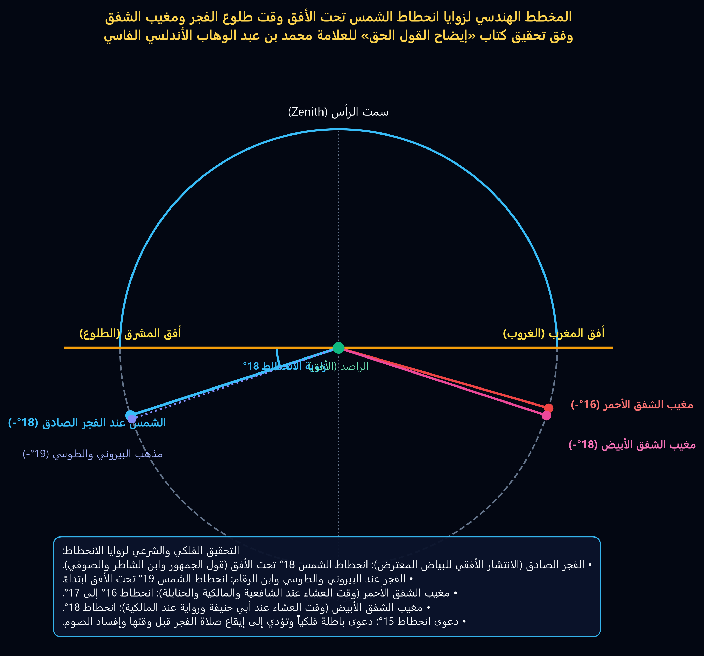
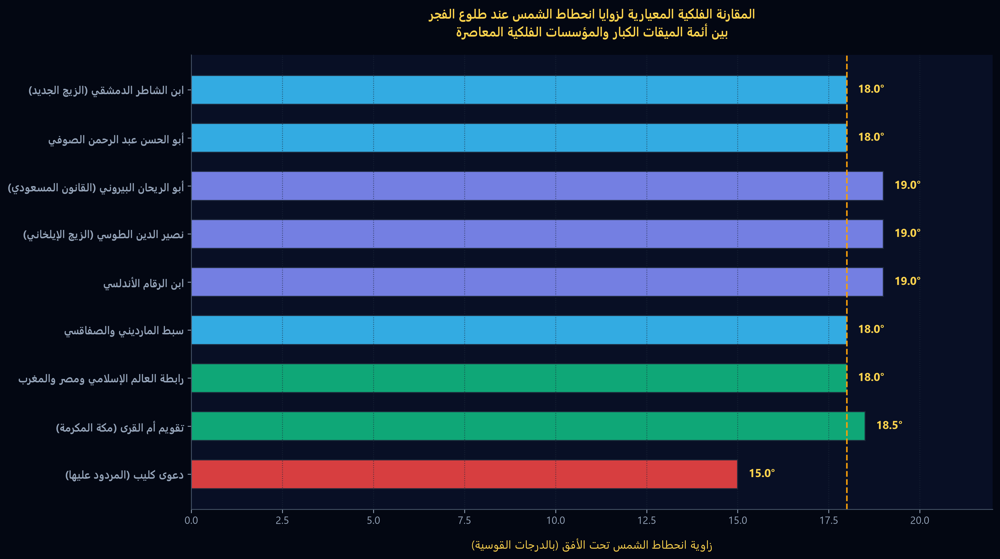

---
### [صفحة 1]

**إيضاح القول الحق**

**في مقدار انحطاط الشمس وقت**

**طلوع الفجر وغروب الشفق**

للأستاذ العلامة الفلكي

السيد الحاج محمد بن عبد الوهاب ابن عبد الرازق

الأندلسي أصلا الفاسي المراكشي

* * *

[بخّط اليد في أسفل الصفحة]:

بالخير تفريجه من اختصاصيين في علم الفلك وهما

الأستاذان الشريف سيراد رئيس العرافي مباحثا

والسيد عباس بن محمد بن الحسن الدباغ من مراكش

---
### [صفحة 2]

الحمد لله رب العالمين والصلاة والسلام على سيدنا محمد خاتم النبيئين وإمام المرسلين وعلى ءاله وصحبه اجمعين ، وعلى من تبعهم بإحسان الى يوم الدين

وبعد ، فيما ان فضيلة الاستاذ العلامة السيد عبدالله كنون رئيس رابطة علماء المغرب قد وردت عليه رسالة من وزارة العدل والاوقاف والشؤون الاسلامية بالكويت مؤرخة ب : 21 رجب 1395 ، الموافق 30 / 7 / 1975 رقم : أ ف / ش س 37 / 1978 ومرفقة بكتاب **(( تصحيح وقت اذان الفجر ))** بقلم الشيخ عبد الملك على كليب للاطلاع عليه واحالته على المختصين بالمغرب لدراسته وافادة الوزارة المذكورة .

وبما ان حضرة رئيس رابطة علماء المغرب قد أحال علي الكتاب للنظر فيه وبحثه من الناحية الشرعية والفلكية .

وبما ان صاحب الكتاب المذكور اعتمد على قول ابن منظور في لسان العرب ( الفجر ضوء الصباح وهو حمرة الشمس في سواد الليل ) واعتبر ان انحطاط الشمس تحت الافق وقت طلوع الفجر 16 درجة و 30 دقيقة وادعى ان من صلى الصبح قبل ذلك فصلاته باطلة حسبما في الصفحة الأولى والأخيرة من مؤلفه المذكور .

وبما ان ما اعتمد ه وما ادعاه هو مخالف لما عليه اهل الشرع والفلك واللغة في معنى الفجر وفي قدر انحطاط الشمس تحت الافق وقت طلوعه حتى على ما نقله عن مرصد جرينويش ومرصد البحرية الامريكية ، فها انا انقل ما قاله علماء الشرع والفلك واللغة في معنى الفجر وفي قدر انحطاط الشمس وقت طلوعه ليتضح الحق من غيره وليعرف ان علماء الاسلام الشرعيين والفلكيين قد حرروا أوقات الصلاة والصوم بما لا مزيد عليه وخصوصا الفلكيين منهم فقد حرروا ذلك بحساباتهم المدققة وبارصادهم المتوالية في السنين الطويلة فلم يبق الان نقدم لهم خالص شكرنا وغاية تقديرنا واكبارنا وهذا أوان الشروع في المقصود فأقول وبالله التوفيق

---
### [صفحة 3]

**كَلَامُ أَئِمَّةِ الشَّرْعِ وَاللُّغَةِ فِي الْفَجْرِ وَالْغَلَسِ**

**قَالَ الْإِمَامُ الْبُخَارِيُّ فِي صَحِيحِهِ:** فِي بَابِ قَوْلِ اللَّهِ تَعَالَى ﴿ وَكُلُوا وَاشْرَبُوا حَتَّى يَتَبَيَّنَ لَكُمُ الْخَيْطُ الْأَبْيَضُ مِنَ الْخَيْطِ الْأَسْوَدِ مِنَ الْفَجْرِ ثُمَّ أَتِمُّوا الصِّيَامَ إِلَى اللَّيْلِ ﴿ قَالَ عَنْ عَدِيِّ بْنِ حَاتِمٍ رَضِيَ اللَّهُ عَنْهُ قَالَ: لَمَّا نَزَلَتْ ﴾ حَتَّى يَتَبَيَّنَ لَكُمُ الْخَيْطُ الْأَبْيَضُ مِنَ الْخَيْطِ الْأَسْوَدِ ﴾ عَمَدْتُ إِلَى عِقَالٍ أَسْوَدَ وَإِلَى عِقَالٍ أَبْيَضَ فَجَعَلْتُهُمَا تَحْتَ وِسَادَتِي، فَجَعَلْتُ أَنْظُرُ فِي اللَّيْلِ فَلَا يَسْتَبِينُ لِي، فَغَدَوْتُ عَلَى رَسُولِ اللَّهِ ﷺ فَذَكَرْتُ لَهُ ذَلِكَ، فَقَالَ: « إِنَّمَا ذَلِكَ سَوَادُ اللَّيْلِ وَبَيَاضُ النَّهَارِ » (هـ).

**وَقَالَ الْقُرْطُبِيُّ فِي تَفْسِيرِهِ:** وَسَمَّى الْفَجْرَ خَيْطًا لِأَنَّ مَا يَبْدُو مِنَ الْبَيَاضِ يُرَى مُمْتَدًّا كَالْخَيْطِ، قَالَ الشَّاعِرُ:

الْخَيْطُ الْأَبْيَضُ ضَوْءُ الصُّبْحِ مُنْفَلِقٌ   ...   وَالْخَيْطُ الْأَسْوَدُ جُنْحُ اللَّيْلِ مَكْتُومُ (هـ)

**وَقَالَ الْبُخَارِيُّ فِي بَابِ وَقْتِ الْفَجْرِ:** عَنْ قَتَادَةَ عَنْ أَنَسِ بْنِ مَالِكٍ أَنَّ نَبِيَّ اللَّهِ ﷺ وَزَيْدَ بْنَ ثَابِتٍ تَسَحَّرَا، فَلَمَّا فَرَغَا مِنْ سَحُورِهِمَا قَامَ نَبِيُّ اللَّهِ ﷺ إِلَى الصَّلَاةِ فَصَلَّيَا، قُلْتُ لِأَنَسٍ: كَمْ كَانَ بَيْنَ فَرَاغِهِمَا مِنْ سَحُورِهِمَا وَدُخُولِهِمَا فِي الصَّلَاةِ؟ قَالَ: قَدْرُ مَا يَقْرَأُ الرَّجُلُ خَمْسِينَ آيَةً.

وَعَنْ ابْنِ شِهَابٍ قَالَ: أَخْبَرَنِي عُرْوَةُ بْنُ الزُّبَيْرِ أَنَّ عَائِشَةَ أَخْبَرَتْهُ قَالَتْ: « كُنَّ نِسَاءُ الْمُؤْمِنَاتِ يَشْهَدْنَمَعَ رَسُولِ اللَّهِ ﷺ صَلَاةَ الْفَجْرِ مُتَلَفِّعَاتٍ بِمُرُوطِهِنَّ ثُمَّ يَنْقَلِبْنَ إِلَى بُيُوتِهِنَّ حِينَ يَقْضِينَ الصَّلَاةَ لَا يَعْرِفُهُنَّ أَحَدٌ مِنَ الْغَلَسِ ».

وَعَنْ أَبِي حَازِمٍ أَنَّهُ سَمِعَ سَهْلَ بْنَ سَعْدٍ يَقُولُ: « كُنْتُ أَتَسَحَّرُ فِي أَهْلِي حَتَّى يَكُونَ سُرْعَةٌ بِي أَنْ أُدْرِكَ صَلَاةَ الْفَجْرِ مَعَ رَسُولِ اللَّهِ ﷺ » (هـ).

**قَالَ ابْنُ حَجَرٍ فِي الْفَتْحِ:** وَالْغَرَضُ مِنْ حَدِيثِ سَهْلٍ هَذَا الْإِشَارَةُ إِلَى مُبَادَرَةِ النَّبِيِّ ﷺ بِصَلَاةِ الصُّبْحِ فِي أَوَّلِ الْوَقْتِ، وَحَدِيثُ عَائِشَةَ تَقَدَّمَ فِي أَبْوَابِ سَتْرِ الْعَوْرَةِ وَلَفْظُهُ أَصْرَحُ فِي مُرَادِهِ فِي هَذَا الْبَابِ مِنْ جِهَةِ التَّغْلِيسِ بِالصُّبْحِ وَأَنَّ سِيَاقَهُ يَقْتَضِي الْمُوَاظَبَةَ عَلَى ذَلِكَ، وَأَصْرَحُ مِنْهُ مَا أَخْرَجَهُ أَبُو دَاوُدَ مِنْ حَدِيثِ ابْنِ مَسْعُودٍ أَنَّهُ ﷺ أَسْفَرَ بِالصُّبْحِ مَرَّةً ثُمَّ كَانَتْ صَلَاتُهُ بَعْدُ بِالتَّغْلِيسِ حَتَّى مَاتَ لَمْ يَعُدْ إِلَى أَنْ يُسْفِرَ، ثُمَّ قَالَ ابْنُ حَجَرٍ عِنْدَ قَوْلِ عَائِشَةَ "مِنَ الْغَلَسِ": وَفِي الْحَدِيثِ اسْتِحْبَابُ الْمُبَادَرَةِ بِصَلَاةِ الصُّبْحِ فِي أَوَّلِ الْوَقْتِ (هـ).

---
### [صفحة 4]

وَقَالَ السُّيُوطِيُّ فِي تَنـْوِيرِ الـْحَوَالِكِ (( اَلْغَلَسُ )) قَالَ الرَّافِعِيُّ هُوَ ظُلْمَةُ آخِرِ اللَّيْلِ وَقِيلَ اخْتِلَاطُ ضِيَاءِ الصَّبَاحِ بِظُلْمَةِ اللَّيْلِ ( هـ ) وَالْأَوَّلُ هُوَ الْمَجْزُومُ بِهِ فِي الصِّحَاحِ وَقَالَ فِي النِّهَايَةِ الْغَلَسُ ظُلْمَةُ آخِرِ اللَّيْلِ إِذَا اخْتَلَطَتْ بِضَوْءِ الصَّبَاحِ ، وَقَالَ الْقَاضِي عِيَاضٌ الْغَلَسُ بَقَايَا ظُلْمَةِ اللَّيْلِ يُخَالِطُهَا بَيَاضُ الْفَجْرِ قَالَهُ الْأَزْهَرِيُّ وَالْخَطَّابِيُّ ، قَالَ الْخَطَّابِيُّ وَالْغَبَشُ بِالْبَاءِ وَالشِّينِ الْمُعْجَمَةِ قِيلَ الْغَلَسُ بِالسِّينِ الْمُهْمَلَةِ وَبَعْدَهُ الْفَلَسُ بِاللَّامِ وَهِيَ كُلُّهَا فِي آخِرِ اللَّيْلِ وَيَكُونُ الْغَبَشُ أَوَّلَ اللَّيْلِ ( هـ ) مِنَ التَّنْوِيرِ .

وَقَالَ الْبُخَارِيُّ فِي بَابِ الْأَذَانِ قَبْلَ الْفَجْرِ عَنْ عَبْدِ اللَّهِ بْنِ مَسْعُودٍ عَنِ النَّبِيِّ صَلَّى اللَّهُ عَلَيْهِ وَسَلَّمَ قَالَ « لاَ يَمْنَعَنَّ أَحَدَكُمْ أَوْ أَحَداً مِنْكُمْ أَذَانُ بِلاَلٍ مِنْ سَحُورِهِ فَإِنَّهُ يُؤَذِّنُ أَوْ يُنَادِي بِلَيْلٍ لِيَرْجِعَ قَائِمَكُمْ وَلِيُنَبِّهَ نَائِمَكُمْ وَلَيْسَ أَنْ يَقُولَ الْفَجْرُ أَوْ الصَّبْحُ « ، وَقَالَ بِأَصَابِعِهِ وَرَفَعَهَا إِلَى فَوْقِ وَطَأْطَأَ إِلَى أَسْفَلَ حَتَّى يَقُولَ هَكَذَا ، وَقَالَ زُهَيْرٌ بِسَبَّابَتَيْهِ إِحْدَاهُمَا فَوْقَ الْأُخْرَى ثُمَّ مَدَّهُمَا عَنْ يَمِينِهِ وَشِمَالِهِ ، وَعَنْ عَائِشَةَ عَنِ النَّبِيِّ صَلَّى اللَّهُ عَلَيْهِ وَسَلَّمَ أَنَّهُ قَالَ » إِنَّ بِلاَالاً يُؤَذِّنُ بِلَيْلٍ فَكُلُوا وَاشْرَبُوا حَتَّى يُؤَذِّنَ ابْنُ أُمِّ مَكْتُومٍ » .

**قَالَ الْقَسْطَلاَنِيُّ** فِي إِرْشَادِ السَّارِي فِي الْحَدِيثِ الْأَوَّلِ ( وَقَالَ ) أَيْ أَشَارَ **عَلَيْهِ الصَّلاَةُ وَالسَّلاَمُ** ( بِأَصَابِعِهِ وَرَفَعَهَا ) وَلِأَبِي ذَرٍّ وَرَفَعَهُمَا ( إِلَى فَوْقُ ) بِالضَّمِّ عَلَى الْبِنَاءِ ( وَطَأْطَأَ ) أَيْ خَفَضَ أُصْبُعَيْهِ ( إِلَى أَسْفَلَ ) فَأَشَارَ **عَلَيْهِ السَّلاَمُ** إِلَى الْفَجْرِ الْكَاذِبِ الْمُسَمَّى عِنْدَ الْعَرَبِ بِذَنَبِ السِّرْحَانِ وَهُوَ الضَّوْءُ الْمُسْتَطِيلُ مِنَ الْعُلُوِّ إِلَى الْأَسْفَلِ ( حَتَّى يَقُولَ ) إِنَّ يَظْهَرَ الْفَجْرُ ( هَكَذَا وَقَالَ زُهَيْرٌ ) مَضَى هَكَذَا أَيْ أَشَارَ ( بِسَبَّابَتَيْهِ ) اللَّتَيْنِ تَلِيَانِ الْإِبْهَامَ ( إِحْدَاهُمَا فَوْقَ الْأُخْرَى ثُمَّ مَدَّهُمَا عَنْ يَمِينِهِ وَشِمَالِهِ ) كَأَنَّهُ جَمَعَ بَيْنَ أُصْبُعَيْهِ ثُمَّ فَرَّقَهُمَا لِيَحْكِيَ صِفَةَ الْفَجْرِ الصَّادِقِ لِأَنَّهُ يَطْلُعُ مُعْتَرِضاً ثُمَّ يَعُمُّ الْأُفُقَ ذَاهِباً يَمِيناً وَشِمَالاً ( هـ )

وَقَالَ الْبُخَارِيُّ فِي بَابِ أَذَانِ الْأَعْمَى إِذَا كَانَ لَهُ مَنْ يُخْبِرُهُ عَنْ سَالِمٍ ابْنِ عَبْدِ اللَّهِ عَنْ أَبِيهِ أَنَّ رَسُولَ اللَّهِ صَلَّى اللَّهُ عَلَيْهِ وَسَلَّمَ قَالَ « إِنَّ بِلاَالاً يُؤَذِّنُ بِلَيْلٍ فَكُلُوا وَاشْرَبُوا حَتَّى يُنَادِيَ ابْنُ أُمِّ مَكْتُومٍ » قَالَ وَكَانَ رَجُلاً أَعْمَى لاَ يُنَادِي حَتَّى يُقَالَ لَهُ أَصْبَحْتَ أَصْبَحْتَ ( هـ ) .

**قَالَ ابْنُ حَجَرٍ** فِي الْفَتْحِ ( قَوْلُهُ أَصْبَحْتَ أَصْبَحْتَ ) أَيْ دَخَلْتَ فِي الصَّبَاحِ هَذَا ظَاهِرُهُ وَاسْتُشْكِلَ لِأَنَّهُ جُعِلَ أَذَانُهُ غَايَةً لِلْأَكْلِ فَلَوْ لَمْ يُؤَذِّنْ حَتَّى يَدْخُلَ فِي الصَّبَاحِ لَلَزِمَ مِنْهُ جَوَازُ الْأَكْلِ بَعْدَ طُلُوعِ الْفَجْرِ وَالْإِجْمَاعُ عَلَى خِلاَفِهِ إِلَّا مَا شَذَّ كَالْأَعْمَشِ

---
### [صفحة 5]

وأجَابَ ابنُ حَبِيبٍ وَابنُ عبدِ البَرِّ والأَصِيلِيُّ وَجَمَاعَةٌ مِنَ الشُّرَّاحِ بِأَنَّ المُرَادَ قَارَبَتِ الصَّبَاحَ ويُعَكَّرُ علَى هَذَا الجَوَابِ إنَّ فِي رِوَايَةِ الرَّبِيعِ الَّتِي قَدَّمْنَاهَا ولَمْ يَكُنْ يُؤَذِّنُ حَتَّى يَقُولَ لَهُ النَّاسُ حِينَ يَنْظُرُونَ إلَى بَزُوغِ الفَجْرِ اذِنْ وأَبْلَغُ مِنْ ذَلِكَ أَنَّ لَفْظَ رِوَايَةِ المَصَنِّفِ الَّتِي فِي الصِّيَامِ حَتَّى يُؤَذِّنَ ابنُ أُمِّ مَكْتُومٍ فَإنَّهُ لَا يُؤَذِّنُ حَتَّى يَطْلُعَ الفَجْرُ وَإنَّمَا قُلْتُ أَنَّهُ أَبْلَغُ لِكَوْنِ جَمِيعِهِ مِنْ كَلَامِ النَّبِيِّ ﷺ وَأَيْضاً فَقَوْلُهُ «إنَّ بِلاَلاً يُؤَذِّنُ بِلَيْلٍ» يُشْعِرُ أَنَّ ابنَ أمِ مَكْتُومٍ بِخِلَافِهِ وَلِأَنَّهُ لَوْ كَانَ قَبْلَ الصَّبَاحِ لَمْ يَكُنْ بَيْنَهُ وَبَيْنَ بِلاَلٍ فَرْقٌ لِصِدْقِ أَنَّ كُلاًّ مِنْهُمَا أَذَّنَ قَبْلَ الوَقْتِ ، وَهَذَا المَوْضِعُ عِنْدِي فِي غَايَةِ الإشْكَالِ وَأَقْرَبُ مَا يُقَالُ فِيهِ أنَّ أذَانَهُ جُعِلَ عَلاَمَةً لِتَحْرِيمِ الأَكْلِ وَالشُّرْبِ وَكَأَنَّهُ كَانَ لَهُ مَنْ يُرَاعِي الوَقْتَ بِحَيْثُ يَكُونُ أذَانُهُ مُقَارِناً لاِبْتِدَاءِ طُلُوعِ الفَجْرِ وهو المرادُ بالبُزوغِ وعِنْدَ أخْذِهِ فِي الأذَانِ يَعْتَرِضُ الفَجْرُ فِي الأُفُقِ .

ثُمَّ ظَهَرَ لِي أنَّهُ لاَ يَلْزَمُ مِنْ كَوْنِ المُرَادِ بِقَوْلِهِمْ أصْبَحْتَ أي قَارَبْتَ الصَّبَاحَ وقُوع أذَانِهِ .. قَبْلَ الفَجْرِ لاِحْتِمَالِ أنْ يَكُونَ قَوْلُهُمْ ذَلِكَ يَقَعُ فِي آخِرِ جُزْءٍ مِنَ اللَّيْلِ وأذَانُهُ يَقَعُ فِي أَوَّلِ جُزْءٍ مِنْ طُلُوعِ الفَجْرِ ، وهَذَا وإنْ كَانَ مُسْتَبْعَداً فِي العِبَادَةِ فَلَيْسَ بِمُسْتَبْعَدٍ مِنْ مُؤَذِّنِ النَّبِيِّ ﷺ المُؤَيَّدِ بالمَلاَئِكَةِ فَلاَ يَشْتَرِكُهُ فِيهِ مَنْ لَمْ يَكُنْ بِتِلْكَ الصِّفَةِ ، وقَدْ رَوَى أَبُو قُرَّةَ مِنْ وَجْهٍ آخَرَ عَنِ ابْنِ عُمَرَ حَدِيثاً فِيهِ «وَكَانَ ابنُ أُمِّ مَكْتُومٍ يَتَوَخَّى الفَجْرَ فَلاَ يُخْطِئُهُ» .

**وَفِي هَذَا الحَدِيثِ** جَوَازُ الأَذَانِ قَبْلَ طُلُوعِ الفَجْرِ وَاسْتِحْبَابُ أذَانِ واحِدٍ بَعْدَ واحِدٍ وَجَوَازُ اتِّخَاذِ مُؤَذِّنَيْنِ فِي المَسْجِدِ الوَاحِدِ إلى آخِرِ كَلاَمِهِ فَلْيُرَاجَعْ .

**وقَوْلُهُ ثُمَّ ظَهَرَ إلخ** رُجُوعٌ مِنْهُ إلَى مَا أجَابَ بِهِ ابنُ حَبِيبٍ وابنُ عَبْدِ البَرِّ وغَيْرُهُمَا وأَنَّهُ لاَ اشْكَالَ علَى أنَّ قَوْلَهُ وأَقْرَبُ مَا يُقَالُ فِيهِ إلخ هُوَ رَاجِعٌ فِي الحَقِيقَةِ إلَى جَوَابِ ابنِ حَبِيبٍ وابنِ عَبْدِ البَرِّ وغَيْرِهِمَا .

**وفِي موطإِ مالِكٍ** عن عبدِ اللَّهِ بنِ عمرَ ان أُخْتَهُ حَفْصَةَ زوجَ النبيِّ ﷺ أخْبَرَتْهُ أنَّ رسولَ اللَّهِ ﷺ كانَ اذَا سَكَتَ المؤَذِّنُ عن الأذَانِ بصَلاَةِ الصُّبْحِ صَلَّى ركعَتَيْنِ خَفِيفَتَيْنِ قَبْلَ أنْ تُقَامَ الصَّلاَةُ ، قَالَ الزَّرْقَانِيُّ فِي شَرْحِهِ عَلَى المَوَطإِ صَفْحَة 234 مِنَ الجُزْءِ الأوَّلِ ( صَلَّى رَكْعَتَيْنِ خَفِيفَتَيْنِ ) لِيُبَادِرَ إلَى صَلاَةِ الصُّبْحِ أَوَّلَ الوَقْتِ كَمَا جَزَمَ بِهِ القُرْطُبِيُّ فِي حِكْمَةِ تَخْفِيفِهِمَا أوْ لِيَدْخُلَ فِي الفَرْضِ بِنَشَاطٍ تَا مٍّ كَمَا قَالَهُ غَيْرُهُ ( هـ )

---
### [صفحة 6]

وقال الترمذي في جامعه باب ما جاء في التغليس بالفجر ثم ذكر حديث عائشة المتقدم وقال قال أبو عيسى حديث عائشة حديث صحيح وهو الذي اختاره غير واحد من أهل العلم من أصحاب النبي صلى الله عليه وسلم منهم أبو بكر وعمر ومن بعدهم من التابعين وبه يقول الشافعي وأحمد وإسحاق يستحبون التغليس بصلاة الفجر (هـ) .

قال ابن العربي في عارضة الأحوذي ما ملخصه والتغليس ظلام آخر الليل والفجر فجران الأول كذنب السرحان ، والثاني وهو نور يبدو ومنتشرا مستطيرا على الأفق صادق ثابت مديد كهيئة الأكليل وهو الصبح والصباح ، وقال بعضهم الصبح ما جمع بياضا وحمرة ولا يصح إلا ما قلناه وهو الخيط الأبيض وكذلك قال الشافعي وأحمد ثم قال (فقهه) لا اختلاف بين الأئمة أن أول وقت صلاة الصبح طلوع الفجر الصادق (هـ) المراد ، وقال النووي في شرح المهذب صفحة 43 من الجزء الثالث وأجمعت الأمة على أن أول وقت الصبح طلوع الفجر الصادق وهو الفجر الثاني إلى أن قال **( فرع )** قال أصحابنا الفجر فجران أحدهما يسمى الفجر الأول والفجر الكاذب والأخر يسمى الفجر الثاني والفجر الصادق فالفجر الأول يطلع مستطيلا نحو السماء كذنب السرحان وهو الذيب ثم يغيب ذلك ساعة ثم يطلع الفجر الثاني الصادق مستطيرا بالراء أي منتشرا عرضا على الأفق ، فقال أصحابنا والأحكام كلها متعلقة بالفجر الثاني فبه يدخل وقت صلاة الصبح ويخرج وقت العشاء ويدخل في الصوم ويحرم به الطعام والشراب على الصائم وبه ينقضي الليل ويدخل النهار ولا يتعلق بالفجر الأول شيء من الأحكام بإجماع المسلمين (هـ)

وقال الحطاب في شرحه على مختصر خليل صفحة 499 من الجزء الأول **( فصل )** ولا خلاف أن أول وقتها طلوع الفجر الصادق وهو الضياء المعترض في الأفق ويقال له الفجر المستطير بالراء أي المنتشر الشائع ، قال الله تعالى ﴿ وَيَخَافُونَ يَوْمًا كَانَ شَرُّهُ مُسْتَطِيرًا ﴾ وقال في الطراز الفجر المستطير شبه بالطائر يفتح جناحيه وهو الفجر الثاني ، وأما الفجر الأول فيقال له المستطيل باللام لأنه يصعد في كبد السماء قال في الطراز كهيئة الطيلسان ويشبه ذنب السرحان وهو الذيب والأسد فإن لونه مظلم وباطن ذنبه أبيض وشبهه الشعراء مع الليل بالثوب الأسود الذي جيبته في صدره إذا شق جيبه وبرز الصدر ويقال الكاذب والكذاب لأنه يغر من لا يعرفه وتسميه العرب المحلف كان حالفا يحلف لطلع الفجر وآخر يحلف أنه لم يطلع ،

---
### [صفحة 7]

**قال في الذخيرة:** وكثير من الفقهاء لا يعرف حقيقة هذا الفجر ويعتقد أنه عام الوجود في سائر الأزمنة وهو خاص ببعض الشتاء وسبب ذلك أنه المجرة فمتى كان الفجر بالبلدة ونحوها طلعت المجرة قبل الفجر وهي بيضاء فيعتقد أنها الفجر فإذا باينت الأفق ظهر من تحتها الظلام ثم يطلع الفجر بعد ذلك وأما في غير الشتاء فتطلع المجرة أول الليل أو نصفه فلا يطلع آخر الليل إلا الفجر الحقيقي انتهى ونازعه غيره في ذلك وقال إنه مستمر في جميع الأزمنة وهو الظاهر ولا شك أن ذلك الوقت من الليل فلا يحرم فيه الأكل ومن صلى الصبح فيه لم تجزه بلا خلاف (هـ)

فقد اتضح مما ذكرناه من الآية والأحاديث وكلام الأئمة أمور:

منها أن الآية الكريمة عبرت عن ضياء الفجر بالخيط الأبيض وعن ظلمة الليل بالخيط الأسود من باب التشبيه البليغ فلذلك قال عليه السلام لعدي بن حاتم «إنما ذلك سواد الليل وبياض النهار« ومنها أن النبي عليه السلام بين الفجر الكاذب والصادق بالإشارة بأصابعه وبين أن الفجر الكاذب لا يحل الصلاة ولا يحرم الأكل في رمضان والذي يحرم ويحل هو الفجر الصادق وهو البياض المعترض في الأفق كما هو نص الآية ونص قوله عليه السلام »إنما ذلك سواد الليل وبياض النهار».

ومنها أن من قال بأن الفجر الذي يحل ويحرم هو الحمرة فقد خالف الآية الشريفة وخالف تفسير النبي عليه السلام لها بقوله : «إنما ذلك سواد الليل وبياض النهار» ، وخالف ما عليه الأئمة المقتدى بهم سلفا وخلفا . وتقدم قول ابن العربي في العارضة والفجر فجران الأول كذنب السرطان والثاني وهو نور يبدو ومنتشرا مستطيرا على الأفق صادق ثابت مديد كهيئة الإكليل وهو الصبح والصباح ، وقال بعضهم الصبح ما جمع بياضا وحمرة ولا يصح إلا ما قلناه وهو الخيط الأبيض وكذلك قال الشافعي وأحمد (هـ)

**وقال القيومي في المصباح المنير:** «والفجر اثنان الأول الكاذب وهو المستطيل ويبدو أسود معترضا ، والثاني الصادق وهو المستطير ويبدو ساطعا يملأ الأفق ببياضه وهو عمود الصبح ويطلع بعد ما يغيب الأول وبطلوعه يدخل النهار ويحرم على الصائم كل ما يفطر به» (هـ)

وأيضا فإن الحمرة يتأخر طلوعها عن طلوع البياض بدرجتين على ما هو المعتمد والصحيح وبأربع درج على ما قاله أبو علي المراكشي في كتابه جامع المبادئ والغايات وسيأتي ذلك

---
### [صفحة 8]

وَعَلَى كُلِّ حَالٍ فَمَنْ قَالَ بِأَنَّ الْفَجْرَ الصَّادِقَ الَّذِي يَحِلُّ الصَّلَاةَ وَيَحْرُمُ الْأَكْلَ وَالشُّرْبَ عَلَى الصَّائِمِ هُوَ حُمْرَةُ الشَّمْسِ فِي سَوَادِ اللَّيْلِ أَوْ هُوَ الْبَيَاضُ وَالْحُمْرَةُ فَقَدْ أَخْطَأَ الصَّوَابَ لِمَا ذَكَرْنَاهُ .

وَمِنْهَا أَنَّ النَّبِيَّ عَلَيْهِ السَّلَامُ كَانَ يُبَادِرُ بِصَلَاةِ الصُّبْحِ بِحَيْثُ يُوَقِّعُهَا بِغَلَسٍ وَلَا يُؤَخِّرُهَا لِلْإِسْفَارِ الِانْبِدَارِ ، وَتَقَدَّمَ عَنِ السُّيُوطِيِّ فِي التَّنْوِيرِ أَنَّ الْغَلَسَ ظُلْمَةُ آخِرِ اللَّيْلِ وَهُوَ مَا قَالَهُ الرَّافِعِيُّ . وَجَزَمَ بِهِ الْجَوْهَرِيُّ فِي الصِّحَاحِ ، وَقَالَ ابْنُ الْأَثِيرِ فِي النِّهَايَةِ الْغَلَسُ ظُلْمَةُ آخِرِ اللَّيْلِ إِذَا اخْتَلَطَتْ بِضَوْءِ الصَّبَاحِ ، وَقَالَ عِيَاضٌ : الْغَلَسُ بَقَايَا ظُلْمَةِ اللَّيْلِ يُخَالِطُهَا بَيَاضُ الْفَجْرِ قَالَهُ الْأَزْهَرِيُّ وَالْخَطَّابِيُّ ( هـ ) .

وَمِمَّنْ قَالَ بِأَنَّ الْغَلَسَ ظُلْمَةُ آخِرِ اللَّيْلِ الْفَيُّومِيُّ فِي الْمِصْبَاحِ الْمُنِيرِ وَمُحَمَّدُ بْنُ أَبِي بَكْرٍ الرَّازِيُّ فِي مُخْتَارِ الصِّحَاحِ .

هَذَا ، وَقَدْ قَالَ ابْنُ مَنْظُورٍ فِي لِسَانِ الْعَرَبِ الْغَلَسُ ظَلَامُ آخِرِ اللَّيْلِ ،

**قال الأخطل:**

كذبتك عينك أم رأيت بواسطة   ...   غلس الظلام من الرباب خيالا .

ثُمَّ قَالَ ، قَالَ أَبُو زَيْدٍ هو منه و الْغَلَسُ أَوَّلُ الصَّبَاحِ حَتَّى يَنْتَشِرَ فِي الْآفَاقِ وَكَذَلِك الْغَبَسُ وَهُمَا سَوَادٌ مُخْتَلِطٌ بِبَيَاضٍ وَحُمْرَةٍ مِثْلُ الصَّبَاحِ سَوَاءً . وَفِي الْحَدِيثِ كَانَ يُصَلِّي الصُّبْحَ بِغَلَسٍ . الْغَلَسُ ظُلْمَةُ آخِرِ اللَّيْلِ إِذَا اخْتَلَطَتْ بِضَوْءِ الصَّبَاحِ ( هـ ) أَمَّا قَوْلُهُ الْغَلَسُ ظُلْمَةُ آخِرِ اللَّيْلِ وَقَوْلُهُ : الْغَلَسُ ظُلْمَةُ آخِرِ اللَّيْلِ إِذَا اخْتَلَطَتْ بِضَوْءِ الصَّبَاحِ فَهُوَ مُوَافِقٌ لِمَا قَدَّمْنَاهُ عَنْ أَئِمَّةِ اللُّغَةِ وَالدِّينِ وَأَمَّا مَا نَقَلَهُ عَنْ أَبِي مَنْصُورٍ مِنْ أَنَّ الْغَلَسَ سَوَادٌ مُخْتَلِطٌ بِبَيَاضٍ وَحُمْرَةٍ مِثْلُ الصَّبَاحِ سَوَاءً فَهُوَ مُخَالِفٌ لِتَفْسِيرِهِ الْأَوَّلِ وَالْأَخِيرِ وَمُخَالِفٌ لِمَا قَدَّمْنَاهُ فِي الْغَلَسِ وَالصَّبَاحِ ، وَعَلَيْهِ فَلَا يَنْبَغِي اعْتِبَارُهُ وَلَا الِالْتِفَاتُ إِلَيْهِ لِأَنَّهُ مِنَ الشُّذُوذِ وَمِنَ الْخُرُوجِ عَمَّا عَلَيْهِ أَئِمَّةُ اللُّغَةِ وَالدِّينِ .

وَمِنْهَا أَنَّهُ وَقَعَ الْإِجْمَاعُ عَلَى أَنَّهُ لَا يَجُوزُ الْأَكْلُ بَعْدَ طُلُوعِ الْفَجْرِ وَلَا يَقُولُ بِجَوَازِهِ إِلَّا مَنْ شَذَّ كَالْأَعْمَشِ ،

وَمِنْهَا أَنَّ الْمُعْتَبَرَ فِي تَحْرِيمِ الْأَكْلِ وَحِلِّيَّةِ الصَّلَاةِ هُوَ ابْتِدَاءُ طُلُوعِ الْفَجْرِ وَبُزُوغُهُ وَلَا يُشْتَرَطُ تَعْمِيمُ الضِّيَاءِ فِي الْآفَاقِ إِلَّا مَنْ شَذَّ وَخَرَجَ عَنِ الْإِجْمَاعِ .

وَمِنْهَا أَنَّ النَّبِيَّ عَلَيْهِ السَّلَامُ كَانَ يُؤَخِّرُ السَّحُورَ بِحَيْثُ يَكُونُ بَيْنَ فَرَاغِهِ مِنْ سَحُورِهِ وَدُخُولِهِ فِي الصَّلَاةِ قَدْرُ مَا يَقْرَأُ الرَّجُلُ خَمْسِينَ آيَةً .

وَمِنْهَا مَشْرُوعِيَّةُ الْأَذَانِ قَبْلَ الْفَجْرِ وَعِنْدَ الْفَجْرِ وَمَشْرُوعِيَّةُ تَعَدُّدِ الْمُؤَذِّنِينَ فِي الْمَسْجِدِ الْوَاحِدِ .

---
### [صفحة 9]

**كلام علماء الفلك في الفجر والشفق**

**قال البيروني في التفهيم**: (ما الفجر وما الشفق) الليل بالحقيقة هو كوننا في ظلام ظل الأرض فإذا قربت الشمس منا في حال غيبتها أحسسنا بضيائها المحيط بالظل وهو الفجر في المشرق طليعة أمام الشمس، والشفق في المغرب ساقة شعاعها من خلف، فأما في المشرق فيطلع بعد السحر بياض مستطيل مستدق الأعلى يسمى الصبح الكاذب إذ لا حكم له في الشريعة ويشبه بذنَب السرحان من جهة الاستطالة والدقة والانتصاب ويبقى مدة ثم يتلوه الفجر الصادق معترضا عليه منبسطا على الأفق وحكم الصوم والصلاة منوط به وبعده يحيد الأفق لاقتراب الشمس وسطوع ضيائها على الكدورات القريبة من الأرض ويتبيّنه الطلوع والحال عند غروبها كذلك بعكس هذا الترتيب وهو أن الأفق يبقى محمرا بعد غروب الشمس، ثم تزول الحمرة ويبقى البياض الذي هو نظير الفجر وبه -وبالحمرة- حكم وقت الصلاة أي صلاة العشاء فإذا غاب هذا البياض المعترض بقي المستطيل المنتصب نظير الصبح الكاذب مدة من الليل هو المراد .

**وقال نصير الدين الطوسي في الزبدة في الباب الرابع والعشرين**: قد تقدم أنه إذا وقع ضوء الشمس على الأرض، وقع في الجهة المقابلة للشمس ظل مخروطي ينعدم على قاعدته دائرة عظيمة على كرتي الأرض والماء وارتفاع ذلك المخروط يصل إلى ثخن فلَك الزهرة وينعدم فيه، فإذا كان ذلك المخروط فوق الأرض ونحن واقعون داخله كان ذلك هو الليل وذلك المخروط لا محالة يتحرك في مقابلة الشمس فيطلع من المشرق عند غروب الشمس ويزداد ارتفاعه بحسب انحطاطها ويقع الناس في مخروط الظلام حتى لا يرون النور أصلا ولا يزال الحال على ذلك حتى تقرب الشمس إلى أفق المشرق وينحرف رأس المخروط نحو المغرب، ويقرب الذي يلي المشرق منا فيرى النور الملاصق له، وذلك هو الصبح ولنزْد ذلك وضوحا، ونقول إذا فُرِض في هذه الحال سطح يمر بالبصر وسهم المخروط ويقطع قاعدة المخروط، فإنه لا محالة يحدث مثلث في ذلك المخروط ولا شك أن المخروط الخارج من البصر منطبقا على الأفق إلى الضلع الأقرب إلى الناظر من ضلعي المثلث يحيط مع الضلع المذكور بزاوية حادة فيجب أن يكون موضع العمود الخارج من البصر إلى ذلك الضلع فوق الأفق منه وذلك أقرب الخطوط الواصلة بين البصر ونور الشمس، فأول ما يرى نور الشمس فإنما يرى فوق الأفق ثم ما يقرب من ذلك الموضع من ذلك الضلع حتى يرى النور فوق الأفق على هيئة طولانية آخذا انتشارها في جهة امتداد المخروط،

---
### [صفحة 10]

وهذا النور يسمى الصبح الأول ولعدم اتصاله بالأفق فإن الأفق ح يرى مظلماً ويسمى بالصبح الكاذب أيضاً يعني أنه لو كان صادقاً في أنه من نور الشمس لكان من جهة الشمس متصلاً بالأفق إلى لحوق الشمس بالأفق وليس كذلك ، وإذا ازداد ميل المخروط نحو المغرب وقرب منه السطح الشرقي من المخروط جداً بحيث يمكن أبصار الأنوار الخارجة عند استنارة الأفق وانبسطت الأضواء فيه وقيل لذلك الصبح الثاني والصادق أيضاً ، وإذا قربت الشمس جداً من الأفق وتراكمت الأشعة هناك ظهرت الحمرة وحال الشفق بمعكوس حال الصبح فإن الحمرة تظهر أولاً ثم النور المنبسط ثم البياض المستطيل كمثل ما تقدم وقد علم بالرصد أول الفجر وآخر الشفق يكون وقت انحطاط الشمس عن الأفق ثمان عشرة درجة من دائرة ارتفاعها ثم ذكر ما يعرض لمدة الصبح والشفق في خط الاستواء وفي غيره فليراجع .

وقد ذكر في تبصرته في الفصل التاسع من الباب الثالث شكلاً يوضح مخروط الظل والأفق والمثلث والعمود والشمس والأرض وهو هذا

فالأرض هي ( ا ب ج د ) والشمس هي ( ح ط ى ك )

وممثل مخروط ظل الأرض والمثلث الحاد الزوايا هما ( هـ و ز ) وسهم المخروط ( ز ) وموقع العمود وموضع الناظر هما ( ا ) وسطح الأفق المرئي هو ( هـ و ) وطرف الأفق ( و ) .

---
### [صفحة 11]

ثُمَّ قالَ بَعْدَ هَذا الشَّكْلِ وَقَدْ عُرِفَ بِالتَّجْرِبَةِ أنَّ انْحِطاطَ الشَّمْسِ عِنْدَ أوَّلِ طُلُوعِ الفَجْرِ ثَمانِيَةَ عَشَرَ جُزْءًا ، فَفِي البِلادِ الَّتِي يَكُونُ عَرْضُها ثَمانِيَةً وَأرْبَعِينَ وَنِصْفًا يَتَّصِلُ الصُّبْحُ بِالشَّفَقِ إِذا كانَتِ الشَّمْسُ فِي المُنْقَلَبِ الصَّيْفِيِّ وَفِيما جاوَزَتْ عُرُوضُها ذَلِكَ المِقْدارَ يَكُونُ ذَلِكَ فِي زَمانٍ أكْثَرَ بِحَسَبِ تَناقُصِ انْحِطاطِ الشَّمْسِ عَنِ الإِفْقِ القَدْرِ المَذْكُورِ (هـ) المُرادُ بِقَوْلِهِ بِالتَّجْرِبَةِ أى بالرَّصْدِ كَما تَقَدَّمَ عَنْهُ فِي الزُّبْدَةِ وَنَصِيرُ الدِّينِ الطُوسِيُّ هُوَ مُحَمَّدُ بْنُ مُحَمَّدِ بْنِ الحَسَنِ الطُوسِيُّ المَتَوَفَّى سَنَةَ 672 هِجْرِيَّةً مُوافِقَ 1274 مِيلادِيَّةً وَكانَ هُوَ القَيِّمَ بِالمَرْصَدِ العَظِيمِ الَّذِي بَناهُ وَشَيَّدَهُ هُولاكُوهان بِمَراغَةَ سَنَةَ 657 ، وَكانَ مِنْ أَعْوانِهِ عَلَى الرَّصْدِ جَماعَةٌ مِنَ الحُكَماءِ وَجَّهَ عَلَيْهِمِ المَلِكُ المَذْكُورُ مِنْ أقاصِي البِلْدانِ مِنْهُمُ المُؤَيَّدُ العَرْضِيُّ مِنْ دِمَشْقَ وَالفَخْرُ المَراغِيُّ الَّذِي كانَ بِالمَوْصِلِ وَالفَخْرُ الخَلاطِيُّ الَّذِي كانَ بِتَفْلِيسَ وَنَجْمُ الدِّينِ القَزْوِينِيُّ فَضَبَطُوا حَرَكَةَ الكَواكِبِ وَالزَّيْجَ الإِيلْخانِيَّ المُرَتَّبَ عَلَى أرْبَعِ مَقاﻻتٍ ، وَكانَتْ لَهُ خِزانَةٌ مُشْتَمِلَةٌ عَلَى أرْبَعِمِائَةِ أَلْفِ مُجَلَّدٍ وَصَنَّفَ كُتُبًا عَدِيدَةً ، انْظُرْ قامُوسَ الأَعْلامِ .

وَقالَ القاضِي زادَه فِي شَرْحِهِ عَلَى مُلَخَّصِ الجَغْمِينِيِّ فِي الهَيْئَةِ **( الشَّمْسُ إِذا وَقَعَ ضَوْءُها عَلَى الأَرْضِ اسْتَضاءَ وَجْهُها المُواجهةُ لِلشَّمْسِ )** لِكَوْنِها كَثِيفَةً قابِلَةً لَها **(( ووَقَعَ ظِلُّها فِي مُقابَلَةِ جِهَةِ الشَّمْسِ )** إِذْ مِنْ شَأْنِ الظِّلا أَنْ يَكُونَ كَذَلِكَ **( فَإِذا كانَتِ الشَّمْسُ فَوْقَ الأَرْضِ فَهُوَ النَّهارُ إِذْ لَيْسَ يَخُصُّ النَّهارَ ضَوْءٌ سِوَى ضَوْءِ الشَّمْسِ ، وَإِذا كانَتْ تَحْتَ الأَرْضِ وَقَعَ ظِلُّها فَوْقَها وَهُوَ اللَّيْلُ )** إِذْ لا واسِطَةَ بَيْنَ النَّهارِ وَاللَّيْلِ **( وَوُقُوعُ ظِلِّها يَكُونُ عَلَى شَكْلِ مَخْرُوطٍ مُسْتَدِيرٍ )** وَهُوَ شَكْلٌ مُجَسَّمٌ يَحِيطُ بِهِ دائِرَةٌ هِيَ قاعدَتُهُ وَسَطْحٌ مُسْتَدِيرٌ يَرْتَفِعُ مِنْها عَلَى التَّضايُقِ إِلَى نُقْطَةٍ هِيَ رَأْسُهُ **( إِذِ الشَّمْسُ أَعْظَمُ جِرْمًا مِنَ الأَرْضِ بِكَثِيرٍ )** فَيَسْتَضِيءُ أكْثَرُ مِنْ نِصْفِها وَيَفْصِلُ بَيْنَ المُسْتَضِيءِ وَالمُظْلِمِ دائِرَةٌ صَغِيرَةٌ هِيَ قاعدَةُ ذَلِكَ المَخْرُوطِ وَيَسْتَدِقُّ شَيْئًا فَشَيْئًا إِلَى أَنْ يَنْتَهِيَ إِلَى أِفْلاكِ الزُّهَرَةِ **( فَإِذا كانَتِ الشَّمْسُ تَحْتَ الأَرْضِ قَرِيبَةً مِنَ الأُفُقِ كانَ مَخْرُوطُ الظِّـلِّ مائِلاً عَنْ سَمْـتِ الرَّأْسِ )** إِلَى مُقابَلَةِ الشَّمْسِ وَسَطُهُ الَّذِي فِي جِهَتِها مائِلاً إِلَيْنا **( وَكانَ الهَواءُ المُسْتَضِيءُ )** بِضِياءِ الشَّمْسِ لِكَثافَتِهِ الحاصِلَةِ بِسَبَبِ المُجاوَرَةِ لِلأَرْضِ وَالماءِ يَعْكِسُ الهَواءَ المُسْتَضِيءَ * مِنْ كَثْرَةِ البُخارِ فَإِنَّ الهَواءَ الَّذِي فَوْقَها لا يَقْبَلُ الاسْتِضاءَةَ لِلَطافَتِهِ **( قَرِيبًا )** مِنّا **( فَيَظْهَرُ فِي الأُفُقِ النُّورُ )** فَالَبَياضُ المُسْتَطِيلُ المُسْتَدِقُّ الظّاهِرُ فَوْقَ الأَرْضِ أوَّلاً يُسَمَّى بِالصُّبْحِ الكاذِبِ لأَنَّ لَوْنَ الأُفُقِ بَعْدَهُ مُظْلِمًا يُكَذِّبُ كَوْنَهُ نُورَ الشَّمْسِ وَالمُسْتَطِيرُ المُنْبَسِطُ فِي الأُفُقِ بَعْدَهُ بِزَمانٍ يُسَمَّى بِالصُّبْحِ الصّادِقِ لأَنَّهُ أَصْدَقُ ظُهُورًا مِنَ الأَوَّلِ ،

---
### [صفحة 12]

**قال عليه الصلاة والسلام:** «لَا يَغُرَّنَّكُمُ الفَجْرُ المُسْتَطِيلُ فَكُلُوا وَاشْرَبُوا حَتَّى يَطْلُعَ الفَجْرُ المُسْتَطِيرُ» وَقَدْ عُرِفَ بِالتَّجْرِبَةِ أَنَّ أَوَّلَ الصُّبْحِ وَآخِرَ الشَّفَقِ إِنَّمَا يَكُونَانِ إِذَا كَانَ انْحِطَاطُ الشَّمْسِ ثَمَانِيَةَ عَشَرَ جُزْءًا (**فَكُلَّمَا كَانَتِ الشَّمْسُ أَقْرَبَ**) إِلَى الْأُفُقِ (**كَانَتِ الْأَنْوَارُ أَغْلَبَ وَتَظْهَرُ الْحُمْرَةُ كَحَالِ الشَّفَقِ وَالْفَجْرِ**) هـ المُرَادُ.

وَقَدْ قَالَ الْفَاضِلُ الْكَشْوَرِيُّ فِي حَوَاشِيهِ عَلَى شَرْحِ الْقَاضِي زَادَهْ (**قَوْلُهُ فَإِنْ كَانَتِ الشَّمْسُ إِلَخْ**) اعْلَمْ أَنَّ الْمُسْتَنِيرَ مِنَ الْهَوَاءِ كُرَةُ الْبُخَارِ سِوَى مَا دَخَلَ مِنْهَا فِي مَخْرُوطِ ظِلِّ الْأَرْضِ وَهِيَ مُسْتَنِيرَةٌ أَبَدًا لِكَثَافَتِهَا وَإِحَاطَةِ أَشِعَّةِ الشَّمْسِ لَهَا لَكِنَّهَا لَا تُرَى فِي اللَّيْلِ لِبُعْدِهَا عَنِ الْبَصَرِ، ثُمَّ إِنَّ سَهْمَ مَخْرُوطِ الظِّلِّ أَبَدًا فِي مُقَابَلَةِ جِرْمِ الشَّمْسِ، فَفِي مُنْتَصَفِ اللَّيْلِ يَكُونُ عَلَى دَائِرَةِ نِصْفِ النَّهَارِ وَبَعْدَ ذَلِكَ يَمِيلُ إِلَى جَانِبِ الْغَرْبِ لَحْظَةً فَلَحْظَةً حَتَّى إِذَا صَارَتِ الشَّمْسُ قَرِيبَةً مِنَ الْأُفُقِ صَارَ سَطْحُ الْمَخْرُوطِ الَّذِي فِي جَانِبِ الْبُخَارِ الْمُحِيطِ بِالْمَخْرُوطِ قَرِيبًا إِلَى الْبَصَرِ فَيُرَى الْبَيَاضُ فِي جَانِبِ الْمَشْرِقِ (**قَوْلُهُ كَأَنَّ مَخْرُوطَ الظِّـلِّ إِلَخْ**) هَذَا لِأَنَّ الضِّيَاءَ وَالظُّلْمَةَ يَتَحَرَّكَانِ عَلَى سَطْحِ الْأَرْضِ فِي يَوْمٍ بِلَيْلَتِهِ دَوْرَةً وَاحِدَةً (هـ) شَرْحُ التَّذْكِرَةِ (**قَوْلُهُ كَانَ لَوْنُ الْأُفُقِ بِمَدِّهِ مُظْلِمًا**) لَا لِأَنَّهُ اسْتَظْلَمَ فِي الْوَاقِعِ بَلْ لِأَنَّهُ يُرَى مُظْلِمًا لِبُعْدِهِ عَنِ الْبَصَرِ (**قَوْلُهُ وَقَدْ عُرِفَ بِالتَّجْرِبَةِ**) أَيْ بِالْآلَاتِ الرَّصْدِيَّةِ الصَّالِحَةِ لِمَعْرِفَةِ انْحِطَاطِ الْكَوْكَبِ (هـ) شَرْحُ التَّذْكِرَةِ (**قَوْلُهُ ثَمَانِيَةَ عَشَرَ جُزْءًا**) هَذَا هُوَ الْمَشْهُورُ وَوَقَعَ فِي كُتُبِ أَبِي الرَّيْحَانِ أَنَّهُ تِسْعَةَ عَشَرَ جُزْءًا (**قَوْلُهُ كَحَالِ الشَّفَقِ وَالْفَجْرِ**) هُمَا مُتَشَابِهَانِ شَكْلًا وَمُتَقَابِلَانِ وَضْعًا إِذِ الْفَجْرُ يَبْدُو مِنْ بَيَاضٍ ضَعِيفٍ مُسْتَطِيلٍ ثُمَّ بَيَاضٍ عَرِيضٍ ثُمَّ حُمْرَةٍ وَالشَّفَقُ يَبْدُو بَعْدَ الْغُرُوبِ مِنْ حُمْرَةٍ ثُمَّ بَيَاضٍ عَرِيضٍ ثُمَّ بَيَاضٍ مُسْتَطِيلٍ وَمُتَخَالِفَانِ لَوْنًا لِأَنَّ لَوْنَ الْبُخَارِ فِي الْمَشْرِقِ مَائِلٌ إِلَى الصَّفَاءِ وَالْبَيَاضِ لِلرُّطُوبَةِ الْمُكْتَسَبَةِ مِنْ بُرُودَةِ اللَّيْلِ وَفِي الْمَغْرِبِ مَائِلٌ إِلَى الصُّفْرَةِ لِغَلَبَةِ الْحَرِّ الدُّخَانِيِّ الْمُكْتَسَبِ مِنْ حَرَارَةِ النَّهَارِ (هـ) الْمُرَادُ.

(**وَقَوْلُ الْفَاضِلِ الْكَشْوَرِيِّ هَذَا هُوَ الْمَشْهُورُ**) أَيْ عِنْدَ طَائِفَةٍ مِنَ الْمُتَقَدِّمِينَ الرَّصَّادِ لِلْمُسْلِمِينَ، أَمَّا الْمُتَأَخِّرُونَ مِنَ الرَّصَّادِ فَقَدْ تَحَقَّقُوا بِأَرْصَادِهِمُ الْمُتَوَالِيَةِ فِي السِّنِينَ الطَّوِيلَةِ أَنَّ ابْتِدَاءَ الْفَجْرِ وَبُزُوغَهُ يَكُونُ عِنْدَ انْحِطَاطِ الشَّمْسِ تِسْعَ عَشْرَةَ دَرَجَةً وَغُرُوبَ الشَّفَقِ الْأَحْمَرِ يَكُونُ عِنْدَ انْحِطَاطِهَا سَبْعَ عَشْرَةَ دَرَجَةً. وَعَلَيْهِ وَقَعَ الِاتِّفَاقُ شَرْقًا وَغَرْبًا كَمَا سَيَأْتِي (**وَقَوْلُهُ وَوَقَعَ فِي كُتُبِ أَبِي الرَّيْحَانِ إِلَخْ**) * قَالَ أَبُو الْعَبَّاسِ أَحْمَدُ بْنُ سُلَيْمَانَ الرَّسْمُوكِيُّ فِي إِكْمَالِ فَتْحِ الْمُغِيثِ فِي شَرْحِ الْيَوَاقِيتِ فِي فَصْلِ مُدَّةِ الشَّفَقِ وَالْفَجْرِ الْبِيرُونِيُّ وَجَمَاعَةٌ أَنَّهُ تِسْعَ عَشْرَةَ دَرَجَةً، وَقَالَ أَبُو الرَّيْحَانِ الْبِيرُونِيُّ أَنَّ ارْتِفَاعَ النَّظِيرِ عِنْدَ مَغِيبِ الشَّفَقِ سَبْعَ عَشْرَةَ دَرَجَةً (هـ) وَالْبِيرُونِيُّ تُوُفِّيَ سَنَةَ 440 هِجْرِيَّةً.

---
### [صفحة 13]

وممن قال بالثمانية عشر ابو الحسن عبد الرحمن الصوفي البزاز المتوفى سنة 376 هـ موافق 986 ميلادية فقد قال في كتاب العمل بالاسطرلاب الذي ألفه لعضد الدولة ابن بويه : باب في معرفة طلوع الفجر ومغيب الشفق اذا كان قوساهما معمولا على الاسطرلاب الى ان قال فإن لم يكن في الاسطرلاب هاتان القوسان مخطوطين فضع نظير جزء الشمس على ثمانية عشر جزءا من اجزاء الارتفاع في ناحية المغرب ان اردت الطلوع للفجر او في ناحية المشرق ان اردت مغيب الشفق ، وانظر رأس أي كوكب شئت على كم وقع من اجزاء الارتفاع فاضبط ذلك الكوكب حتى يصير ارتفاعه ذلك المقدار وهو وقت الفجر أو مغيب الشفق أيا عملت له ( هـ ) والصوفي هذا من كتبه الصور السماوية .

وممن قال بذلك ابو اسحاق ابراهيم بن يحيى النقاش الشهير بابن الزرقالة المغربي القرطبي الطليطلي قال المواسي في حقه هو الرجل المشهور بصناعة الرصد المتأخر المدة المتقدم في المرتبة على جميع من سلف ووصفه أبو عبد الله البقار في كتابه الأدوار بأنه معلم العلماء لهذا الشأن ، وقال فيه شيخنا العلمي رحمه الله في مقالة له ابو اسحاق النقاش كان أبصر أهل زمانه بأرصاد الكواكب وهيئة الافلاك واستنباط الآلات النجومية .

وقال في كشف الظنون والزرقالة آلة بديعة الشكل استنبطها ابو اسحاق المذكور وهي تتعلق بعلم الحركات الفلكية بديعة المثال جدا وفي بيانها ألف الفضلاء ( هـ ) .

وقد وضع هذه الآلة لأبي القاسم محمد بن عباد ، وقد حصل عليها رسالتين الأولى في عمل هذه الصفيحة لتقويم الكواكب السبعة ألفها سنة 473 هـ والثانية في العمل بها تشتمل على مائة باب ، قال في هذه الثانية الباب التاسع والاربعون في معرفة الشفق وطلوع الفجر .

**تنظر الى الشمس فإن كانت شمالية الميل فضع طرف العضادة على مثل ارتفاع الجدي في بلدك في ربع الارتفاع ، ثم ابعد المعترضة عن مركز الصفيحة التى ناحية العلا مدة ثمان عشرة درجة ، وادخل بميل الشمس في المدارات الجنوبية فحيث التقى المدار بالمعترضة فعلم وانظر ما يمر بالعلامة من الممرات واخرج به الى المدار الأعظم ، واعلم بعده كما تقدم في الخامس والعشرين فما كان فانقصه من نصف قوس الليل فما بقي فهو قدر ما يدور الفلك من لدن غروب الشمس الى مغيب الشفق ، وكذلك من طلوع الفجر الى طلوع الشمس وان كان الميل جنوبيا فادخل بالمدارات الشمالية ، ثم انقص عدد المدبر من نصف قوس الليل فما كان الباقي فهو ما بين الوقتين ، وبين طلوع الشمس او غروبها ان شاء الله تعالى ( هـ ) .**

---
### [صفحة 14]

وَقَدْ تَبِعَهُ عَلَى ذٰلِكَ الشَّيْخُ اَبُو الطَّيِّبِ بْنُ الْوَلِيدِ اِسْمَاعِيلُ بْنُ اَحْمَدَ الْقُرْطُبِيُّ كَمَا فِي الْبَابِ الرَّابِعَ عَشَرَ مِنْ رِسَالَتِهِ عَلَى الْمُزَرْقَالَةِ الْمُشْتَمِلَةِ عَلَى سِتِّينَ بَابًا .

وَكَذٰلِكَ ابْنُ الْبَنَّاءِ فِي الْبَابِ الرَّابِعَ عَشَرَ مِنْ رِسَالَتِهِ عَلَى الزَّرْقَالَةِ الْمُشْتَمِلَةِ عَلَى اَرْبَعَةٍ وَعِشْرِينَ بَابًا ، وَمَنْ قَالَ بِالثَّمَانِيَةَ عَشَرَ فِي الْفَجْرِ وَفِي الشَّفَقِ الشَّيْخُ اَبُو الْقَاسِمِ الزُّبَيْرُ بْنُ اَبِي جَعْفَرٍ بْنِ الزُّبَيْرِ الثَّقَفِيُّ ، قَالَ فِي رِسَالَتِهِ تَذْكِرَةِ ذَوِي الاَلْبَابِ فِي اسْتِيفَاءِ الْعَمَلِ بِالاَسْطِرْلاَبِ ( الْبَابُ التَّاسِعُ عَشَرَ) فِي كَيْفِيَّةِ مَعْرِفَةِ ارْتِفَاعَاتِ الْكَوَاكِبِ لِمَغِيبِ الشَّفَقِ وَلِطُلُوعِ الْفَجْرِ وَلاَيِّ جُزْءٍ اَرَدْتَ مِنْ اَجْزَاءِ اللَّيْلِ ، اِسْتَخْرِجْ نَظِيرَ جُزْءِ الشَّمْسِ عَلَى مَا تَقَدَّمَ وَضْعُهُ عَلَى مُقَنْطَرَةِ ثَمَانِي عَشْرَةَ فِي جِهَةِ الْمَشْرِقِ ، وَانْظُرِ الْكَوْكَبَ الَّذِي تُرِيدُ مِنَ الْكَوْاكِبِ الْمَوْضُوعَةِ فِي الآلَةِ فَمَا وَافَقَ مِنْ اَعْدَادِ الْمُقَنْطَرَاتِ فَهُوَ ارْتِفَاعُهُ لِمَغِيبِ الشَّفَقِ فِي الْجِهَةِ الَّتِي اَلْفَيْتَهُ فِيهَا ، وَاِنْ اَرَدْتَ ارْتِفَاعَ الْكَوْكَبِ لِطُلُوعِ الْفَجْرِ فَضَعِ النَّظِيرَ عَلَى مُقَنْطَرَةِ ثَمَانِي عَشْرَةَ فِي جِهَةِ الْمَغْرِبِ ، وَانْظُرْ اِلَى الْكَوْكَبِ الَّذِي تُرِيدُ اِرْتِفَاعَهُ فَمَا وَافَقَ مِنْ اَعْدَادِ الْمُقَنْطَرَاتِ فَهُوَ ارْتِفَاعُهُ لِطُلُوعِ الْفَجْرِ فِي الْجِهَةِ الَّتِي اَلْفَيْتَهُ فِيهَا ، وَقَدْ يُوضَعُ لِذٰلِكَ فِي بَعْضِ الآلاَتِ خَطَّانِ فِيمَا بَيْنَ السَّاعَاتِ وَيُكْتَبُ عَلَى خَطِّ الْفَجْرِ مِنْهَا خَطُّ الْفَجْرِ ، وَعَلَى الآخَرِ خَطُّ الشَّفَقِ ( هـ ) الْمُرَادُ .

وَفِي الثَّانِي عَشَرَ مِنْ زِيجِ الْبَتَّانِي فِي صِنَاعَةِ عَمَلِ الاَسْطِرْلاَبِ مَا نَصُّهُ :

وَاِذَا اَرَدْتَ وَضْعَ مُقَنْطَرَاتِ طُلُوعِ الْفَجْرِ وَمَغِيبِ الشَّفَقِ فَتَضَعُ رَأْسَ الْجَدْيِ عَلَى ثَمَانِيَةَ عَشَرَ فِي الْمُقَنْطَرَاتِ وَتُعَلِّمُ فِي النَّظِيرِ مَدَارَ رَأْسِ السَّرَطَانِ عَلاَمَةً ثُمَّ تَضَعُ رَأْسَ الْحَمَلِ عَلَى تِلْكَ الْمُقَنْطَرَةِ وَتُعَلِّمُ فِي النَّظِيرِ ثُمَّ تَضَعُ رَأْسَ السَّرَطَانِ عَلَيْهَا وَتُعَلِّمُ عَلَى النَّظِيرِ ثُمَّ تَطْلُبُ مَرْكَزًا يَجْمَعُ لَكَ بَيْنَ الثَّلاَثِ عَلاَمَاتٍ وَتَخُطُّ عَلَيْهِنَّ خَطًّا ثُمَّ تَصْنَعُ مِنَ الْجِهَةِ الأُخْرَى مَا صَنَعْتَ فِي نَظِيرَتِهَا فَتَكُونُ الَّتِي فِي الْمَشْرِقِ مُقَنْطَرَةَ طُلُوعِ الْفَجْرِ وَالَّتِي فِي الْمَغْرِبِ مُقَنْطَرَةَ مَغِيبِ الشَّفَقِ ( هـ )

وَالْبَتَّانِي هُوَ مُحَمَّدُ بْنُ جَابِرِ بْنِ سِنَانٍ الْحَرَّانِي الأَصْلِ الْبَتَّانِي الْمُتَوَفَّي سَنَةَ 317 هِجْرِيَّةً ، مُوَافِقَ 929 مِيلاَدِيَّةً وَهُوَ الَّذِي بَيَّنَ حَرَكَةَ الأَوْجِ الشَّمْسِيِّ وَأَصْلَحَ قِيمَةَ مُبَادَرَةِ الإِعْتِدَالَيْنِ وَقِيمَةَ مَيْلِ دَائِرَةِ الْبُرُوجِ عَنْ دَائِرَةِ خَطِّ الاِسْتِوَاءِ وَهُوَ أَوَّلُ مَنِ اسْتَخْدَمَ الْجُيُوبَ وَالأَوْثَارَ فِي قِيَاسِ الْمُثَلَّثَاتِ وَالزَّوَايَا وَكَانَ سَاكِنًا بِالرَّقَّةِ عَلَى الْفُرَاتِ حَيْثُ أَجْرَى أَكْثَرَ رَصْدِهِ وَمِنْ تَصَانِيفِهِ الزِّيجُ الْمَعْرُوفُ بِالزِّيجِ الصَّابِي وَهُوَ نُسْخَتَانِ أُولَى وَثَانِيَةٌ وَالثَّانِيَةُ أَجْوَدُ .

وَيُقَالُ إِ نَّهُ أَصَحُّ مِنْ زِيجِ بَطْلِيمُوسَ وَلَمْ يَعْلَمْ أَحَدٌ فِي الإِسْلاَمِ بَلَغَ مَبْلَغَ ابْنِ جَابِرٍ فِي تَصْحِيحِ أَرْصَادِ الْكَوَاكِبِ وَامْتِحَانِ حَرَكَاتِهَا ، قَالَ لالَنْدِ الْمُنَجِّمُ الشَّهِيرُ الْبَتَّانِي أَحَدُ الْفَلَكِيِّينَ الْعِشْرِينَ الأَئِمَّةِ الَّذِينَ ظَهَرُوا فِي الْعَالَمِ كُلِّهِ ،

---
### [صفحة 15]

وعَلَى كُلِّ حَالٍ لهُ أعْمَالٌ عَجِيْبَةٌ وَأرْصَادٌ مُتْقَنَةٌ وَأَوَّلُ مَا ابْتَدَأَ بِالرَّصَدِ فِي سَنَةِ 264 هـ إلَى سَنَةِ 306 ، وَأَثْبَتَ الْكَوَاكِبَ الثَّابِتَةَ فِي زِيْجِهِ لِسَنَةِ 299 وَتُوُفِّيَ عِنْدَ رُجُوْعِهِ مِنْ بَغْدَادَ بِمَوْضِعٍ يُقَالُ لَهُ قَصْرُ الْجِصِّ...

وَمِمَّنْ قَالَ بِالثَّمَانِيَةَ عَشَرَ فِي الْفَجْرِ وَفِي الشَّفَقِ الإِسْتَاذُ الرَّئِيْسُ أبُو عَلِيٍّ الْحَسَنُ بْنُ عِيْسَى بْنِ الْمَجَاصِيّ ، فَقَدْ قَالَ فِي رِسَالَتِهِ تَذْكِرَةِ أُولِي الألْبَابِ فِي عَمَلِ صَنْعَةِ الأَسْطُرْلابِ فَصْلٌ فِي تَخْطِيْطِ أوْقَاتِ الصَّلَوَاتِ ، أمَّا الْفَجْرُ وَالشَّفَقُ فَـأنَّ خَطَّيْهِمَا هُوَ مِقْدَارُ ثَمَانِيَةَ عَشَرَ فِي كُلِّ عَرْضٍ وَفِي كُلِّ زَمَانٍ الخ ..

وَفِي رِسَالَةٍ مُخْتَصَرَةٍ مِنْ رِسَالَةِ الشَّيْخِ الْمُعَدَّلِ بِغَرْنَاطَةَ صَاحِبِ الأَوْقَاتِ بِـهَا أَبِي الْحَسَنِ عَلِيِّ بْنِ جَعْفَرِ بْنِ أَحْمَدَ بْنِ يُوْسُفَ بْنِ بَاصٍ الإسْلَامِيِّ مَا نَصُّهُ **الْبَابُ التَّاسِعُ فِي مَعْرِفَةِ ارْتِفَاعِ الْكَوْكَبِ لِطُلُوْعِ الْفَجْرِ وَمَغِيْبِ الشَّفَقِ عَلِّمْ عَلَى مَدَارِ 18 مِنْ جِهَةِ الْمَشْرِقِ لِلشَّفَقِ وَمِنْ جِهَةِ الْمَغْرِبِ لِلْفَجْرِ الخ** . وَرِسَالَةُ ابْنِ بَاصٍ هِيَ الْمُسَمَّاةُ بِإِقَامَةِ مَعَالِمِ الْفُرُوْضِ بِالصَّفِيْحَةِ الْجَامِعَةِ لِجَمِيْعِ الْفُرُوْضِ وَهُوَ مُخْتَرِعُ الصَّفِيْحَةِ الْمَذْكُوْرَةِ وَعَمِلَ فِيْهَا تِلْكَ الرِّسَالَةَ الَّتِي ابْتَدَأَهَا سَنَةَ 693 أَوَّلُهَا أَمَّا بَعْدَ حَمْدِ اللهِ حَقَّ حَمْدِهِ رَتَّبَهَا عَلَى مَائَةٍ وَسِتِّيْنَ بَابًا ، وَالرِّسَالَةُ الْمُخْتَصَرَةُ مِنْهَا وَهِيَ الَّتِي نَقَلْتُ مِنْهَا مَا ذُكِرَ فِيْهَا أَحَدَ عَشَرَ بَابًا وَمِمَّنِ اخْتَصَرَ رِسَالَةَ ابْنِ بَاصٍ أَبُو الرَّبِيْعِ سُلَيْمَانُ ابْنُ أَحْمَدَ الْفَشْتَالِي الْمُتَوَفَّي سَنَةَ 1208 وَسَمَّى رِسَالَتَهُ النَّبْذَةَ اللّامِعَةَ فِيْمَا يَتَعَلَّقُ بِالصَّفِيْحَةِ الْجَامِعَةِ قَالَ فِي أَوَّلِهَا وَبَعْدُ فَهَذِهِ نَبْذَةٌ لَامِعَةٌ فِيْمَا يَتَعَلَّقُ بِالصَّفِيْحَةِ الْجَامِعَةِ الَّتِي اخْتَرَعَ وَضْعَهَا الْعَلَّامَةُ الْفَيْلَسُوْفُ ابْنُ بَاصٍ شَيْخُ أَبِي الزُّبَيْرِ فِي الْعُدْوَةِ عَامَلَهَا اللهُ بِالْخَلَاصِ قَصَدَ بِهَا الْعَمَلَ فِي سَائِرِ الْعُرُوْضِ وَإِنْ ضَمَمْتَهَا إلَى الأَسْطُرْلَابِ مِنْ لَوَازِمِ الْفُرُوْضِ ، وَقَالَ فِي الْمَسْأَلَةِ الثَّالِثَةِ مِنَ الْفَصْلِ الْخَامِسِ : **الْمَسْأَلَةُ الثَّالِثَةُ فِي مَعْرِفَةِ ارْتِفَاعَاتِ الْكَوَاكِبِ لِمَغِيْبِ الشَّفَقِ وَلِطُلُوْعِ الْفَجْرِ إِذَا أَرَدْتَ ذَلِكَ فَضَعْ نَظِيْرَ الشَّمْسِ عَلَى مَحَلِّ ارْتِفَاعِهِ فِي الْمَشْرِقِ لِمَغِيْبِ الشَّفَقِ وَذَلِكَ عَلَى أَنْ يَكُوْنَ لَهُ فِي الْمَدَارَاتِ ثَمَانِ عَشْرَةَ بِمَا تَقَدَّمَ فِي الْمَسْأَلَةِ الثَّالِثَةِ مِنَ الْفَصْلِ الثَّالِثِ ثُمَّ انْظُرْ وَالشَّبَكَةُ عَلَى حَالِهَا فَأَيُّ كَوْكَبٍ تَرَاهُ أَقْرَبَ إلَى الأُفُقِ فَاعْلَمْ ارْتِفَاعَهُ فَهُوَ ارْتِفَاعُهُ لِلْوَقْتِ الْمَفْرُوْضِ وَكَذَلِكَ تَفْعَلُ فِي الْفَجْرِ إلَّا أَنَّكَ تَضَعُ النَّظِيْرَ عَلَى مَحَلِّ ارْتِفَاعِهِ لِلْوَقْتِ الْمَذْكُوْرِ فِي نَاحِيَةِ الْمَغْرِبِ** (حـ) المُرَادُ .

وَقَالَ أَبُو زَيْدٍ عَبْدُ الرَّحْمَنِ بْنُ عُمَرَ السُّوْسِيُّ الْبُوعَقِيْلِيُّ الشَّهِيْرُ بِابْنِ الْمُفْتِي الْمُتَوَفَّى سَنَةَ 1003 فِي شَرْحِهِ لِرَوْضَةِ الأَزْهَارِ (سَاعَاتُ مَغِيْبِ الشَّفَقِ وَطُلُوْعِ الْفَجْرِ وَمَا فِي مُدَّتَيْهِمَا مِنْ أَدْرَاجٍ) .

---
### [صفحة 16]

> ### [🌌 شكل هندسي رقم 1: هندسة انحطاط الشمس تحت الأفق وحصتي الفجر والشفق]
> 
> **بيان المخطط الفلكي المحقق:** الرسم الهندسي لزوايا انحطاط الشمس تحت الأفق: الفجر الصادق (18°)، ومذهب البيروني والطوسي (19°)، ومغيب الشفق الأحمر (16°) والأبيض (18°).

اعلم ان مغيب الشفق كطلوع الفجر وذلك عندما يكون انخفاض الشمس تحت الافق ثماني عشرة درجة من الدائرة السمتية المارة بقطبي الافق وعلى مثل ذلك يكون ارتفاع النظير من تلك الدائرة فوق الافق من الجهة المقابلة فلزم على هذا ان تكون مدة الشفق مساوية لمدة الفجر وهي الدائر من الفلك من الغروب الى حين كون الانخفاض يح او من حين كون الانخفاض يح الى حين الشروق وهذا على ان انخفاض الشمس للوقتين يح ومنهم من جعل للشفق يح وللفجر يط فتكون على هذا مدة الفجر اوسع من مدة الشفق وذلك ان الشفق هو الحمرة كما علمت والحمرة قبل الشروق كالحمرة بعد الغروب وللفجر ضياء يبدو قبل الحمرة وكانت المدة اوسع من المدة ولكن الاحتياط لدخول الوقت وتبيينه هو على رأى من جعل لهما يح وهو الذي عليه العمل كثيرا ولا يخفى كون ذلك احتياطا والله اعلم (هـ)

**وقال الشيخ حسن افندى في الاصول الوافية في علم القسموغرافية : 118 ـ الشفق ـ**

مدة النهار التي تعلمنا عليها تتغير بسبب الظاهرة المعروفة باسم شفق او فجر ولبيان هذه الظاهرة نقول انه عندما تكون الشمس تحت افق الراصد لا يصل اليه ادنى شعاع مستقيم لكن الاجزاء العليا من الجو تكون مستضيئة مباشرة ولما كان شأن العناصر الغازية ان تعكس في جميع الجهات الضوء الذي تتلقاه فينشأ عن هذا التفرق نور قليل يسمى الشفق او الفجر على حسب كون الظاهرة في المساء او في الصباح ولنبين ما يكون بعد غروب الشمس فنقول انه بمجرد غروبها تاخذ الطبقة الشفقية الفاصلة اجزاء الجو التي لم تزل تدخل فيها الاشعة عن الجزء الذي انقطع دخولها فيه في الانحطاط نحو الافق ولا يبتدىء الليل الا من اللحظة التي فيها ينقطع وصول الاشعة الشمسية الى اي نقطة من منطقة الجو التي تعلو الافق وتكون الشمس وقتئذ على بعد قدره 18 وتحصل الظاهرة صباحا في جهة عكسية فيبتدىء الفجر حينما تكون الشمس تحت الافق بقدر 18 ثم ترتفع الطبقة الفجرية شيئا فشيئا ويعقب النهار الليل .

وحينئذ ينشأ عن الشفق زيادة في طول النهار من مدة الليل ومدة الشفق التي هي قليلة في خط الاستواء تاخذ في الازدياد بازدياد العرض لأن الموازيات تاخذ في الميل شيئا فشيئا عن الافق (هـ) المراد .

فقد اتضح مما ذكرناه وان كان قليلا من كثير ان ما نقله الشيخ عبد الملك على الكليب في مؤلفه «تصحيح وقت اذان الفجر» عن مرصد جرينويش الملكي ولمرصد البحرية الامريكية من ان ابتداء طلوع الفجر يكون وقت انحطاط الشمس تحت الافق الشرقي 18 درجة ليس هو من تحقيقات المرصدين المذكورين وحدهما بل سبقهما بذلك الكثير من علمائنا المتقدمين الرصاد العظام بقرون عديدة .

---
### [صفحة 17]

على ان علماءنا المتقدمين هم المؤسسون لهذا العلم وعنهم اخذ الاوربيون وغيرهم وبمعلوماتهم وتحقيقاتهم وارصادهم يبلغ المتأخرون منهم ما بلغوا فكان من حق هذا الشيخ ان يستدل بكلام علمائنا اولاً ثم يؤكده بكلام المرصدين ثانياً لأنه علم واحد لا فرق فيه بين ذا وذاك .

على ان كلامه فيه إشعار بأن علماءنا كأنهم لم يحققوا شيئاً ولا اسسوا ما يذكر وهذا فيه هضم لمجهودات اولئك العظماء الذين خدموا جميع العلوم وضحوا بحياتهم في سبيل العلم والمعرفة ولكن العذر واضح لأننا فرطنا فيما خلفه لنا اسلافنا العظام حتى صرنا عالة على الاوربيين وصرنا لا نرى ولا نعتبر إلا ما قاله الاوربيون مع ان الاوربيين إنما بلغوا ما بلغوا بما خلفه علماؤنا المخلصون من الكتب القيمة ومن الاختراعات البديعة التي احتفظ بها الاوربيون ونحن قد ضيعناها ،

وياليت هذا الشيخ اقتصر على ما نقله عن المرصدين وعلى قوله صفحة 9

3 - (( الفجر والشفق ) ) عندما تكون الشمس غير بعيدة تحت الافق فإن ضوءها يصل الى الارض منعكسا ومشتتا بواسطة الغلاف الجوي العلوي وتعرف الفترة التي تحدث اثناءها هذه الاضاءة بـ (( الفجر والشفق ) ) ويعتبر انه يبدأ اعادة في الصباح او ينتهي في المساء عند ما يكون مركز الشمس تحت الافق بمقدار 18 .)) لأنه قريب من الصواب كما يأتي ولكنه تجاوز ما نقله عن المرصدين من ان ابتداء طلوع الفجر يكون عند انحطاط الشمس 18 درجة وصار يقول كل من صلى قبل انحطاط الشمس عن الافق 16 درجة و 30 دقيقة فصلاته باطلة كما قال في الصفحة 18 الاخيرة ويلزم عليه انه يحل الاكل في رمضان حتى يكون الانحطاط 16 درجة و 30 دقيقة وهذا من الخروج عن الاجماع ومن الشذوذ ومن مخالفة تحديد الفلكيين الاوربيين والمسلمين كما علمت على ان ما قاله صفحة 10 هو كلام يناقض بعضه بعضا ولا صحة ما ادعاه فهو من الكم المفرغ

** ( تنبيه ) ** عمل طائفة من المتقدمين من فلكيي الإسلام على ان حصتي الفجر والشفق متساويتان وان ابتداء طلوع الفجر وانتهاء غروب الشفق يكونان عند انحطاط الشمس عن الافق 18 درجة وتساوي الحصتين انما يصح اذا اعتبر مغيب الشفق الابيض اما اذا اعتبر مغيب الشفق الاحمر فلا يصح التساوي لأن حصة مغيب الشفق الاحمر اقصر من حصة الفجر كما سيأتي

** (( تنبيه أخر )) ** تحديد انحطاط الشمس تحت الافق وقت ابتداء طلوع الفجر بـ 18 درجة هو على رأي طائفة من المتقدمين ، وقد علمت من قال منهم بذلك

---
### [صفحة 18]

اما الرصاد المتأخرون فمنهم من قال بان انحطاط الشمس وقت ابتداء طلوع الفجر يكون عشرين درجة ومنهم من قال بأنه 19 درجة وهو الصحيح والمعتمد والممتحن بالرصد في سنين عديدة والمتفق عليه كما ان انحطاط الشمس وقت مغيب الشفق الاحمر منهم من قال بأنه 16 درجة ومنهم من قال بأنه 17 درجة وهو المعتمد المعمول به واليك نصوصهم في ذلك .

**قال الشيخ جمال الدين عبد الله بن خليل بن يوسف المارديني المتوفى سنة 806 في مؤلفه ( الدر المنشور في العمل بربع الدستور ) : الباب الثامن والعشرون في معرفة حصتى الشفق والفجر .** الشفق هو الحمرة التي تبقى في افق المغرب بعد مغيب الشمس وحصته قوس من مدار الجزء ما بين الافق والمقنطرة المنحطة تحته سبع عشرة درجة والفجر هو البياض المعترض في افق المشرق بعد نصف الليل وحصته قوس من مدار الجزء ما بين الافق والمقنطرة المنحطة سبع عشرة درجة وهما حادثان من تشبت الابخرة الصاعدة من الارض بالاشعة .

وقد اختلف فيهما كلام الرصاد فطائفة من المتقدمين على انهما متساويان يوخذان من انحطاط ثمانية عشر ويمنعه تقدم البياض في الظهور وتأخره بعد الحمرة في المغيب .

وقال بعض المتأخرين في الشفق ستة عشر وفي الفجر عشرين وهو ضعيف لقلة من قال به من الرصاد ، وقد امتحن ذلك بعض حذاق المتأخرين في سنين متوالية فوجد الثمانية عشر وقت إسفار والعشرين غلسا والحق فيهما الزيادة والنقص بحسب العوارض الحادثة مثل صفاء الجو وكدرته وقوة البخار وخفته وشدة الهواء ورقته ووجود القمر وغيبوبته وضعف نظر الراصد وحده والذي اعتمد عليه محققوا هذا العلم من الرصاد وغيرهم سبعة عشر في الشفق وتسعة عشر في الفجر (هـ) **قال الشيخ عبد العزيز بن عبد السلام الوزكاني في شرحه على ابيات ابن الرتدى عند قوله: وشفق يز من النظير . وبط للفجر بلا تاخير ما نصه** ، واعلم ان هذه العوارض لا تخل بأكثر من درجة واحدة ( هـ )

**وقال الشيخ ابو حفص عمر بن عبد الرحمان بن ابي القاسم بن محمد زكرياء القرشي المخزومي المعروف بالتوزوري في محصلة المطلوب في العمل بربع الجيوب في الباب الثامن عشر ما نصه :** واما معرفة حصة الشفق والفجر فانهما يعرفان بنظير جزء الشمس فان انحطاط الشمس على الافق على قدر ارتفاع النظير وحصة الشفق مدة ما بين مغيب الشمس ومغيب الشفق وحصة الفجر مدة ما بين طلوع الفجر وطلوع الشمس .

---
### [صفحة 19]

واختلف الفقهاء واللغويون في الشفق فقيل الحمرة وهو مذهب مالك والشافعي وقيل البياض وهو مذهب أبي حنيفة وأما الفجر فهو البياض المستطير أي المنتشر بالأفق .

وعمل المتقدمين من أهل هذه الصناعة على تباين بلادهم في المشرق والمغرب على أن ارتفاع النظير مشرقاً عند مغيب الشفق ثمانية عشر ومثل ذلك ارتفاعه مغرباً عند طلوع الفجر عملاً منهم على أن الشفق هو البياض ولم يزل عملهم على ذلك إلى أن زعم أبو علي المراكشي أنه رصده وقت مغيب الحمرة فوجد ارتفاع النظير ستة عشر ورصده وقت طلوع الفجر فوجد ارتفاع النظير عشرين فتوسط بعض المتأخرين بين القولين وعملوا على أن الارتفاع للشفق سبعة عشر وللفجر تسعة عشر وعلى ذلك اقتصر جمال الدين المارديني في رسالته واختار الشيخ عبد العزيز أن يعمل في الشفق بثمانية عشر ، وفي الفجر بعشرين احتياطاً ولئن احتاط في الفجر للصوم لقد أخل بالاحتياط للصلاة ( هـ )

وقوله فتوسط بعض المتأخرين مراده به ابن الشاطر كما أن مراده بالتوسط التوسط المبنى على الرصد في سنين متوالية كما علمت من كلام جمال الدين المارديني

**قال ابن الشاطر في زيجه الكبير الباب الثامن والثلاثون في معرفة طلوع الفجر ومغيب الشفق اعرف الدائر لنظير جزء الشمس على أن الارتفاع يط درجة في الفجر وفي الشفق يز فما كان فهو الحصة لكل واحد منهما هذا هو الذي وقع عليه القياس وعند أبي علي المراكشي ك ويز وعند غالب الأقدمين يح والأول أصح منهما ( هـ )** وابن الشاطر هو الشيخ علاء الدين أبو الحسن علي ابن إبراهيم بن محمد الأنصاري الدمشقي الشهير بابن الشاطر المؤقت بالجامع الأموي بدمشق المتوفي سنة ٧٧٦ .

**قال الريشي في نزهة الخاطر ولما نظرت في الأزياج فإذا أقربها رصداً في هذا الزمان زيج الإمام العالم العلامة فريد زمانه وأوحد عصره وأنه الشيخ علاء الدين أبو الحسن علي بن إبراهيم بن محمد الأنصاري الدمشقي الشهير بابن الشاطر المؤقت بالجامع الأموي بدمشق تغمده الله برحمته وكان رصده بها في سنة خمسين وسبعمائة من الهجرة كما ذكر ذلك في كتبه وهذا الزيج جامع مفيد وبحر مديد قل أن تسمح بمثله القرائح قد ضمنه ما يملا الأسماع والنواظر وتحقيق مقال القائل كم ترك الأول للآخر وإذا كانت العلوم منحاً إلهية ومواهب اختصاصية فغير مستبعد أن يدخر لبعض المتأخرين ما عسر على كثير من المتقدمين ( هـ )**

---
### [صفحة 20]

وَقَالَ فِي كَشْفِ الظُّنُونِ: زِيجُ ابْنِ الشَّاطِرِ الْأَنْصَارِيِّ الدِّمَشْقِيِّ الْفَلَكِيِّ الْمُتَوَفَّى سَنَةَ 777.

أَوَّلُهُ: الْحَمْدُ لِلَّهِ عَالِمِ مَقَادِيرِ الْأَشْيَاءِ. اِخْتَصَرَهُ شَمْسُ الدِّينِ الْحَلَبِيُّ وَسَمَّاهُ **الﺪُّرَّ الْفَاخِرَ**.

وَصَحَّحَهُ الشَّيْخُ شِهَابُ الدِّينِ أَحْمَدُ بْنُ غُلَامِ اللَّهِ بْنِ أَحْمَدَ الْحَاسِبُ الْكُوفِيُّ الرَّيْشِيُّ

الْمُوَقِّتُ بِجَامِعِ الْمَلِكِ الْمُؤَيَّدِ، وَسَمَّاهُ: **نُزْهَةَ النَّاظِرِ فِي تَصْحِيحِ أُصُولِ ابْنِ الشَّاطِرِ**.

ثُمَّ اِخْتَصَرَهُ وَسَمَّاهُ: **اللَّمْعَةَ فِي حَلِّ السَّبْعَةِ يَسْتَخْرِجُ مِنْهُ الْأَعْمَالَ بِأَسْهَلِ مَأْخَذٍ

وَأَقْرَبِ مَقْصَدٍ بِالْجَدْوَلِ حَاصِرًا لَهُ فِي اثْنَيْ عَشَرَ فَصْلًا فِي سِتِّينَ جَدْوَلًا** (هـ).

وَقَوْلُهُ: **نُزْهَةُ النَّاظِرِ** إِلَخْ الَّذِي فِي النُّزْهَةِ، وَسَمَّيْتُهُ نُزْهَةَ الْخَاطِرِ فِي تَلْخِيصِ زِيجِ ابْنِ الشَّاطِرِ.

وَقَدْ قَالَ ابْنُ الشَّاطِرِ فِي أَوَّلِ زِيجِهِ الْمَذْكُورِ: «وَمَنْ أَرَادَ الْوُقُوفَ عَلَى طُرُقِ الْأَرْصَادِ الَّتِي

سَلَكْتُهَا وَالْآلَاتِ الَّتِي ابْتَكَرْتُهَا وَالْأَعْمَالِ الَّتِي حَرَّرْتُهَا فَعَلَيْهِ بِكِتَابِي الْمُسَمَّى بـ**تَعْلِيقِ

الْأَرْصَادِ**، وَبِكِتَابِي الْمُسَمَّى بـ**نِهَايَةِ السُّولِ فِي تَصْحِيحِ الْأُصُولِ**، فَإِنَّهُ يَظْهَرُ لَهُ الْحَقُّ

عِيَانًا، وَيُعْذَرُ فِي مُخَالَفَتِي لِمَنْ تَقَدَّمَ فِيمَا وَقَعَ مِنَ الِاخْتِلَافِ وَذَلِكَ لِضَرُورَةٍ رَصْدِيَّةٍ

وَدَقَائِقَ بَرُهَانِيَّةٍ. وَاعْلَمْ أَنِّي سَلَكْتُ فِي تَحْقِيقِ الْأَرْصَادِ أَقْرَبَ الطُّرُقِ وَأَبْعَدَ الْمَدَى،

وَاسْتَعْمَلْتُ فِي ذَلِكَ مِنَ الْأَرْصَادِ الْقَدِيمَةِ مَا وَقَعَ عَلَيْهِ اتِّفَاقُ الْمُحَقِّقِينَ وَهِيَ الْمَأْخُوذَةُ

مِنْ أَرْصَادِ اَبْرَخَسَ الْفَاضِلِ وَمَنْ تَقَدَّمَهُ دُونَ أَرْصَادِ بَطْلِيمُوسَ، وَاسْتَشْهَدْتُ عَلَى ذَلِكَ

بِالْأَرْصَادَاتِ الَّتِي رُصِدَتْ بَعْدَ تَارِيخِ الْهِجْرَةِ مِنْ أَهْلِ هَذَا الْفَنِّ« إِلَى أَنْ قَالَ: »وَمَنْ أَرَادَ

أَنْ يَحُوزَ مِنْ هَذِهِ الصِّنَاعَةِ مَكْنُونَ دُرِّهَا وَيَفُوزَ بِالاطِّلَاعِ عَلَى حُصُونِ سِرِّهَا فَعَلَيْهِ

بِكِتَابِي الْمُتَرْجَمِ بـ**نِهَايَةِ الْغَايَاتِ مِنَ الْأَعْمَالِ الْفَلَكِيَّاتِ**، وَبِكِتَابِي الْمُسَمَّى بـ**تَعْلِيقِ

الْأَرْصَادِ**، وَبِكِتَابِي الْمُسَمَّى بـ**نِهَايَةِ السُّولِ فِي تَصْحِيحِ الْأُصُولِ** إِلَخْ».

وَلَهُ مُؤَلَّفَاتٌ أُخْرَى مِنْهَا:

- رِسَالَةٌ فِي كَيْفِيَّةِ عَمَلِ دَقَائِقِ اخْتِلَافِ الْآفَاقِ الْمَرْئِيَّةِ.

- وَمِنْهَا: **كَشْفُ الْمَغِيبِ فِي الْحِسَابِ بِالرَّبْعِ الْمُجِيبِ**.

- وَمِنْهَا: **تُحْفَةُ السَّامِعِ فِي الْعَمَلِ بِالرَّبْعِ الْجَامِعِ** رَتَّبَهَا عَلَى مُقَدِّمَةٍ وَوَاحِدٍ وَأَرْبَعِينَ بَابًا وَخَاتِمَةٍ.

- وَمِنْهَا: **الْأَشِعَّةُ اللَّامِعَةُ فِي الْعَمَلِ بِالْآلَةِ الْجَامِعَةِ** وَقَدِ اخْتَرَعَهَا وَوَضَعَهَا لِتَكُونَ مَدَارًا لِأَكْثَرِ الْعُلُومِ الرِّيَاضِيَّةِ.

- وَمِنْهَا: **النَّفْعُ الْعَامُّ فِي الْعَمَلِ بِالرَّبْعِ التَّامِّ لِمَوَاقِيتِ الْإِسْلَامِ** إِلَى غَيْرِ ذَلِكَ.

وَعَلَى كُلِّ حَالٍ فَابْنُ الشَّاطِرِ هُوَ مِنْ الشَّخْصِيَّاتِ الْعَظِيمَةِ الَّتِي مَرَّتْ فِي الْإِسْلَامِ،

وَخَلَّفَتْ آثَارًا عِلْمِيَّةً كَبِيرَةً، وَلَوْ لَمْ يَحُزْ إِلَّا هَذِهِ الْمَسْأَلَةَ، مَعَ مَسْأَلَةِ رُؤْيَةِ الْأَهِلَّةِ الَّتِي

ذَكَرَهَا فِي الْبَابِ السَّابِعِ وَالثَّمَانِينَ مِنْ زِيجِهِ الْمَذْكُورِ لَكَفَى، نَطْلُبُ اللَّهَ أَنْ يَرُدَّ بِالْإِسْلَامِ

وَالْمُسْلِمِينَ حَتَّى يَسْتَرْجِعُوا مَا خَلَفَهُ أَسْلَافُنَا الْأَمَاجِدُ.

وَقَالَ بَدْرُ الدِّينِ مُحَمَّدُ بْنُ مُحَمَّدِ بْنِ أَحْمَدَ سِبْطُ الْمَارِدِينِيِّ الْمَوْلُودُ سَنَةَ 826

الْمُوَقِّتُ بِالْجَامِعِ الْأَزْهَرِ فِي مُؤَلَّفِهِ: **حَاوِي الْمُخْتَصَرَاتِ فِي الْعَمَلِ بِرُبْعِ الْمَقْنَطَرَاتِ** فِي الْبَابِ

الْعِشْرِينَ: «يُعْرَفُ وَقْتُ الْعِشَاءِ بِغُرُوبِ الشَّفَقِ بِاتِّفَاقِ الْأَئِمَّةِ، أَوْ بِمَضِيِّ قَدْرِ حِصَّتِهِ...»

---
### [صفحة 21]

من الغروب والشفق هو الحمرة المعترضة في أفق المغرب بعد الغروب عند إمامنا

الشافعي ومالك وأحمد في أصح قوليه وصاحبي أبي حنيفة وقال أبو حنيفة

وأحمد في القول الآخر إنه البياض الذي بعد الحمرة.

وخصته قوس من مدار الشمس فيما بين مركزها والأفق الغربي حال كونها

منحطة عن الأفق الغربي شز درجة على الصحيح ويعرف وقت الصبح بطلوع الفجر

الصادق وهو المنتشر ضوؤه معترضا بالأفق الشرقي باتفاق الأئمة أو بمضي قوس

الليل خلا حصة الفجر وهي الممتدة التي بين طلوع الفجر وطلوع الشمس وحدها

قوس من مدار الشمس فيما بين مركزها والأفق حال كون الشمس منحطة عن

أفق المشرق يط على الصحيح .

وقيل إن المعتبر في الحصتين أن تكون الشمس منحطة يح فيهما وهذا مردود

عقلا وشرعا إلا على قول أبي حنيفة فيتجه من جهة تساوي الحصتين وقيل

يعتبر يو في الشفق ويط في الفجر وقيل غير ذلك ، قال الأستاذ طبيقا البطلمش

ثم ١٤ ان المراكشي وفضلاء المصريين الفجر على ك والشفق على يو ور١ النصير

الطوسي وفضلاء المشرق والشام الفجر على يط والشفق على يز كما تقدم .

قال الشيخ جمال الدين المارديني وقد امتحنها بعض حذاق المتأخرين في

سنيين متوالية يعني الشيخ علاء الدين بن الشاطر فوجد الثمانية عشر وقت إسفار

والعشرين وقت غلس قال والحق فيهما الزيادة والنقص بحسب العوارض الحادثة

مثل صفاء الجو وكدرته وقوة البخار وضعفه وشدة الهواء ورقته ووجود

القمر وغيبوبته وضعف نظر الراصد وحدته والذي اعتمد عليه محققوا هذا العلم

من الرصاد وغيرهم يعني كالنصير الطوسي والمؤيد العرضي وأبي الوفاء البيزجاني

وأبي الريحان البيروني وغيرهم من أئمة الرصد وتبعهم ابن الغزولي وأبو الطاهر

وغيرهما أن الشمس إذا انحطت عن أفق المغرب يز غرب الشفق وإذا صارت منحطة

عن أفق المشرق يط يطلع الفجر قلت وهذا عليه عامة الموقتين وأهل هذا العلم

من مشايخنا وغيرهم ولا عبرة بما يفعله بعض من لا دراية له بالصناعة ولا إلمام له

بالعلم وأهله (هـ) .

وقال الشيخ محمود الجنوبي في المرصد العاشر من مراصده : الفصل

الثاني في حصتي الفجر والشفق قد وقع بين القوم اختلاف في وقت طلوع الفجر

الصادق ومغيب الشفق الأحمر والمعتمد عند المحققين أن الأول عند انحطاط

الشمس عن أفق المشرق يط أي تسع عشرة درجة والثاني عند انحطاطها

عن أفق المغرب يز أي سبع عشرة درجة واعلم أن الشفق المحدود بذلك

الانحطاط هو الشفق الأحمر كما صرح به في عامة كتب الفن ولا يتوهم أحد

أن الأحمر يغيب قبل ذلك لأن الغائب قبله شدة الحمرة لا جميع آثارها (هـ)

---
### [صفحة 22]

**وقال الشيخ الفرضي الحسوبي الميقاتي أبو القاسم بن جـ محمد الأنصاري الصفاقسي في رسالته في الربع المجيب الباب الحادي عشر في معرفة حصتي الفجر والشفق وطريق معرفتهما:** أن تزيد بعد القطر على جيب تسعة عشر ( 19 ) إن أردت الفجر وعلى جيب سبعة عشر ( 17 ) إن أردت الشفق وكان الميل شماليا وأنقصه منهما إن كان الميل جنوبيا فما حصل فهو الأصل المعدل ثم ضع الخيط على الستيني والمرئ على الأصل وحرك الخيط حتى يقع المري على الأصل المعدل فما حازه الخيط من أول القوس زد عليه نصف الفضلة في الجنوب وأنقصها في الشمال تحصل مدة الحصة المطلوبة .

فإن نقصت غاية نظير عن سبعة عشر فالنصف الأول من الليل حصة الشفق والنصف الثاني حصة الفجر وينعدم جوف الليل ( هـ )

**وقال الشيخ الشريف سيدي عبد السلام بن محمد بن أحمد الحسني العلمي المتوفى سنة 1322 هـ في شرحه إبدع اليواقيت على تحرير المواقيت:** « وقد اختلف الفقهاء واللغويون في الشفق فقيل الحمرة وهو مذهب مالك والشافعي وأحمد وقيل البياض وهو مذهب أبي حنيفة وأما الفجر فهو البياض المستطير أي المنتشر بالأفق وعمل المتقدمين من أهل هذه الصناعة على تباين بلادهم في المشرق والمغرب على أن ارتفاع النظير مشرقاً عند مغيب الشفق ثمانية عشر ومثل ذلك ارتفاعه مغرباً عند طلوع الفجر عملاً منهم على أن الشفق هو البياض ولم يزل عملهم على ذلك إلى أن زعم أبو علي المراكشي أنه رصد وقت مغيب الحمرة فوجد ارتفاع النظير ستة عشر ورصد وقت طلوع الفجر فوجد ارتفاع النظير عشرين وهو ضعيف لقلة من قال به من الرصاد متوسط بعض المتأخرين بين القولين وعملوا على أن الارتفاع للشفق سبعة عشر وللفجر تسعة عشر وقد اعتمد على هذا كثير من رصاد المتأخرين كالنصير الطوسي والمؤيد الفرضي وأبي الريحان البيروني وغيرهم من أئمة الرصاد وقال فيه صاحب حاوي المختصرات وهذا عليه عامة الموقتين وأهل العلم . »

**وقال أبو عبد الله سيدي محمد المعطي مريين الرباطي في إرشاد الحائر له:** وما اعتمدناه عليه في انحطاط يح للشفق وانحطاط يط للفجر هو المعول عليه والمعمول به وهو مذهب فضلاء الشام والمصريين وأهل تونس من قديم حتى الآن وهو الصحيح ( هـ ) **وقال المارديني في رسالته على الربع المجيب:** وقد امتحن ذلك بعض الحذاق من المتأخرين في سنين متوالية فوجد الثمانية عشر وقت إسفار والعشرين وقت غلس والحق فيهما الزيادة والنقص بحسب العوارض الحادثة مثل صفاء الجو وكدرته وقوة البخار وخفته وشدة الهواء ورقته .

---
### [صفحة 23]

ووجود القمر وغيبوبته وضعف نظر الراصد وحدته والذي يعتمد عليه محققوا هذا العلم من الرصاد وغيرهم يز للشفق ويط للفجر هـ واما سبب حدوثهما وحدوث الفجر الكاذب المعروف عند المصريين الآن بالضياء المنطقي ووقت ظهوره وضبط ذلك فستعلم جميعه في علم الضوء من المقدمة هـ كلامه ومثله في حاشيته على الرسالة الفتحية للمارديني .

**وقال الشيخ علي بن عبد القادر البنتيتي الحنفي الموقت بالجامع الازهر المتوفى بالقاهرة في نيف وستين والف في مؤلفه الفتوحات الوهبية لشرح الرسالة الفتحية :** ثم اعلم ان الفجر الصادق باتفاق الأئمة هو البياض المنتشر ضوءه في افق المشرق لإقبال الشمس اليه واما الشفق فاختلف فيه فذهب الامام الشافعي والامام مالك والامام احمد في اصح قوليه وكذا صاحب أبي حنيفة الى انه الحمرة التي بعد غيبوبة الشمس وقال الامام الاعظم ابو حنيفة وكذا الامام احمد في النقول الثاني انه البياض الذي بعد الحمرة وعند الرصاد ائمة هذا الفن على ما اعتمده المحققون منهم ان الشفق يغيب بانحطاط الشمس تحت الافق سبع عشرة درجة وان الفجر يطلع اذا كان بين الافق والشمس تسع عشرة درجة ( هـ )

**وفي شرح على الفتحية ما نصه :** قد عرفت من قبل ان الارض كرية الشكل وإنها موضوعة في مركز العالم وبه يظهر لنا نصف الفلك ويختفي نصفه الآخر ومعلوم ان الشكل الكرى المستدير بضياء الغير اذا وقع عليه ضياء الشمس الذي هو اكبر منه يكون ظله مخروطا ويكون رأسه في مقابلة ذلك الشيء فاذا كانت الشمس تحت الارض يقع ظلها فوقها واذا كانت فوقها يقع ظلها تحتها وعلى كل حال يكون الهواء المستضيء بضياء الشمس محيطا بحواشي المخروط فاذا غربت الشمس على الافق الغربي يطلع راس ظل الارض في الافق الشرقي كنظير درجة الشمس لاكن لا يكون وجه الارض مظلما لكون الظل مخروطا بل يعمر الافق في الجانب الغربي ويكون الهواء مضيئا بضياء واضح ثم ياخذ في الضعف الى ان تغيب تلك الحمرة ثم يصفر الافق ثم ياخذ الاصفرار في الضعف الى ان يغيب ثم يبيض مثل بياض الصبح الصادق ثم ياخذ في الضعف الى ان يغيب ثم يعقب الخط البياض المستطيل فاذا عرفت هذا فاعلم ان الشفق عند الامامين هو الحمرة والفتوى على قوليهما والفجر على عكس الشفق يعني يظهر اولا في الجانب الشرقي خيط بياض مستطيل كذنب السرحان ويسمى بالفجر الكاذب ثم يظهر الهواء المضيء بضياء الشمس المحيط بحواشي الظل معترضا من الافق الشرقي ويسمى بالفجر الصادق ثم يزداد الى ان تطلع الشمس ويقرب راس ظل الارض.

---
### [صفحة 24]

وَاعْلَمْ أَنَّهُمْ لَمَّا اِخْتَلَفُوا فِي كَمِّيَّةِ انْحِطَاطِ جُزْءِ الشَّمْسِ عَنِ الإِفُقِ الغَرْبِيِّ حِينَ غِيَابِ الشَّفَقِ الأَحْمَرِ وَكَذَلِكَ فِي كَمِّيَّةِ انْحِطَاطِ جُزْءِ الشَّمْسِ عَنِ الأُفُقِ الشَّرْقِيِّ وَقْتَ طُلُوعِ الفَجْرِ الصَّادِقِ نَظَرَ المُؤَلِّفُ فِي أَقْوَالِهِمْ فَوَجَدَ قَوْلَ جَدِّهِ الشَّيْخِ جَمَالِ الدِّينِ المَارِدِينِيِّ وَمَنْ تَبِعَهُ مِنَ الحُذَّاقِ فِي هَذَا الفَنِّ مَعْمُولًا بِهِ عِنْدَ عَامَّةِ المَوَاقِيتِيِّينَ فِي هَذَا الزَّمَانِ تَابَعَهُمْ فَقَالَ زِدْ بَعْدَ القُطْرِ عَلَى جَيْبِ يز فِي الشَّمَالِ إِلَى أَنْ قَالَ وَإِنْ فَعَلْتَ ذَلِكَ يَجِيبُ يط حَصَّلَ مِقْدَارَ حِصَّةِ الفَجْرِ (هـ).

وَأَوَّلُ هَذَا الشَّرْحِ **الحَمْدُ لِلَّهِ رَافِعِ خِيَامِ الأَفْلَاكِ بِغَيْرِ عَمَدٍ وَلَا أَطْنَابٍ**

وَقَالَ الشَّيْخُ عَبْدُ العَزِيزِ الوَفَائِيُّ المَصْرِيُّ المُتَوَفَّى سَنَةَ 876 فِي رِسَالَتِهِ عَلَى الآلَةِ الَّتِي وَضَعَهَا وَسَمَّاهَا دَائِرَةَ المَعْدِلِ **البَابُ الحَادِيَ عَشَرَ فِي مَعْرِفَةِ حِصَّةِ الشَّفَقِ وَالفَجْرِ** انْظُرْ أَيَّ كَوْكَبٍ يَكُونُ بُعْدُهُ مُسَاوِيًا أَوْ مُقَارِبًا لِمَيْلِ الشَّمْسِ فِي خِلَافِ جِهَتِهَا كَالقَمَرِ لَيْلَةَ تَمَامِهِ فَتَرْصُدُ ارْتِفَاعَهُ حَتَّى يَكُونَ يَرْمِ مُشْرِقًا أَوْ مُغْرِبًا ثُمَّ اعْرِفْ دَائِرَةَ الِارْتِفَاعِ بِمِنْكَابٍ وَنَحْوِهِ فَهُوَ مِقْدَارُ حِصَّةِ الشَّفَقِ وَإِنْ فَعَلْتَ ذَلِكَ بِارْتِفَاعِ يط حَصَّلْتَ حِصَّةَ الفَجْرِ بِالتَّقْرِيبِ هـ وَرِسَالَتُهُ هَذِهِ رَتَّبَهَا عَلَى مُقَدِّمَةٍ وَخَمْسَةَ عَشَرَ بَابًا.

وَمَا جَزَمَ بِهِ فِي هَذِهِ الرِّسَالَةِ مِنْ اعْتِبَارِ يط فِي الفَجْرِ وَيز فِي الشَّفَقِ يُنَافِي مَا اسْتَصْوَبَهُ فِي مُؤَلَّفِهِ كَافِيَةِ السَّنِيبِ فِي العَمَلِ بِالجَيْبِ فِي البَابِ التَّاسِعِ وَالعَاشِرِ مِنَ المَقَالَةِ الثَّالِثَةِ مِنْ أَنَّهُ يَعْمَلُ بِرَأْيِ المُتَقَدِّمِينَ فِي الشَّفَقِ وَهُوَ 18 وَيَعْمَلُ بِرَأْيِ أَبِي عَلِيٍّ المَرَّاكُشِيِّ فِي الفَجْرِ وَهُوَ 20 قَالَ لِلِاحْتِيَاطِ وَالتَّمْكِينِ وَبِهِ تَبَرَأُ ذِمَّةُ المَوَقِّتِ فِي حَقِّ الصَّائِمِ وَقَدْ رَدَّ عَلَيْهِ التَّوْزَرِيُّ فِي مَحْصَلَةِ المَطَالِبِ حَيْثُ قَالَ : «وَاخْتَارَ الشَّيْخُ عَبْدُ العَزِيزِ أَنْ يَعْمَلَ فِي الشَّفَقِ بِثَمَانِيَةَ عَشَرَ، وَفِي الفَجْرِ بِعِشْرِينَ احْتِيَاطًا وَلَئِنِ احْتَاطَ فِي الفَجْرِ لِلصَّوْمِ لَقَدِ اخْتَلَّ بِالاحْتِيَاطِ لِلصَّلَاةِ» . رَاجِعْ كَلَامَ التَّوْزَرِيِّ المُتَقَدِّمَ.

وَمِمَّنِ اعْتَمَدَ 19 فِي الفَجْرِ وَ17 فِي الشَّفَقِ الشَّيْخُ عَبْدُ اللَّهِ بْنُ سَاسِي السِّمْلَالِيُّ فِي مُؤَلَّفِهِ الكَوْكَبِ اللَّامِعِ فِي العَمَلِ بِدَوَائِرِ المَطَالِعِ الَّذِي أَلَّفَهُ سَنَةَ 1112 وَكَانَ حَيًّا سَنَةَ 1131 رَاجِعْ كَلَامَهُ فِي البَابِ السَّابِعِ ،

وَكَذَلِكَ الشَّيْخُ أَحْمَدُ بْنُ أَبِي حَمِيدَةَ المَطْرَفِيُّ المَرَّاكُشِيُّ المُتَوَفَّى سَنَةَ 1001 فِي مُؤَلَّفِهِ المُغْرِبِ فِي وَصْفِ المَجِيبِ ، رَاجِعْ كَلَامَهُ فِي البَابِ الثَّانِي عَشَرَ فِي مَعْرِفَةِ حِصَّةِ الشَّفَقِ وَالفَجْرِ.

وَقَالَ الشَّيْخُ أَبُو زَيْدٍ عَبْدُ الرَّحْمَنِ التَّاجُورِيُّ الإِفْرِيقِيُّ المُتَوَفَّى سَنَةَ 960 فِي رِسَالَتِهِ عَلَى الرُّبْعِ المَقَنْطَرِ فِي البَابِ الحَادِي عَشَرَ فَإِنْ لَمْ يَكُنْ فِي الرُّبْعِ قَوْسُ الشَّفَقِ وَالفَجْرِ فَاعْلَمْ بِالمَرِيِّ عَلَى نَظِيرِ دَرَجَةِ الشَّمْسِ وَانْقُلِ الخَيْطَ حَتَّى يَقَعَ المَرِيُّ عَلَى مَقَنْطَرَةِ يز إِنْ أَرَدْتَ حِصَّةَ الشَّفَقِ ، وَعَلَى مَقَنْطَرَةِ تِسْعَةَ عَشَرَ إِنْ أَرَدْتَ حِصَّةَ الفَجْرِ ،

---
### [صفحة 25]

... فَمَا قَطَعَهُ الخَيْطُ مِنْ أَوَّلِ قَوْسِ الأرْتِفَاعِ زِدْ عَلَيْهِ نِصْفَ الفَضْلَةِ فِي الجَنُوبِ وَانْقُصْهَا مِنْهُ فِي الشَّمَالِ يَحْصُلِ المَطْلُوبُ مِنَ الحِصَّتَيْنِ ( هـ )

وَقَالَ الشَّيْخُ أَبُو العَبَّاسِ أَحْمَدُ بْنُ عِيسَى المَوَاسِي المتوفى سنة 911 في شرحه على روضة الأزهار بعد كلام طويل في الفجر والشفق عند الأئمة والفقهاء: هذا ما يتعلق بالفقه فلنرجع إلى غير ذلك، قال الشيخ أبو الحسن علي بن إبراهيم الأنصاري المطعم في رسالته على الربع المجيب في الباب الرابع ما نصه «وقت الصبح هو طلوع الفجر وهو البياض الذي يطلع بعد طلوع الفجر الكاذب ويتزايد ولا يتناقص وتعقبه الجمرة بقريب من أربع درج ارتفاعية وقد اختلف في ارتفاع نظير جزء الشمس وقت طلوع الفجر وقد ذكر أصحاب الرسائل القديمة أن مقدار ذلك ثمان عشرة درجة وذكر النصير الطوسي والمؤيد العرضي وأبو الريحان البيروني أنه مقدار تسع عشرة درجة وذكر أبو علي المراكشي في كتاب المبادئ والغايات أنه مقدار عشرين درجة وبه قال المصريون في زماننا هذا وعليه وقع الاعتبار مراراً متوالية من الشيخ المحقق شمس الدين محمد العنزى وإما وقت العشاء الأخيرة فهو عند مغيب الشفق الأحمر المعترض في الأفق الغربي وقد اختلف في ارتفاع النظير عند غروب الشفق فقال النصير الطوسي والمؤيد العرضي وأبو الريحان البيروني أنه سبع عشرة درجة وذكر أبو علي المراكشي أنه رصده فوجده ست عشرة درجة، وعليه عمل مصر في زماننا هذا وهو الصحيح وذكر المتقدمون أنه ثمان عشرة درجة وهو خطأ لأنهم لم يفرقوا بين طلوع البياض ومغيب الحمرة لأن طلوع الجمرة يساوي مغيبها وطلوع الحمرة يكون بعد طلوع البياض بقريب من أربع درج ارتفاعية وهذا خطأ بين فنعتمد على ما صح» انتهى كلامه.

وقال الشيخ شمس الدين القواص في رسالته على الإسطرلاب في الفصل السادس منها ما نصه «وإما الشفق فإنك تضع جزء الشمس على أفق المشرق وتعلم ما يحاذي المرى علامة وحرك الشبكة حتى يقع النظير على مقنطرة يو وعلم قبالة المرى علامة ثانية فما بين العلامتين هو الدائر لغروب الشفق الأحمر وكذلك تفعل في طلوع الفجر إذا عملت درجة النظير على مقنطرة عشرين» انتهى، ثم نقل كلام الشيخ دانيال الشافعي في رسالته على الإسطرلاب وكلام الشيخ محمد بن يوسف السنوسي في شرحه لبقية الطلاب في علم الإسطرلاب لابن الحباك وقال: وقال بعض المحققين في رسالته على الربع المجيب ما نصه:

**فصل في معرفة مغيب الشفق وطلوع الفجر**

الشفق عند مالك والشافعي رحمهما الله تعلى عبارة عن الحمرة التي تبقى في المغرب بعد غروب الشمس، والفجر عبارة عن البياض المعترض في الأفق الشرقي قبل طلوع الشمس، فأما الشفق فقد كاد في بعض البلاد أن لا يغيب إلى آخر الليل إلا أنه ينتقل من المغرب إلى المشرق وفي بعض البلاد يغيب بعد توسط من الليل وذلك على غير نظام،

---
### [صفحة 26]

وهذا بحسب انتقال الشمس في الدوائر الموازية لمعدل النهار وايضا بحسب اختلاف العروض فاما الدوائر الشمالية الموازية لمعدل النهار في العروض الشمالية كلما بعدت البلد واعترض عن معدل النهار كانت اعظام فكانت مدة مغيب الشفق اطول وكلما قربت كانت المدة اقصر واقصرها مدة هي التي تكون والشمس في دائرة معدل النهار في بلد لا عرض له فانها تبلغ ست عشرة درجة والعروض الجنوبية بالعكس مما ذكرنا وانما كان الزمان الذى بين طلوع الفجر وطلوع الشمس اطول من زمان مغيب الشفق لأن حمرة الشفق قريبة من جرم الشمس والبياض يتلو الحمرة فاذا غابت الحمرة يخلف بعده البياض نحو درجة أ و درجتين وفي الفجر يطلع البياض اولاً ثم تتلوه الحمرة وكلما كانت البلد اقل عرضا كانت مدة مغيب الشفق اقصر وفي الأكثر عرضاً اكثر مدة وإذا بلغ انخفاض الشمس في الدائرة السمتية عن الافق الغربي يو درجة غاب الشفق وإذا بقي بين الشمس وبين الافق الشرقي من الدائرة السمتية المارة بالاُفق والشمس من درج الارتفاع عشرون درجة طلع الفجر فعلى هذا اذا كانت غاية ارتفاع النظير اقل مما ذكرنا لم يغب الشفق في ذلك البلد ولم يكن للفجر طلوع وكذلك اذا كان الفجر اقل مما ذكرنا لم يكن للفجر طلوع انتهى كلامه **رحمه الله** هـ المراد من كلام الماواسي .

وهذا الكلام الاخير الذى نسبه لبعض المحققين اصله لأبي علي المراكشي في كتاب جامع المبادئ والغايات ، **قال الشيخ الغازي احمد باشا مختار في كتابه رياض المختار مرآة الميقات والادوار صفحة 200 مادة 139 ما نصه:** «اما العشاء فعند الامامين يدخل وقتها بمغيب الشفق الاحمر الذى يعقب غروب الشمس وعند الامام الاعظم بمغيب الشفق الابيض الذى يلي الشفق الاحمر . والفجر هو وقت ابتداء النهار ، ويدل على انقضاء الليل» وحيث ان تعيين هذه الاوقات من امور الدين المهمة فلنبين آراء علماء الاسلام المتقدمين بالنسبة للخطوط المبينة لهذه الاوقات فنقول :

اننا قد اطلعنا على كتابين في هذا الموضوع احدهما كتاب جامع المبادئ والغايات لأبي الحسن علي الذى ترجمه (المسيوس ديللو )الى اللغة الفرنسانية والآخر رسالة على الدر المنثور تأليف سه ديللو بين المترجم المذكور **قال ابو الحسن ما معناه:** «الشفق عند الامام مالك والامام الشافعي هو الاحمرار الذى يبقى جهة الغرب بعد غروب الشمس والفجر هو البياض الذى يظهر قبل شروق الشمس في جهة الافق الشرقية وهذان اللونان ناشئان عن انعكاس اشعة الشمس على الكرة الارضية» ،

---
### [صفحة 27]

وَفِي بَعْضِ جِهَاتِ الْكُرَةِ الْأَرْضِيَّةِ يَبْقَى الْاحْمِرَارُ الْمَذْكُورُ ظَاهِرًا مُدَّةَ اللَّيْلِ وَلَكِنَّهُ غَيْرُ ثَابِتٍ فِي مَحَلٍّ وَاحِدٍ فَيُرَى مُنْتَقِلًا مِنَ الْغَرْبِ إِلَى الشَّرْقِ وَفِي جِهَاتٍ أُخْرَى يَبْقَى ظَاهِرًا مُدَّةَ جُزْءٍ مِنَ اللَّيْلِ وَتَخْتَلِفُ هَذِهِ الْمُدَّةُ بِالنِّسْبَةِ إِلَى انْتِقَالِ الشَّمْسِ عَلَى مَدَارَاتِهَا الْيَوْمِيَّةِ وَإِلَى عُرُوضِ الْبِلَادِ.

أَمَّا تَعَلُّقُهَا بِانْتِقَالِ الشَّمْسِ فَلِأَنَّ الشَّمْسَ كُلَّمَا قَرُبَتْ مِنْ خَطِّ الْاسْتِوَاءِ تَنْقُصُ مُدَّةُ الشَّفَقِ وَكُلَّمَا بَعُدَتْ عَنْهُ وَقَرُبَتْ مِنْ أَحَدِ الْانْقِلَابَيْنِ تَزِيدُ الْمُدَّةُ الْمَذْكُورَةُ وَفِي الْبِلَادِ الَّتِي عُرُوضُهَا شَمَالِيَّةٌ إِذَا كَانَتِ الشَّمْسُ عَلَى الْمَدَارَاتِ الشَّمَالِيَّةِ تَكُونُ تِلْكَ الْمُدَّةُ أَعْظَمَ مِمَّا تَكُونُ عِنْدَمَا تُوجَدُ الشَّمْسُ عَلَى الْمَدَارَاتِ الْجَنُوبِيَّةِ وَعَكْسُ ذَلِكَ يَكُونُ فِي الْبِلَادِ الَّتِي عُرُوضُهَا جَنُوبِيَّةٌ.

وَأَمَّا تَعَلُّقُ مُدَّةِ الشَّفَقِ بِعُرُوضِ الْبِلَادِ فَلِأَنَّهَا تَكُونُ قَصِيرَةً فِي الْبِلَادِ الَّتِي عُرُوضُهَا صَغِيرَةٌ وَطَوِيلَةً فِي الْبِلَادِ الَّتِي عُرُوضُهَا عَظِيمَةٌ وَأَمَّا الْبِلَادُ الَّتِي عَرْضُهَا صِفْرٌ وَهِيَ الَّتِي عَلَى خَطِّ الْاسْتِوَاءِ فَبِحَيْثُ أَنَّ الشَّمْسَ فِي يَوْمِ حَرَكَتِهَا عَلَى مَعَدَّلِ النَّهَارِ تَحْتَاجُ إِلَى سَاعَةٍ وَأَرْبَعِ دَقَائِقَ لِتَغِيبَ تَحْتَ الْأُفُقِ بِقَدْرِ 16 دَرَجَةً فَأَقْصَرُ مُدَّةِ الشَّفَقِ عَلَى سَطْحِ الْأَرْضِ تَكُونُ هُنَاكَ وَتُسَاوِي حِينَئِذٍ سَاعَةً وَأَرْبَعَ دَقَائِقَ وَالْمُدَّةُ الَّتِي بَيْنَ طُلُوعِ الْفَجْرِ وَشُرُوقِ الشَّمْسِ هِيَ أَعْظَمُ مِنَ الْمُدَّةِ الَّتِي بَيْنَ غُرُوبِهَا وَمَغِيبِ الشَّفَقِ لِأَنَّ احْمِرَارَ الشَّفَقِ يَبْتَدِئُ عِنْدَمَا يَكُونُ بَيْنَ الشَّمْسِ وَالْأُفُقِ الشَّرْقِيِّ قَوْسٌ مِنْ دَائِرَةِ السَّمْتِ يُسَاوِي 16 وَلَكِنَّ هَذَا الْاحْمِرَارَ لَا يَظْهَرُ إِلَّا بَعْدَ ظُهُورِ الْبَيَاضِ الَّذِي يَتَقَدَّمُهُ وَابْتِدَاءُ هَذَا الْبَيَاضِ هُوَ حِينَ وُجُودِ الشَّمْسِ بِالْقُرْبِ مِنَ الْأُفُقِ الشَّرْقِيِّ الْمَذْكُورِ بِقَدْرِ 20 فَهَذَا هُوَ ابْتِدَاءُ الْفَجْرِ ( أَيْ ذَلِكَ الْبَيَاضُ ) .

وَعَلَى ذَلِكَ إِذَا كَانَ فِي بَلَدٍ غَايَةُ ارْتِفَاعِ دَرَجَةِ الشَّمْسِ فِيهِ أَقَلَّ مِنْ مِقْدَارِ الشَّفَقِ الْمُتَقَدِّمِ ذِكْرُهُ فَلَا يَكُونُ لِشَفَقِ تِلْكَ اللَّيْلَةِ انْتِهَاءٌ وَلَا يُوجَدُ إِذَنْ فَجْرٌ وَإِذَا كَانَ غَايَةُ الْارْتِفَاعِ الْمَذْكُورِ أَقَلَّ مِنَ الْمِقْدَارِ الَّذِي وُجِدَ لِلْفَجْرِ فَلَا يَكُونُ هُنَاكَ ابْتِدَاءُ فَجْرٍ .

**وَقَالَ شَارِحُ الدُّرِّ الْمَنْثُورِ:** الشَّفَقُ هُوَ الْاحْمِرَارُ الَّذِي يَبْقَى فِي جِهَةِ الْأُفُقِ الْغَرْبِيَّةِ بَعْدَ غُرُوبِ الشَّمْسِ وَالْفَجْرُ هُوَ الْبَيَاضُ الَّذِي يَظْهَرُ فِي آخِرِ اللَّيْلِ فِي جِهَةِ الشَّرْقِ .

وَهَاتَانِ الظَّاهِرَتَانِ السَّمَاوِيَّتَانِ نَاشِئَتَانِ عَنْ دُخُولِ أَشِعَّةِ الشَّمْسِ فِي الْأَبْخِرَةِ الَّتِي تَصْعَدُ مِنْ سَطْحِ الْأَرْضِ وَقَدِ اخْتَلَفَ الْعُلَمَاءُ فِي تَعْيِينِ مُدَّةِ كُلٍّ مِنْهُمَا فَقَالَ الْمُتَقَدِّمُونَ :

يَغِيبُ الشَّفَقُ مَتَى كَانَتِ الشَّمْسُ تَحْتَ الْأُفُقِ الْغَرْبِيِّ بِقَدْرِ ثَمَانِ عَشْرَةَ دَرَجَةً وَبِحَسَبِ هَذَا الْبُعْدِ عَلَى الدَّائِرَةِ الْمَارَّةِ بِالشَّمْسِ وَبِقُطْبَيْ دَائِرَةِ الْأُفُقِ وَيَتِمُّ اللَّيْلُ فَيَبْتَدِئُ الْفَجْرُ حِينَمَا تَكُونُ الشَّمْسُ تَحْتَ الْأُفُقِ الشَّرْقِيِّ بِقَدْرِ ثَمَانِ عَشْرَةَ دَرَجَةً أَيْضًا .

وَأَمَّا الْمُتَأَخِّرُونَ فَقَدِ اخْتَلَفَتْ آرَاؤُهُمْ فَقَالَ أَبُو الْحَسَنِ عَلِيٌّ الْمَرَّاكُشِيُّ وَمَنْ تَابَعَهُ كَابْنِ سَمْعُونٍ وَالْمِزِّيِّ وَغَيْرِهِمَا يَغِيبُ الشَّفَقُ مَتَى كَانَتِ الشَّمْسُ تَحْتَ الْأُفُقِ الْغَرْبِيِّ بِقَدْرِ سِتَّ عَشْرَةَ دَرَجَةً وَيَبْتَدِئُ الْفَجْرُ حِينَمَا تَكُونُ الشَّمْسُ تَحْتَ الْأُفُقِ الشَّرْقِيِّ بِقَدْرِ عِشْرِينَ دَرَجَةً .

---
### [صفحة 28]

> ### [📊 شكل بياني رقم 2: المقارنة المعيارية لزوايا انحطاط الفجر بين أئمة الفلك التراثي والحديث]
> 
> **بيان المخطط الفلكي المحقق:** المقارنة الفلكية لزوايا انحطاط الفجر بين ابن الشاطر، الصوفي، البيروني، الطوسي، ابن الرقام، والمؤسسات الفلكية العالمية المعاصرة.

وقال الشيخ الإمام الفاضل علاء الدين الشهير بابن الشاطر ومن تبعه كالنصير الطوسي والمؤيد العرضي وأبي الريحان البيروني وأبي الوفاء البوزجاني وغيرهم من أئمة الرصد والهيئة أن وقت أكثر اللمعان يكون عند ما تكون الشمس في 18 ووقت أقل اللمعان يكون عند ما تكون الشمس في 20 وفي الحقيقة يختلف ذلك بالنسبة لعرض المحل وصفاء الهواء وكدورته وكثرة الأبخرة وقلتها ووجود القمر وعدم وجوده وضعف بصر الراصد وشدته.

فعلى مذهب المؤسسين لحقائق هذا العلم كالعلماء المتقدم ذكرهم والشيخ شمس الدين بن المتروبي وابن الطاهر يكون مغيب الشفق في 17 وظهور الفجر في 19 هـ.

وقد اطلعنا في بعض الكتب الإفرنجية على أن الحازن استنتج من انكسار الضوء بفرض ظهور الفجر في 19 إن ارتفاع الهواء المحيط بالكرة الأرضية يعادل اثنتين وخمسين ألف قدم.

وما تقدم هو رأي المتقدمين في الشفق والفجر وعند بعض أهل هذا العصر أن الشفق يدوم إلى الدرجة الثامنة عشرة ولذلك قلنا في رسم البسائط إن الشفق ينتهي حينما تكون الشمس تحت الأفق بثمان عشرة درجة فيدخل إذ ذاك وقت صلاة العشاء ويعلم مما تقدم أن تعيين مدة الشفق مفيد في معرفة وقت صلاة العشاء وهذه الفائدة لا توجد اليوم في تعيين وقت الفجر نعم إن علماء الإسلام كانوا إلى القرن السابع أو الثامن من الهجرة النبوية يرسمون على آلاتهم الرصدية كالأسطرلاب وغيره خطوط الفجر وألفوا في ذلك كتبا ورسائل عديدة ولكن كان ذلك مبنيا على اعتبارهم وقت الإمساك عند ابتداء الفجر ولهذا لم يرسموا على آلاتهم خطوطا أخر للإمساك.

ولا شك أنهم كانوا مصيبين في هذا الاعتبار كما يظهر من نص الآية الشريفة ﴿ وَكُلُوا وَاشْرَبُوا حَتَّى يَتَبَيَّنَ لَكُمُ الْخَيْطُ الْأَبْيَضُ مِنَ الْخَيْطِ الْأَسْوَدِ مِنَ الْفَجْرِ ﴾ حيث حدد وقت التناول بتمييز الخيط الأبيض من الخيط الأسود وظاهره أنه ليس القصد من ذلك وقت الإمساك بل وقت الفجر أي وقت ظهور أول بياض يعقب ختام الليل وبعبارة أخرى القصد منها صيرورة خط تلاقي الأفق الشرقي بسطح السماء أبيض بسبب ظهور الفجر بعد ما كان أسود بسبب ظلام الليل ولكن جرت العادة عند المتأخرين أن يعتبروا وقت الإمساك عند ما تكون الشمس تحت الأفق الشرقي بقدر إحدى وعشرين درجة ونصف درجة محسوبة على محيط دائرة سمت المحل أي دائرة ارتفاعه، وحيث إن الفجر يبتدئ في تسع عشرة درجة يكون وقت الإمساك متقدما عند المتأخرين على وقت الفجر.

---
### [صفحة 29]

... بدرجتين ونصف درجة اى بقدر اثنتي عشرة او ثلاث عشرة دقيقة زمانية تقريبا وتسمى في اصطلاحهم بالتمكين والقصد منها زيادة الاحتياط في ضبط وقت الامساك فلهذا السبب متى رسم خط الامساك على الآلات الرصدية لا يحتاج الامر الى رسم خط الفجر عليها وقد جرينا على ذلك في بسيطة اليد المتقدم ذكرها حيث رسمنا خط الامساك تحت الافق بقدر احدى وعشرين درجة ونصف درجة ولم نرسم للفجر خطا مخصوصا بل اكتفينا بتسمية خط الشفق المرسوم تحت الافق بقدر ثمان عشرة درجة خط الفجر وخط العشاء وإذا اراد مريد رسم خط الفجر على الاسطرلاب ولم يكتف برسم خط الشفق فالامر سهل لأنه مهما كان المدار اليومي الذى تكون فيه الشمس فإنا اذا رسمنا تحت الافق بقدر سبع عشرة درجة دائرة موازية له فعند وصول الشمس الى هذه الدائرة بعد الغروب يدخل وقت ختام الشفق وإذا رسمنا دائرة اخرى على بعد 19 من الافق فعند وصول الشمس اليها قبل الشروق يدخل وقت ابتداء الفجر .

**ثم قال صفحة 302 : 181 (( في معرفة حصة الشفق وحصة الفجر ـ الشفق** هو الحمرة المعترضة في افق المغرب بعد الغروب ومن بعد غروبه يدخل وقت العشاء والفجر هو البياض المعترض في افق المشرق وبطلوعه يدخل وقت الصبح وقد اختلف العلماء فيهما فقالت جماعة من المتقدمين انهما متساويان ويستخرجان بانحطاط يج ( 18 ) اي ان الشفق يغيب بانحطاط الشمس تحت الافق يج ( 18 ) درجة والفجر يطلع اذا كان بين الشمس وبين الافق يح ( 18 ) درجة ايضا وهذا القول ليس على ما ينبغي لأن القائل به قد قال بتساوي الحصتين والنظر يرد هذا لأنا نرى البياض يتأخر عن الحمرة في المغيب ويتقدم عليها في الطلوع بمقدار محسوس ، وقال بعض المتأخرين ان الحمرة تغرب والشمس منحطة عن الافق يو ( 16 ) والفجر يطلع منحطة ك ( 20 ) وبين هذا القول والقول الأول فرق عظيم وهو ضعيف ايضا لقلة من قال به من الرصاب ، وكان جمهور العلماء على ذلك وهو موجود في رسائلهم الى الآن ، قال الشيخ جمال الدين المارديني وقد امتحنها بعض حذاق المتأخرين في سنين متوالية فوجد الثمان عشرة وقت اسفار والعشرين وقت غلس ، قال والحق فيهما الزيادة والنقص بحسب العوارض الحادثة مثل صفاء الجو وكدرته وقوة البخار وخفته وشدة الهواء ورقته ووجود القمر وغيبوبته وضعف نظر الراصد وحدته والذي اعتمد عليه محققوا هذا العلم من الرصاب وغيرهم ان الشمس اذا انحطت عن افق المغرب يز ( 17 ) غرب الشفق واذا صار بينها وبين افق المشرق يط ( 19 ) طلع الفجر وانتهى الليل وهذا عليه عامة الموقتين في هذا الزمان .

---
### [صفحة 30]

وَالْفَجْرُ فَجْرَانِ صَادِقٌ وَكَاذِبٌ فَالْكَاذِبُ يَسْبِقُ الصَّادِقَ فِي الطُّلُوعِ وَيَطْلُعُ مُسْتَطِيلًا فَوْقَ العِصَابَةِ السَّوْدَاءِ الَّتِي تَكُونُ فِي آخِرِ اللَّيْلِ وَهَذِهِ العِصَابَةُ قِيلَ انَّهَا الخَيْطُ الأَسْوَدُ الَّذِي يَتَبَيَّنُ مِنْ تَحْتِهِ الخَيْطُ الأَبْيَضُ وَقِيلَ اِنَّ الكَاذِبَ يَتَقَدَّمُ عَلَى الصَّادِقِ بِقَدْرِ دَرَجَةٍ تَقْرِيبًا عَنْ عَرْضِ لِـ : ( 30 ) اِلَى ( م ) ( 40 ) وَلَيْسَ بِشَيْءٍ وَاعْلَمْ اَنَّ الكَلَامَ الَّذِي تَقَدَّمَ اِنَّمَا هُوَ عَلَى الفَجْرِ الصَّادِقِ فَعَلَى هَذَا يَكُونُ لِكُلِّ صُبْحٍ فَجْرٌ وَلَيْسَ لِكُلِّ فَجْرٍ صُبْحٌ .

لَمَّا كَانَ رَأْيُ المَتَقَدِّمِينَ الَّذِي سَمِعْتَهُ الْآنَ فِي مَسْأَلَةِ الشَّفَقِ وَالفَجْرِ عَلَى غَايَةٍ مِنَ الدِّقَّةِ وَالصِّحَّةِ لَمْ نَرَ بُدًّا مِنْ اِدْرَاجِهِ بِنَصِّهِ مُكْتَفِينَ بِنَقْلِ عِبَارَاتِهِمْ وَبِمَا قَدَّمْنَاهُ مِنَ التَّفْصِيلَاتِ فِي هَذَا الصَّدَدِ فِي المَادَّةِ ( 139 ) وَنَزِيدُ عَلَى ذَلِك أَنَّ المُتَقَدِّمِينَ لَمْ يَتَكَلَّمُوا عَلَى وَقْتِ الاِمْسَاكِ وَقَدْ قُلْنَا فِيمَا تَقَدَّمَ اَنَّ وَقْتَ الاِمْسَاكِ هُوَ الوَقْتُ الَّذِي تَكُونُ فِيهِ الشَّمْسُ مُنْحَطَّةً مِنْ جِهَةِ الشَّرْقِ بِقَدْرِ اِحْدَى وَعِشْرِينَ دَرَجَةً وَنِصْفِ دَرَجَةٍ وَهُوَ الرَّأْيُ المُعْتَبَرُ اليَوْمَ .

وَالَّذِي اَرَاهُ اَنَّ مَا تَقَدَّمَ مِنَ الاِيضَاحَاتِ فِي مَسْأَلَةِ الفَجْرِ الكَاذِبِ وَالفَجْرِ الصَّادِقِ هِيَ فِي غَايَةٍ مِنَ الصِّحَّةِ اِذْ لَا مِرْيَةَ عِنْدِي فِي اَنَّ الفَجْرَ الكَاذِبَ يَكُونُ غَيْرَ مَحْسُوسٍ فِي البِلَادِ الَّتِي عَرْضُهَا يَزِيدُ عَلَى 30 فَفِي الاَسْتَانَةِ العَلِيَّةِ مَثَلًا يَبْتَدِئُ الفَجْرُ مَعَ طُلُوعِ الصُّبْحِ الصَّادِقِ وَقَوْلُهُ **(( لِكُلِّ صُبْحٍ فَجْرٌ وَلَيْسَ لِكُلِّ فَجْرٍ صُبْحٌ ))** صَحِيحٌ كَمَا يُشَاهَدُ ذَلِكَ فِي البِلَادِ القَرِيبَةِ مِنَ القُطْبَيْنِ فَاِنَّ بَعْضَ تِلْكَ الجِهَاتِ تَغْرُبُ فِيهَا الشَّمْسُ تَحْتَ الاُفُقِ بِقَدْرِ سَبْعَ عَشْرَةَ اَوْ ثَمَانَ عَشْرَةَ دَرَجَةً ثُمَّ تَتَبَاعَدُ عَنْهُ فَالْفَجْرُ هُنَاكَ يَزُولُ اِذَنْ قَبْلَ طُلُوعِ الصُّبْحِ ثُمَّ قَالَ : ( 182 ) اَنَّ وَقْتَ صَلَاةِ العِشَاءِ عِنْدَ الإِمَامَيْنِ هُوَ وَقْتُ خِتَامِ الشَّفَقِ وَالفَجْرِ وَالاِمْسَاكِ وَقْتُ خِتَامِ اللَّيْلِ . وَلَا يَخْفَى اَنَّ وَقْتَ المَشَاءِ يَدْخُلُ عَقِيبَ انْحِطَاطِ الشَّمْسِ بَعْدَ الغُرُوبِ بِسَبْعَ عَشْرَةَ دَرَجَةً وَيَدْخُلُ الفَجْرُ عِنْدَ انْحِطَاطِهَا مِنْ جِهَةِ الشَّرْقِ بِتِسْعَ عَشْرَةَ دَرَجَةً وَيَكُونُ وَقْتُ الاِمْسَاكِ مَعَ التَّمْكِينِ قَبْلَ الشُّرُوقِ بِاِحْدَى وَعِشْرِينَ دَرَجَةً وَنِصْفِ دَرَجَةٍ هـ المُرَادُ .

وَحَيْثُ خَتَمَ بِقَوْلِهِ : **(( وَلَا يَخْفَى اَنَّ وَقْتَ العِشَاءِ يَدْخُلُ عَقِيبَ انْحِطَاطِ الشَّمْسِ بَعْدَ الغُرُوبِ بِسَبْعَ عَشْرَةَ دَرَجَةً وَيَدْخُلُ الفَجْرُ عِنْدَ انْحِطَاطِهَا مِنْ جِهَةِ الشَّرْقِ بِتِسْعَ عَشْرَةَ دَرَجَةً ))** فَهُوَ مِنَ المَعْتَمَدِينَ عَلَى مَا حَرَّرَهُ عُلَمَاءُ الاِسْلَامِ الفَلَكِيُّونَ فِي الفَجْرِ وَالشَّفَقِ وَهُوَ كَوْنُ الاِنْحِطَاطِ 19 فِي الفَجْرِ وَ 17 فِي الشَّفَقِ الاَحْمَرِ .

**: وَقَالَ الشَّيْخُ حُسَيْن زَائِد الاَزْهَرِيُّ الَّذِي كَانَ حَيًّا سَنَةَ 1312 فِي زِيجِهِ المُطْلِعِ السَّعِيدِ فِي حِسَابَاتِ الكَوَاكِبِ عَلَى الرَّصَدِ الجَدِيدِ** وَاَمَّا حِصَّةُ العِشَاءِ فَحَصَلَ دَائِرِ ارْتِفَاعِ سَبْعَةَ عَشَرَ لِنَظِيرِ دَرَجَةِ الشَّمْسِ تَحْصُلُ ، وَاَمَّا حِصَّةُ الفَجْرِ فَهِيَ دَائِرِ ارْتِفَاعِ تِسْعَةَ عَشَرَ لِنَظِيرِ دَرَجَةِ الشَّمْسِ اَيْضًا . ( هـ )

---
### [صفحة 31]

وقال شيخنا المرحوم العلامة الجليل الشريف سيدي محمد بن محمد بن إبراهيم العلمي المتوفى سنة 1373 في شرحه حل العقدة عن مقاصد العمدة: **((فصل في معرفة حصة الشفق والفجر))** قال في إصلاح التقويم من الفني عن البيان أنه يرى ضياء في الأفق الغربي مساء بعيد غروب الشمس وكذا في الأفق الشرقي صباحا قبل طلوعها مدة قليلة كل يوم على الدوام فالذي يرى مساء يقال له الشفق والذي يرى صباحا يقال له الفجر وكل منهما ينقسم إلى صادق وكاذب ويقال للضياء القليل المنتشر منهما على وجه الأرض الغبس وهو يتولد من انتشار الخطوط الشعاعية للشمس وانعكاساتها في الهواء النسيمي الكائن فوق الأفق حينما تكون الشمس تحت الأفق على مقربة منه ودرجة قوته والألوان الظاهرة منه في كل جهة متناسبة بقرب الشمس من الأفق وصفوة الهواء.

وهو ينقسم إلى قسمين عرفي وفلكي فالعرفي يمتد إلى زمن يمكن فيه رؤية الكواكب ذوات القدر الأول بعد غروب الشمس بالنظر العادي وتكون الشمس منحطة تحت الأفق ست درجات.

والفلكي يمتد إلى زمن يمكن فيه رؤية أصغر النجوم بالنظر العادي أيضا والشمس حينئذ تكون منحطة تحت الأفق تسع عشرة درجة على قول الراصدين المسلمين وثمان عشرة درجة على قول راصدي أروبا وفي هذه المدة الثانية يقال لذلك الضوء بعد غروب الشمس الشفق الصادق وقبل طلوعها الفجر الصادق والحادثات المضيئة في القطعات السماوية فوق الأفق الغربي والشرقي التي تظهر في بعض المحال والأوقات بعد المدة المذكورة مساء يقال لها الشفق الكاذب والتي تظهر قبل تلك المدة صباحا الفجر الكاذب أو الصبح الكاذب ومـدّة الفجر الكاذب تعدّ من الليل شرعا فبغيوبة الشفق الصادق يدخل وقت العشاء وبظهور الفجر الصادق يدخل وقت الفجر وصلاة الصبح وحصتا الشفق والفجر الصادقين ودرجة انحطاطهما سواء لا فرق بينهما واعلم أنه عند غروب الشمس يتولد خط أسود في الأفق الشرقي وكلما انحطت الشمس تحت الأفق الغربي يتصاعد ذلك الخط من المشرق إلى جهة سمت الرأس وتتوسع المنطقة الغير المضيئة الحاصلة بين الأفق الشرقي والخط المذكور وإذا أحاطت ..... السماء فحينئذ يغيب الغبس أي الفلكي وهذا الخط الأسود المذكور هو حدّ الطبقة المظلمة يبدو خطا ثم يتسع وهو الذي أُشير إليه في الحديث النبوي حيث قال صلى الله عليه وسلم : « إذا أدبر النهار من ها هنا وأشار إلى الغرب وأقبل الليل من هاهنا وأشار إلى الشرق فقد أفطر الصائم » (هـ) المراد منه.

---
### [صفحة 32]

قُلْتُ وَمُرَادُه بِالشَّفَقِ الصَّادِقِ مَا يَعُمُّ البَيَاضَ وَلِذٰلِكَ سُوِّيَ بَيْنَهُمَا فِي قَدْرِ انْحِطَاطِ الشَّمْسِ تَحْتَ الأُفُقِ وَهُوَ حِينَئِذٍ تِسْعَ عَشْرَةَ دَرَجَةً عَلَى قَوْلِ رَاصِدِي المُسْلِمِينَ أَيْ مُحَقِّقِيهِم فِي البَيَاضَيْنِ مَعَاً بَيَاضِ الشَّفَقِ وَبَيَاضِ الفَجْرِ، لاَكِنِ الفَجْرُ لاَ خِلاَفَ فِي أَنَّهُ البَيَاضُ وَاخْتُلِفَ فِي الشَّفَقِ هَلْ هُوَ البَيَاضُ أَوْ الحُمْرَةُ الَّتِي تَغْرُبُ قَبْلَهُ، وَذٰلِكَ عِنْدَ انْحِطَاطِ الشَّمْسِ تَحْتَ الأُفُقِ سَبْعَ عَشْرَةَ دَرَجَةً، فَذَهَبَ أَبُو حَنِيفَةَ إِلَى الأَوَّلِ وَذَهَبَ غَيْرُهُ إِلَى الثَّانِي، وَالخِلاَفُ فِي ذٰلِكَ شَهِيرٌ لُغَةً وَفِقْهَاً.

وَقَدْ قَالَ القَاضِي عِيَاضٌ مِنَ المَالِكِيَّةِ: وَالقَوْلُ بِالبَيَاضِ عِنْدِي أَبَيْنُ لِلْخُرُوجِ مِنْ خِلاَفِ أَئِمَّةِ الفِقْهِ وَاللِّسَانِ، كَمَا اخْتَلَفَ الرُّصَّادُ فِي مِقْدَارِ انْحِطَاطِ الشَّمْسِ تَحْتَ الأُفُقِ عِنْدَ مَغِيبِ الشَّفَقِ وَطُلُوعِ الفَجْرِ، وَالتَّحْقِيقُ هُوَ مَا ذُكِرَ، بَلِ انْعَقَدَ عَلَيْهِ الاِتِّفَاقُ كَمَا فِي إِصْلاَحِ التَّقْوِيمِ أَيْضَاً إِذْ قَالَ: أَمَّا كَوْنُ بِدَايَةِ الفَجْرِ الصَّادِقِ نِهَايَةَ اللَّيْلِ وَكَوْنُ الشَّمْسِ مُنْحَطَّةً فِي ذٰلِكَ الوَقْتِ عَنِ الأُفُقِ تِسْعَ عَشْرَةَ دَرَجَةً فَهُوَ مُتَّفَقٌ عَلَيْهِ.

وَقَدْ بَسَطْنَا الكَلاَمَ عَلَى الخِلاَفِ فِي ذٰلِكَ فِي الشَّرْحِ وَفِي حَاشِيَةِ شَرْحِ الفَتْحِيَّةِ فَلاَ نُطِيلُ بِهِ هُنَا، وَعَلَى المُعْتَمَدِ جَرَيْنَا فِيمَا أَشَرْنَا إِلَيْهِ فِي عَمَلِ اسْتِخْرَاجِ الحِصَّتَيْنِ بِقَوْلِنَا:

اجْعَلْ تَمَامَ الاِرْتِفَاعِ فِي الشَّفَقْ   ...   فَرَّ وَقِطْ فِي الفَجْرِ وَانْحُ مَا سَبَقْ ،

وَالخَارِجَ اجْعَلْ مِنْ زَوَالٍ فِي الشَّفَقْ   ...   وَاطْرَحْ بِقَفْ مِنْ نِصْفِ لَيْلٍ فِي الفَلَقْ

وَمِمَّنِ اعْتَبَرَ فِي الاِنْحِطَاطِ تِسْعَ عَشْرَةَ دَرَجَةً فِي الفَجْرِ وَفِي الشَّفَقِ الرَّاصِدُ الشَّهِيرُ أَبُو عَبْدِ اللهِ مُحَمَّدُ بْنُ إِبْرَاهِيمَ الأَوْسِيُّ السَّبْتِيُّ الأَشْبِيلِيُّ الدَّارِ المَعْرُوفُ بِابْنِ الرَّقَّامِ الَّذِي كَانَ حَيّاً سَنَةَ 685 هِجْرِيَّةً زَمَنَ خِلاَفَةِ المَوَحِّدِينَ.

**قَالَ فِي زِيجِهِ المُسْتَوْفَى البَابَ الخَامِسَ وَالخَمْسُونَ فِي مَعْرِفَةِ سَاعَاتِ طُلُوعِ الفَجْرِ وَمَغِيبِ الشَّفَقِ مِنْ قَبْلِ انْخِفَاضِ الشَّمْسِ تَحْتَ الأُفُقِ:** «وَبِالعَكْسِ خُذْ سَهْمَ نِصْفِ قَوْسِ نَظِيرِ دَرَجَةِ الشَّمْسِ الطَّبِيعِيَّةِ وَاضْرِبْهُ فِي جَيْبِ تِسْعَ عَشْرَةَ دَرَجَةً أَبَداً فَمَا اجْتَمَعَ فَاقْسِمْهُ عَلَى جَيْبِ ارْتِفَاعِ نِصْفِ النَّهَارِ لِتِلْكَ الدَّرَجَةِ المَذْكُورَةِ أَعْنِي دَرَجَةَ النَّظِيرِ وَانْقُصِ الخَارِجَ مِنْ سَهْمِ نِصْفِ قَوْسِ النَّهَارِ المَذْكُورِ لِلنَّظِيرِ وَقَوْسُ البَاقِي تَقْوِيسُ السَّهْمِ وَاسْقُطِ القَوْسَ مِنْ نِصْفِ قَوْسِ النَّهَارِ لِلنَّظِيرِ فَمَا بَقِيَ فَدَائِرٌ مِنَ الفَلَكِ فَاقْسِمْهُ عَلَى أَزْمَانِ سَاعَةٍ وَاحِدَةٍ زَمَانِيَّةٍ مِنْ أَزْمَانِ نَظِيرِ دَرَجَةِ الشَّمْسِ فَمَا خَرَجَ فَسَاعَاتُ طُلُوعِ الفَجْرِ وَمَغِيبِ الشَّفَقِ» هـ المُرَادُ.

وَمُرَادُ ابْنِ الرَّقَّامِ بِالشَّفَقِ الشَّفَقُ الأَبْيَضُ لِمَا عَلِمْتَ مِنْ أَنَّ تَسَاوِيَ الحِصَّتَيْنِ إِنَّمَا يَصِحُّ إِذَا اعْتُبِرَ الشَّفَقُ الأَبْيَضُ، وَعَلَيْهِ فَإِذَا اسْتَخْرَجْتَ حِصَّةَ الفَجْرِ بِالطَّرِيقَةِ الَّتِي ذَكَرَهَا شَيْخُنَا رحمه الله فِي قَوْلِهِ: **اجْعَلْ تَمَامَ الاِرْتِفَاعِ فِي الشَّفَقِ فَرَّ وَقِطْ فِي الفَجْرِ وَأْنْحُ مَا سَبَقَ** الخ.

---
### [صفحة 33]

وطرحتها من 12 ساعة بقيت حصة مغيب الشفق الابيض محسوبة من الزوال وهذا هو المعمول به في المغرب لقول عياض والقول بالبياض عندي أبين للخروج من خلاف ائمة الفقه واللسان ولقول بعضهم لأن تكون صلاتي صحيحة على كلا المذهبين أحب الي من أن تكون صحيحة على مذهب باطلة على مذهب .

هذا وقد اتضح مما ذكرناه من كلام هؤلاء العلماء الفلكيين المقتدى بهم سلفا وخلفا امور منها ان الخلاف الواقع بينـهم في قدر انحطاط الشمس تحت الافق وقت ابتداء طلوع الفجر هو ما بين 18 درجة و 20 درجة ليس الا وعليه فمن قال بأن طلوع الفجر انما يكون وقت انحطاط الشمس تحت الافق 16 درجة و 35 دقيقة فقد خالف اجماع الفلكيين المسلمين والاوربيين كما خالف اجماع العلماء الشرعيين القائلين ان المعتبر في حلية الصلاة وحرمة الاكل في رمضان هو ابتداء طلوع الفجر لا عموم انتشار الضياء .

ومنها ان هؤلاء العلماء الفلكيين الشرعيين قالوا ان القول بعشرين درجة ضعيف لقلة من قال به من الرصاد وقالوا انهم امتحنوا وقت ابتداء طلوع الفجر بارصادهم المتوالية في سنين عديدة فوجدوا انحطاط الشمس اذ ذاك 19 درجة ليس الا وقالوا ان هذا هو المعتمد والصحيح وهو الذى وقع عليه الاتفاق .

وعليه فمن بنى صومه او صلاته على ان انحطاط الشمس تحت الافق وقت ابتداء طلوع الفجر 19 درجة فقد فعل ما هو واجب عليه وصح صومه وصلاته لأنه اقتدى بعلماء فلكيين شرعيين ثقات مخلصين وهم المؤسسون للعلوم الفلكية والمخترعون للآلات الرصدية القطعية وبأفكارهم وتحقيقاتهم يتمشى العالم اليوم كما أن من نقص أو زاد على 19 درجة ولو بدقيقة واحدة فقد خرج عما هو معتمد وصحيح ومُتَّفَقٌ عليه وممتحن بتوالي الارصاد في سنين عديدة .

** ( تنبيه ) ** ذكر الشيخ محمد مختار باشا المصرى في مؤلفه مختصر في اعمال التقويم صفحة 41 أن الجارى اعتباره في مصر هو وجوب وقت العشاء متى كانت الشمس منحطة عن الافق بقدر 17 درجة و 30 دقيقة أي أن تمام ارتفاع الشمس وقت العشاء 30 . 107 ولعل هذا للتمكين وقال صفحة 43 الجارى اعتباره في بلدتنا هذه هو دخول وقت الفجر متى كانت الشمس منحطة عن الافق بقدر 19 درجة و 30 دقيقة ولا يخفى ان اعتبار ذلك لأجل التمكين هو غير صواب وخصوصا الفجر لأن الاحتياط للصوم يوجب الاخلال بالصلاة كما تقدم .

وقد قال شيخنا رحمه الله في حل العقيدة تتمات الاولى اذا كانت الحصتان محسوبتين بطريقتهما المحقق بأن حسِبت المطالب الموصلة لهما بعين وقتهما واستخرجتا بالطريق الحساب الذي لا تقريب فيه واستظهر على حلولهما بالآلة المحققة فلا يحتاج فيهما لتمكين ، بل يكون بدعة لأنه زيادة على ما حدد شرعا .

---
### [صفحة 34]

وَمَا جَرَى بِهِ عَمَلُ عَامَّةِ المَوَقِّتِينَ مِنْ تَمْكِينِ وَقْتِ العِشَاءِ بِزِيَادَةِ نَحْوِ دَرَجَتَيْنِ فَالظَّاهِرُ أَنَّهُ مَعَ اسْتِخْرَاجِ حِصَّتِهَا بِالطَّرِيقِ المُحَرَّرِ لِلْخُرُوجِ مِنْ خِلَافِ أَئِمَّةِ الفِقْهِ وَاللِّسَانِ وَالخُرُوجُ مِنَ الخِلَافِ مُسْتَحَبٌّ سِيَّمَا وَصَلَاةُ العِشَاءِ يُنْدَبُ تَأْخِيرُهَا قَلِيلًا فِي مَذْهَبِنَا فَلَا مَحْذُورَ يَلْزَمُ مِنْهُ بِخِلَافِ وَقْتِ الفَجْرِ فَإِنَّهُ يَتَعَلَّقُ بِهِ أَمْرَانِ؛ الإِمْسَاكُ وَالاحْتِيَاطُ لَهُ يَقْتَضِي تَقْدِيمَهُ، وَالصَّلَاةُ وَالاحْتِيَاطُ لَهَا يَقْتَضِي تَأْخِيرَهَا. وَمَتَى احْتِيطَ لِأَحَدِهِمَا وَقَعَ الإِخْلَالُ بِالآخَرِ وَالاحْتِيَاطُ لَهُمَا مِمَّا يُوجِبُ أَنْ يَكُونَ وَقْتُ الإِمْسَاكِ غَيْرَ وَقْتِ الصَّلَاةِ وَالـمَكْسَرِ، وَالشَّارِعُ جَعَلَ الوَقْتَ لَهُمَا وَاحِدًا فَوَجَبَ أَخْذُهُ بِالطَّرِيقِ الـمُحَقَّقِ الـمُفِيدِ لِلْقَطْعِ فِرَارًا مِنْ مُخَالَفَةِ الشَّارِعِ وَالتَّوْقِيتُ اليَوْمَ غَيْرُهُ بِالأَمْسِ، وَمِنْ ثَمَّ قَبْلَ هَذَا العَصْرِ مَنْ عُلَمَاءِ الفَنِّ عَلَى الاحْتِيَاطِ بِتَقْدِيمِ الإِمْسَاكِ بِثُلُثِ سَاعَةٍ وَنَحْوِهِ كَانَ يَرْتَكِبُ الطَّرِيقَ الـمُقَرَّبَ كَالـمُعْمَلِ بِالإِسْطِرْلَابِ وَيَعْتَمِدُ فِي حُلُولِ الأَوْقَاتِ عَلَى مُرَاعَاةِ الكَوَاكِبِ لَيْلًا وَمَعَ ذَلِكَ فَيَالَيْتَهُ نَصَّ عَلَى وُجُوبِ تَأْخِيرِ الصَّلَاةِ وَلَوْ بِأَقَلَّ مِنْ ذَلِكَ القَدْرِ الـمَذْكُورِ إِذِ التَّقْرِيبُ يُوجِبُ تَارَةً النَّقْصَ وَتَارَةً الزِّيَادَةَ.

وَالعُمْدَةُ فِي ذَلِكَ عَلَى مُتَوَلِّي خُطَّةِ التَّوْقِيتِ فَإِنْ كَانَ عَالِمًا بِطُرُقِ التَّحْقِيقِ وَسَلَكَهَا وَتَيَسَّرَتْ لَهُ آلَاتُهُ وَاسْتَعْمَلَهَا فَالأَمْرُ وَاضِحٌ لِأَنَّهُ عَدْلٌ عَارِفٌ أَمِينٌ عَلَى الأَوْقَاتِ وَيَجُوزُ تَقْلِيدُهُ، وَإِنْ كَانَ غَيْرَ عَدْلٍ أَوْ عَدْلًا لاَ غَيْرَ عَارِفٍ فَهَذَا لاَ يَجُوزُ تَقْلِيدُهُ بِحَالٍ، وَمَنْ صَلَّى أَوْ صَامَ بِتَقْلِيدِهِ فَصَلَاتُهُ بَاطِلَةٌ كَصِيَامِهِ حَسَبَمَا تُفِيدُهُ نُصُوصُ أَئِمَّةِ مَذْهَبِنَا، وَعَلَيْهِ فَلْيَحْتَطِ الإِنْسَانُ لِنَفْسِهِ بِتَقْدِيمِ الإِمْسَاكِ وَتَأْخِيرِ الصَّلَاةِ فَيُمْسِكُ فِي وَقْتٍ عَلَى يَقِينٍ أَنَّهُ مِنَ اللَّيْلِ وَيُصَلِّي فِي وَقْتٍ عَلَى يَقِينٍ أَنَّهُ مِنَ النَّهَارِ لِأَنَّ الذِّمَّةَ عَامِرَةٌ بِيَقِينٍ فَلَا تَبْرَأُ إِلاَّ بِيَقِينٍ، وَلاَ خُصُوصِيَّةَ لِلْفَجْرِ بِهَذَا المَعْنَى بَلْ سَائِرُ أَوْقَاتِ الصَّلَاةِ كَذَلِكَ فَلَا تُصَلَّى أَيُّ صَلَاةٍ إِلاَّ بَعْدَ تَحَقُّقِ دُخُولِ وَقْتِهَا.

وَمَسْأَلَةُ الإِمْسَاكِ قَبْلَ الفَجْرِ كُنْتُ أَلَّفْتُ فِيهَا رِسَالَةً قَبْلَ هَذَا الوَقْتِ بِنَحْوِ ثَلَاثِينَ عَامًا سَمَّيْتُهَا «إِسْمَاعُ مُصَفِّي الأَذَانِ أَنَّ الإِمْسَاكَ لاَ يَجِبُ قَبْلَ الأَذَانِ» وَمَوْضُوعُهَا مَعَ تَحْرِيرِ الوَقْتِ بِكُلِّ مَا يَجِبُ وَإِلاَّ فَيَتَعَيَّنُ الاحْتِيَاطُ عَلَى نَحْوِ مَا قَدَّمْنَا.

وَزَادَ فِي الطِّينِ بِلَّةً وَفِي الطُّنْبُورِ نَغْمَةً مَنْ قَالَ إِنَّ الحِصَّةَ أَيِ المُدَّةَ الَّتِي بَيْنَ طُلُوعِ الفَجْرِ وَطُلُوعِ الشَّمْسِ تُطْرَحُ مِنْ نِصْفِ قَوْسِ اللَّيْلِ المَرْئِيِّ فَيَبْقَى بَعْدَ ذَلِكَ حِصَّةُ الفَجْرِ ظَانًّا مِنْهُ أَنَّ دَقَائِقَ اخْتِلَافِ الآفَاقِ كَمَا تُوجِبُ تَقَدُّمًا فِي الشُّرُوقِ الشَّمْسِيِّ تُوجِبُهُ فِي طُلُوعِ الفَجْرِ، وَمَا دَرَى الفَرْقَ بَيْنَهُمَا وَالأَسْبَابَ الَّتِي تُوجِبُهُ فِي الشُّرُوقِ دُونَ الفَجْرِ،

---
### [صفحة 35]

وقَدْ أَشَرْتُ إِلَيْهَا فِيمَا تَقَدَّمَ وَلَمْ أَتَكَلَّمْ عَلَى ذَلِكَ فِي الشَّرْحِ وَلَا فِي الرَّسَالَةِ السَّابِقَةِ الذِّكْرِ بِكَلَامٍ صَرِيحٍ فِيهِ لِأَنَّ هَذَا رَأْيٌ حَادِثٌ وَقَدْ نَبَّهْتُ عَلَيْهِ فِي حَاشِيَةِ شَرْحِ الْفَتْحِيَّةِ.

*** هُوَ الحَقُّ لَا يَخْفَى عَلَى ذِي بَصِيرَةٍ ***

*** وَإِنْ كَانَ لَمْ يَعْدَمْ خِلَافَ مُعَانِدِهْ ( هـ ) ***

وَقَوْلُهُ **وَزَادَ فِي الطَّسِينِ بَلِيَّةً الخ** مُرَادُهُ أَنَّ بَعْضَ الموَقِّتِينَ بِمَرَّاكُشَ ادَّعَى أَنَّ دَقَائِقَ اخْتِلَافِ الْآفَاقِ كَمَا تُعْتَبَرُ فِي الشُّرُوقِ وَالْغُرُوبِ كَذَلِكَ تُعْتَبَرُ فِي الفَجْرِ وَالْعِشَاءِ مُسْتَدِلًّا بِمَا قَالَهُ الشَّيْخُ حُسَيْن زَائِدٌ فِي المَطْلَعِ السَّعِيدِ وَالْجَنْبَوِيُّ فِي مَرَاصِدِهِ وَقَدِ انْتَقَدْتُ كَلَامَهُ وَمَا اسْتَنَدَ عَلَيْهِ فِي مَجْلِسِ قَاضِي الجَمَاعَةِ بِمَرَّاكُشَ العَلَّامَةِ المَرْحُومِ السَّيِّدِ عَبَّاسِ بْنِ إِبْرَاهِيمَ وَقَدْ ضَمَّ ذَلِكَ المَجْلِسُ عَدَدًا مِنَ العُلَمَاءِ وَالموَقِّتِينَ وَذَلِكَ فِي رَمَضَانَ عَامَ 1353 هِجْرِيَّةً ثُمَّ كَتَبْتُ رِسَالَةً سَمَّيْتُهَا فَصْلَ الخِطَابِ فِي حُكْمِ دَائِرَيِ الشَّفَقِ وَالفَجْرِ المُسْتَخْرَجَيْنِ بِالحِسَابِ وَلَمَّا وَجَّهْتُهَا لِشَيْخِنَا رَحِمَهُ اللهُ كَتَبَ رِسَالَةً أُخْرَى سَمَّاهَا الفَلَقَ الكَاشِفَ لِظُلْمَةِ القَلَقِ عَنْ حِصَّتَيِ الفَجْرِ وَالشَّفَقِ وَقَدْ طُبِعَتَا مَعًا بِالمَطْبَعَةِ الفَاسِيَّةِ الحَجَرِيَّةِ وَبِالْأَسَفِ لَيْسَ عِنْدِي الآنَ مِنَ الرِّسَالَتَيْنِ إِلَّا نُسْخَةٌ وَاحِدَةٌ فِي مَجْمُوعٍ.

( **رَجْعٌ** ) وَمِمَّا اتَّضَحَ مِمَّا ذَكَرْنَاهُ أَنَّ الخِلَافَ الوَاقِعَ فِي انْحِطَاطِ الشَّمْسِ وَقْتَ مَغِيبِ الشَّفَقِ الأَحْمَرِ هُوَ مَا بَيْنَ 16 وَ 17 لَيْسَ إِلَّا وَأَنَّ القَوْلَ بـِ 16 هُوَ ضَعِيفٌ لِقِلَّةِ مَنْ قَالَ بِهِ مِنَ الرُّصَّادِ وَأَنَّ القَوْلَ بـِ 17 هُوَ المَعْتَمَدُ وَالمُتَّفَقُ عَلَيْهِ وَالمُمْتَحَنُ بِتَوَالِي الأَرْصَادِ فِي سِنِينَ عَدِيدَةٍ.

وَعَلَيْهِ فَمَنْ أَرَادَ أَنْ يَبْنِيَ عَلَى مَغِيبِ الشَّفَقِ الأَحْمَرِ فَلْيَعْتَبِرِ انْحِطَاطَ الشَّمْسِ 17 دَرَجَةً لَا أَزْيَدَ وَلَا أَنْقَصَ حَتَّى إِنَّ مَنْ زَادَ أَوْ نَقَصَ فَقَدْ خَرَجَ عَمَّا وَقَعَ عَلَيْهِ الِاتِّفَاقُ وَعَمَّا هُوَ مُعْتَمَدٌ وَمُمْتَحَنٌ بِالرَّصْدِ سِنِينَ عَدِيدَةً وَمِنْهَا أَنَّ القَائِلِينَ بِتَسَاوِي حِصَّتَيِ الفَجْرِ وَالشَّفَقِ مُرَادُهُمْ بِالشَّفَقِ: الشَّفَقُ الأَبْيَضُ وَلَا إِشْكَالَ لِمَا عَلِمْتَ مِنْ كَلَامِ أَئِمَّةِ الفَنِّ مِنْ أَنَّ المُدَّةَ الَّتِي بَيْنَ غُرُوبِ الشَّمْسِ وَمَغِيبِ الشَّفَقِ الأَحْمَرِ هِيَ أَقَلُّ مِنَ المُدَّةِ الَّتِي بَيْنَ طُلُوعِ الفَجْرِ وَطُلُوعِ الشَّمْسِ عَلَى أَنَّهُ كَيْفَ يُمْكِنُ اعْتِبَارُ الشَّفَقِ الأَحْمَرِ مَعَ تَسَاوِي الحِصَّتَيْنِ وَأَبُو عَلِيٍّ المَرَّاكُشِيُّ الرَّاصِدُ العَظِيمُ يَقُولُ بِأَنَّ انْحِطَاطَ الشَّمْسِ وَقْتَ مَغِيبِ الشَّفَقِ الأَحْمَرِ يَكُونُ 16 دَرَجَةً وَانْحِطَاطَ الشَّمْسِ وَقْتَ طُلُوعِ الفَجْرِ يَكُونُ 20 دَرَجَةً ، وَلِذَا قَالَ أَبُو الحَسَنِ عَلِيُّ بْنُ إِبْرَاهِيمَ المَطْعَمُ وَقَدِ اخْتُلِفَ فِي ارْتِفَاعِ النَّظَرِ عِنْدَ غُرُوبِ الشَّفَقِ فَقَالَ النَّصِيرُ الطُّوسِيُّ وَالمُؤَيَّدُ العِرْضِيُّ وَأَبُو الرَّيْحَانِ البِيرُونِيُّ أَنَّهُ سَبْعَ عَشْرَةَ دَرَجَةً وَذَكَرَ أَبُو عَلِيٍّ المَرَّاكُشِيُّ أَنَّهُ رَصَدَهُ فَوَجَدَهُ سِتَّ عَشْرَةَ دَرَجَةً ، وَعَلَيْهِ عَمَلُ مِصْرَ فِي زَمَانِنَا هَذَا وَهُوَ الصَّحِيحُ ، وَذَكَرَ المُتَقَدِّمُونَ أَنَّهُ ثَمَانَ عَشْرَةَ دَرَجَةً وَهُوَ خَطَأٌ

---
### [صفحة 36]

لِأَنَّهُمْ لَمْ يُفَرِّقُوا بَيْنَ طُلُوعِ البَيَاضِ وَمَغِيبِ الحُمْرَةِ لِأَنَّ طُلُوعَ الحُمْرَةِ يُسَاوِي مَغِيبَهَا.

وَطُلُوعُ الحُمْرَةِ يَكُونُ بَعْدَ طُلُوعِ البَيَاضِ بِقَرِيبٍ مِنْ أَرْبَعِ دَرَجِ ارْتِفَاعِيَّةٍ وَهَذَا خَطَأٌ بَيِّنٌ فَنَعْتَمِدُ عَلَى مَا صَحَّ هـ رَاجِعْهُ فِي كَلَامِ المَوَاسِي المُتَقَدِّمِ .

وَقَالَ سِبْطُ المَارِدِينِيِّ فِي حَاوِي المُخْتَصَرَاتِ وَقِيلَ إِنَّ المُعْتَبَرَ فِي الحِصَّتَيْنِ أَنْ تَكُونَ الشَّمْسُ مُنْحَطَّةً يِح فِيهِمَا وَهَذَا مَرْدُودٌ عَقْلًا وَشَرْعًا إِلَّا عَلَى قَوْلِ أَبِي حَنِيفَةَ فَيَتَّجِهُ مِنْ جِهَةِ تَسَاوِي الحِصَّتَيْنِ ( هـ ) وَقَدْ تَقَدَّمَ .

وَتَقَدَّمَ أَيْضًا قَوْلُ جَمَالِ الدِّينِ المَارِدِينِيِّ فِي الدُّرِّ المَنْثُورِ وَقَدِ اخْتُلِفَ فِيهِمَا كَلَامُ الرُّصَّادِ فَطَائِفَةٌ مِنَ المُتَقَدِّمِينَ عَلَى أَنَّهُمَا مُتَسَاوِيَانِ يُؤْخَذَانِ مِنْ انْحِطَاطِ ثَمَانِيَةَ عَشَرَ وَيَمْنَعُهُ تَقَدُّمُ البَيَاضِ فِي الظُّهُورِ وَتَأَخُّرُهُ بَعْدَ الحُمْرَةِ فِي المَغِيبِ (هـ)

وَتَقَدَّمَ قَوْلُ التَّوْزَرِيِّ فِي مَحْصَلَةِ المَطْلُوبِ وَعَمَلُ المُتَقَدِّمِينَ مِنْ أَهْلِ هَذِهِ الصِّنَاعَةِ عَلَى تَبَايُنِ بِلَادِهِمْ فِي المَشْرِقِ وَالمَغْرِبِ عَلَى أَنَّ ارْتِفَاعَ النَّظِيرِ مُشْرِقًا عِنْدَ مَغِيبِ الشَّفَقِ ثَمَانِيَةَ عَشَرَ وَمِثْلُ ذَلِكَ ارْتِفَاعُهُ مُقَرَّبًا عِنْدَ طُلُوعِ الفَجْرِ عَمَلًا مِنْهُمْ عَلَى أَنَّ الشَّفَقَ هُوَ البَيَاضُ (هـ)

وَقَالَ شَيْخُنَا فِي حَاشِيَتِهِ عَلَى شَرْحِ الرِّسَالَةِ الفَتَحِيَّةِ صَفْحَةِ 124 وَحَكَى فِي نَفْحِ الطِّيبِ فِي تَرْجَمَةِ نَادِرَةِ الأَعْصَارِ أَبِي عَبْدِ اللهِ بْنِ النَّجَّارِ أَنَّهُ كَانَ يَقُولُ مر عَمَلِ المُتَقَدِّمِينَ عَلَى تَسَاوِي فَضْلَتَيْ مَا بَيْنَ المَغْرِبِ وَالعِشَاءِ وَالفَجْرِ وَالشَّمْسِ فَيُؤَذَّنُ نِيونِ لِلْعِشَاءِ لِثَمَانِ عَشَرَةَ دَرَجَةً وَلِلْفَجْرِ لِبَقَائِهَا وَالجَارِي عَلَى مَذْهَبِ مَالِكٍ أَنَّ الشَّفَقَ الحُمْرَةُ أَنْ تَكُونَ فَضْلَةُ مَا بَيْنَ العِشَائَيْنِ أَقْصَرَ لِأَنَّ الحُمْرَةَ ثَانِيَةُ الغَوَارِبِ وَالطَّوَالِعِ وَعُرِضَ كَلَامُهُ هَذَا عَلَى أَبِي زَيْدٍ عَبْدِ الرَّحْمَنِ اللَّجَائِيِّ فِي فُصُولِهِ هـ بخ هـ

وَعَلَيْهِ فَمَا قَالَهُ الشَّيْخُ مُحَمَّدُ بْنُ يُوسُفَ السَّنُوسِيُّ فِي شَرْحِهِ عَلَى الطُّلَّابِ فِي عِلْمِ الِاسْطِرْلَابِ لِابْنِ الحَبَّاكِ مِنْ أَنَّ المُدَّةَ الَّتِي بَيْنَ غُرُوبِ الشَّمْسِ وَبَيْنَ مَغِيبِ الشَّفَقِ الأَحْمَرِ هِيَ المُدَّةُ الَّتِي بَيْنَ طُلُوعِ الفَجْرِ وَطُلُوعِ الشَّمْسِ حَيْثُ إِنَّ الحُمْرَةَ بَعْدَ غُرُوبِ الشَّمْسِ تَطُولُ مُدَّتُهَا بِسَبَبِ تَكَاثُرِ الأَبْخِرَةِ المُتَصَاعِدَةِ فِي العَشِيِّ وَالبَيَاضُ تَقِلُّ مُدَّتُهُ بِسَبَبِ ضَعْفِ الأَبْخِرَةِ المُتَصَاعِدَةِ فِي الصَّبَاحِ » هُوَ كَلَامٌ لَا يَتَّفِقُ مَعَ المُمَاهَدِ وَالمَحْسُوسِ كَمَا عَلِمْتَ .

وَأَيْضًا فَإِنَّ المُمَاهَدَ وَالمَحْسُوسَ هـ وَمَا قَدَّمْنَاهُ عَنْ نَصِيرِ الدِّينِ الطُّوسِيِّ وَالكُشُورِيِّ وَغَيْرِهِمَا مِنْ أَنَّ الفَجْرَ وَالشَّفَقَ مُتَشَابِهَانِ شَكْلًا وَمُتَقَابِلَانِ وَضْعًا إِذِ الفَجْرُ يَبْدُو مِنْ بَيَاضٍ ضَعِيفٍ مُسْتَطِيلٍ ثُمَّ بَيَاضٍ عَرِيضٍ ثُمَّ حُمْرَةٍ ، وَالشَّفَقُ يَبْدُو بَعْدَ الغُرُوبِ مِنْ حُمْرَةٍ ثُمَّ بَيَاضٍ عَرِيضٍ ثُمَّ بَيَاضٍ مُسْتَطِيلٍ وَمُتَخَالِفَانِ لَوْنًا فَإِنَّ لَوْنَ البُخَارِ فِي المَشْرِقِ مَائِلٌ إِلَى الصَّفَاءِ وَالبَيَاضِ لِلرُّطُوبَةِ المُكْتَسَبَةِ مِنْ بُرُودَةِ اللَّيْلِ وَفِي المَغْرِبِ مَائِلٌ إِلَى الصُّفْرَةِ لِغَلَبَةِ الحَرِّ الدُّخَانِيِّ المُكْتَسَبِ مِنْ حَرَارَةِ النَّهَارِ .

---
### [صفحة 37]

وعليه فمن قال بتساوي الحصتين فمراده الشفق الأبيض ولا إشكال وأيضا قد قدمنا أن ابن الرقام هو ممن اعتبروا تساوي حصتي الفجر والشفق ولكن اعتبر الانحطاط فيهما معا 19 درجة فهل من الممكن أن يقال مراده الشفق الأحمر كلا بل مراده الشفق الأبيض قطعا .

وعلى كل حال فمن أراد أن يبنى على مغيب الشفق الأحمر فليستخرج حصته بانحطاط الشمس 17 درجة كما يستخرج حصة الفجر بانحطاط الشمس 19 درجة على ما هو المتفق عليه شرقا وغربا شمالا وجنوبا وهو الصحيح والمعتمد وهو الممتحن بالرصد سنين عديدة . ومن أراد أن يبنى على مغيب الشفق الأبيض للخروج من الخلاف فليستخرج حصة الفجر بانحطاط الشمس 19 درجة وبعد استخراجها محسوبة من نصف الليل يطرحها من 12 ساعة تبقى له حصة مغيب الشفق الأبيض محسوبة من الزوال وهذا ما نفعله في مغربنا هذا وهو الموافق لما قاله ابن الرقام في المستوفى وقد تقدم نصه .

وهذا هو الذى حرره علماؤنا الثقات المقتدى بهم سلفا وخلفا فمن اتهمه من غير زيادة ولا نقص فقد أدى واجبه على أحسن حال وصحت صلاته وصومه وبرئت منهما ذمته ومن خالف ذلك فقد خالف ما أمره به الشرع الإسلامي وخالف ما حرره علماؤنا العظماء ، وكان معدودا من الخارجين عما حدده أهل الشرع والهيئة وكان من المنحرفين عن المحجة البيضاء التي ليلها كنهارها . ومن أراد مزيد كلام فيما يتعلق بالفجر والشفق فعليه بمراجعة رسالتنا **(( فصل الخطاب في حكم دائرى الشفق والفجر المستخرجين بالحساب ))** ورسالة شيخنا **(( الفلق الكاشف لظلمة القلق عن حصتي الفجر والشفق ))** وكذلك مؤلفه :**(( إسماع مصفي الأذان أن الإمساك لا يجب قبل الأذان ))** وهو مشتمل على مقدمة وثلاثة أبواب وخاتمة وفي كل باب ثلاثة فصول إذ بالإطلاع على ذلك يزداد الإنسان يقينا فيما حررناه في هذا الجواب الذى نرجو أن يكون موفيا بالمطلوب ونطلب الله أن يجعله خالصا لوجهه الكريم وأن ينفع به النفع العميم إنه على ما يشاء قدير وبالإجابة جدير وحسبنا الله ونعم الوكيل ولا حول ولا قوة إلا بالله العلي العظيم ، وصلى الله على سيدنا محمد وآله وصحبه أجمعين والحمد لله رب العالمين .

وحرر بمراكش بالمغرب الأقصى في 14 ذى الحجة 1395 جرية

موافق لـ : 18 دجنبر 1975 ميلادية .

محمد ابن عبد الرازق وفقه الله .

---
### [صفحة 38]

**تقريظان على الإيضاح**

**قال الأستاذ الجليل العلامة الفلكي النبيل الشريف الأصيل سيدي إدريس العراقي الفاسي .**

بِسْمِ اللَّهِ الرَّحْمَنِ الرَّحِيمِ الحمدُ لله مَطْلَعِ فَجْرِ نِعَمِهِ وَمَانِحِ فَضْلِهِ وَكَرَمِهِ وَمُحِقِّ الحَقِّ وَمُبِدِّ البَاطِلِ بِرَدِيدِهِ وَالصَّلَاةُ وَالسَّلَامُ عَلَى سَيِّدِنَا مُحَمَّدٍ نَبِيِّهِ وَرَسُولِهِ وَمُصْطَفَاهُ مِنْ خَلْقِهِ وَخَلِيلِهِ صَاحِبِ الأَخْلَاقِ الرَّفِيعَةِ وَمُؤَسِّسِ المِلَّةِ وَالشَّرِيعَةِ وَعَلَى آلِهِ وَأَصْحَابِهِ ذَوِي المَحَاسِنِ وَالمَآثِرِ صَلَاةً وَسَلَامًا يَدُومَانِ بِعَدَدِ كُلِّ حَادِثٍ وَغَابِرٍ وَيَتَكَرَّرَانِ مَا اسْتَمَدَّتِ الأَقْلَامُ مِنْ مَحَابِرِ المَحَابِرِ ، أَمَّا بَعْدُ - فَقَدِ اطَّلَعَ كَاتِبُهُ سَامَحَهُ اللهُ عَلَى مَا سَطَرَهُ وَكَتَبَهُ أَخُونَا فِي اللهِ وَحَبِيبُنَا فِي ذَاتِ اللهِ الفَقِيهُ النَّبِيهُ العَبْقَرِيُّ النَّزِيهُ العَلَّامَةُ الفَلَكِيُّ البَارِعُ النَّجِيبُ المُطَّلِعُ المُشَارِكُ اللَّوْذَعِيُّ الأَدِيبُ أَبُو عَبْدِ اللهِ السَّيِّدُ الحَاجُّ مُحَمَّدُ بْنُ عَبْدِ الوَهَّابِ ابْنِ عَبْدِ الرَّزَّاقِ الفَاسِي أَصْلًا المَرَّاكُشِي وَطَنًا حَفِظَ اللهُ قَرِيحَتَهُ وَأَدَامَ خُلَّتَهُ وَمَوَدَّتَهُ حَوْلَ تَحْقِيقِ وَقْتِ الفَجْرِ الصَّادِقِ وَالكَاذِبِ وَقَدْرِ انْحِطَاطِ الشَّمْسِ وَقْتَ طُلُوعِ الفَجْرِ وَغُرُوبِ الشَّفَقِ عِنْدَ المَحَقِّقِينَ مِنَ العُلَمَاءِ وَسَمَّاهُ (( إِيضَاحُ القَوْلِ الحَقِّ فِي مِقْدَارِ انْحِطَاطِ الشَّمْسِ وَقْتَ طُلُوعِ الفَجْرِ وَغُرُوبِ الشَّفَقِ )) فَأَلْفَيْتُهُ سَهْمًا مَفُوقًا وَجَوْهَرًا عَلَى الأَجْيَادِ مَطُوقًا آخِذًا غَايَةَ الإِتْقَانِ وَالتَّحْرِيرِ آتِيًا عَلَى مَنْهَجِ المَتَّفَقِ عَلَيْهِ الشَّهِيرِ نَابِذًا لِمَنْ سَلَكَ مَسْلَكَ ضِدِّهِ وَمُؤَيِّدًا لِمَا عَلَيْهِ الحَقُّ بِالنُّصُوصِ الشَّرْعِيَّةِ وَالفَلَكِيَّةِ مُوفِيًا كَمَالَ قَصْدِهِ ، وَقَدْ فَرَغَ العُلَمَاءُ مِنْ تَحْرِيرِ هَذِهِ المَسْأَلَةِ مُنْذُ زَمَانٍ وَحَسْبُ المَرْءِ اقْتِفَاؤُهُ لِذَوِي الرُّسُوخِ وَالمَكَانَةِ وَالإِمْعَانِ . . . أولئك آبائي فجئني بمثلهم   ...   إذا جمعتنا يا جرير المجامع . . .

وَالنُّصُوصُ الشَّرْعِيَّةُ وَالفَلَكِيَّةُ الَّتِي اسْتَدَلَّ بِهَا المُؤَلِّفُ سَدَّدَهُ اللهُ تَعَالَى فِي المَسْأَلَةِ شَافِيَةٌ وَعَنْ مُطَالَعَةِ غَيْرِهَا مُغْنِيَةٌ وَكَافِيَةٌ فَلَمْ يَبْقَ مَجَالٌ لِمُخَالَفَتِهَا وَلَا عُدُولٌ عَنْ جَادَّتِهَا .

وَمِمَّا يَزِيدُ الأَمْرَ وُضُوحًا مِنَ الأَحَادِيثِ النَّبَوِيَّةِ مَا رَوَاهُ البُخَارِيُّ وَمُسْلِمٌ وَأَبُو دَاوُدَ وَالتِّرْمِذِيُّ وَالنَّسَائِيُّ وَالبَيْهَقِيُّ عَنْ عَائِشَةَ رَضِيَ اللهُ عَنْهَا أَنَّهَا قَالَتْ: «إِنْ كَانَ رَسُولُ اللَّهِ صَلَّى اللَّهُ عَلَيْهِ وَسَلَّمَ لَيُصَلِّي الصُّبْحَ فَيَنْصَرِفُ النِّسَاءُ مُتَلَفِّعَاتٍ بِمُرُوطِهِنَّ مَا يُعْرَفْنَ مِنَ الغَلَسِ» أَيْ مَا يَعْرِفُهُنَّ أَحَدٌ مِنْ أَجْلِ ظُلْمَةِ آخِرِ اللَّيْلِ المُخْتَلِطَةِ بِضَوْءِ الصَّبَاحِ .

**قال الشيخ محمود السبكي في المنهل العذب المورود شرح سنن أبي داوود ما نصه :**

وَالحَدِيثُ يَدُلُّ عَلَى اسْتِحْبَابِ المُبَادَرَةِ بِصَلَاةِ الفَجْرِ أَوَّلَ وَقْتِهَا وَبِهِ قَالَ مَالِكٌ وَالشَّافِعِيُّ وَأَحْمَدُ وَإِسْحَاقُ وَأَبُو ثَوْرٍ وَالأَوْزَاعِيُّ وَدَاوُدُ بْنُ عَلِيٍّ وَالطَّبَرِيُّ وَهُوَ المَرِوِيُّ عَنْ عُمَرَ وَعُثْمَانَ وَابْنِ الزُّبَيْرِ وَأَنَسٍ وَأَبِي مُوسَى وَابْنِ هُرَيْرَةَ وَفِي هَذَا القَوْلِ المَحَازِمِي عَنْ بَقِيَّةِ الخُلَفَاءِ الأَرْبَعَةِ وَأَبِي مَسْعُودٍ الأَنْصَارِيِّ - وَأَهْلِ الحِجَازِ وَتَقَدَّمَ لِلْمُصَنِّفِ عَنْ أَبِي مَسْعُودٍ أَنَّ رَسُولَ اللهِ صَلَّى اللهُ عَلَيْهِ وَسَلَّمَ صَلَّى الصُّبْحَ مَرَّةً بِغَلَسٍ ثُمَّ صَلَّى مَرَّةً أُخْرَى فَأَسْفَرَ بِهَا ثُمَّ كَانَتْ صَلَاتُهُ بَعْدَ ذَلِكَ التَّغْلِيسَ حَتَّى مَاتَ وَلَمْ يَعُدْ إِلَى أَنْ يُسْفِرَ .

وَحَدِيثُ أَبِي مَسْعُودٍ هَذَا رَوَاهُ أَبُو دَاوُدَ وَالنَّسَائِيُّ وَابْنُ مَاجَهْ مِنْ حَدِيثٍ طَوِيلٍ وَرِجَالُهُ رِجَالُ الصَّحِيحِ ، وَقَالَ الخَطَّابِيُّ هُوَ صَحِيحُ الإِسْنَادِ ، وَبَعْدَ ذِكْرِ صَاحِبِ المَنْهَلِ العَذْبِ '

---
### [صفحة 39]

المورود لمذهب أبي حنيفة وذكره قول الطحاوي إن حديث عائشة المذكور منسوخ قال ما نصه لكن دعواه النسخ لحديث عائشة لا دليل عليه ويقوى عدم النسخ ما قاله الترمذي من أن حديث عائشة حسن صحيح وهو الذي اختاره غير واحد من أصحاب النبي صلى الله عليه وسلم منهم أبو بكر وعمر ومن بعدهم من التابعين فلو كان منسوخا لمـــا ذهب إليه هؤلاء الأكابر الذين هم أعلم بالنسخ من غيرهم .

ومما يدل لا اعتبار تسع عشرة درجة فلكية في قدر انحطاط الشمس من الأفـــق عند طلوع الفجر واعتبار سبع عشرة درجة فلكية في قدر انحطاطها عنه عند غروب الشفق وكون ما ذكر هو المعول عليه ما ذكره شيخنا العلامة المحقق الفلكي المشارك المدقق الشريف الأجل صاحب التأليف العديدة والتأييد المفيدة المبجل أبو عبد الله سيدي محمد فتحا بن محمد بن إبراهيم العلمي طيب الله ثراه في حاشية الرسالة الفتحيــة في الأعمال الجيبية صفحة 125 بعد نقله لكلام الدر المنشور ما نصه وأفهم قوله والحق فيهما الزيادة والنقص بحسب العوارض الحادثة مثل صفاء الجو وكدرته وشدة الهواء ورقته ووجود القمر وغيبوبته وضعف نظر الراصد وحدته أنه بقطع النظر عن العوارض لا زيادة ولا نقص وذلك سبعة عشر في الشفق وتسعة عشر في الفجر وهو الذي عليه المحققون ، قال في الدر المنشور والذي يعتمد عليه محققوا هذا العلم وغيره من الرصاد وغيرهم سبعـــة عشر للشفق وتسعة عشر للفجر هـ

ثم بعد ذكره للخلاف في قدر الانحطاط مصدرا بالقول المعول عليه قال ما نصه

**وعلى الأول جرى جماعة من المتقدمين منهم نصير الدين الطوسي والمؤيد العرضي وأبوــ**

**الريحان** وعلى الأول جرى جماعة من المتقدمين منهم نصير الدين الطوسي والمؤيد العرضي وأبو الريحان البيروني وقال المصنف في حاوي المختصرات هذا هو الذي عليه عامــة الموقتين وأهل هذا العلم ، وقال الشيخ أبو عبد الله محمد مرسي الرباطي في إرشاد الحائر الذي صنفه لسلطان العلماء وعالم السلاطين مولانا سليمان بن محمد بن عبد الله بن إسماعيل وما اعتمدنا عليه في انحطاط سبعة عشر للشفق وتسعة عشر للفجـــر هو المعول عليه والمعمول به وهو مذهب فضلاء الشام والمصريين وأهل تونس من قديـم حتى الآن وهو الصحيح على أن صاحب إصلاح التقويم نص على أن كون الانحطاط فــي الفجر تسعة عشر متفق عليه هـ والحاصل أن المؤلف أزاح عن هذه المسألـــة المبهمة غشاوة الجهل واللبس وأتى فيها بمرهم العلم الصحيح فشفى به ما فــي النفس مع التعريف منه بكثير من رجال الفكر وأهل الرصد والذكر ، وغير خاف أن مسألة تحرير الفجر والشفق هي من أهم أمور الدين التي يجب الاعتناء بها والتثبت التـــام

---
### [صفحة 40]

فِي شَأْنِهَا لِتَعَلُّقِهَا بِقَاعِدَتَيْنِ مِنْ قَوَاعِدِ الإِسْلَامِ وَهُمَا الصَّلَاةُ وَالصِّيَامُ لِقَوْلِهِ تَعَالَى ﴿ إِنَّ الصَّلَاةَ كَانَتْ عَلَى الْمُؤْمِنِينَ كِتَابًا مَوْقُوتًا ﴿، وَقَوْلِهِ عَزَّ مِنْ قَائِلٍ ﴾ وَكُلُوا وَاشْرَبُوا حَتَّى يَتَبَيَّنَ لَكُمُ الْخَيْطُ الْأَبْيَضُ مِنَ الْخَيْطِ الْأَسْوَدِ مِنَ الْفَجْرِ ثُمَّ أَتِمُّوا الصِّيَامَ إِلَى اللَّيْلِ ﴾ فَمَا عَلَيْنَا إِلَّا أَنْ نَسْأَلَ اللهَ الْعَلِيَّ الْقَدِيرَ أَنْ يَمُدَّ فِي عُمُرِ مُؤَلِّفِهِ وَيَفْسَحَ فِي أَجَلِهِ وَيُبَلِّغَهُ مُنْتَهَى سُؤْلِهِ وَأَمَلِهِ وَيُبْقِيَهُ لِنَفْعِ الْعِبَادِ ذُخْرًا وَيَخْلُدَ لَهُ فِي الصَّالِحَاتِ ذِكْرًا وَيَخْتِمَ لَنَا وَلَهُ وَلِكُلِّ الْمُسْلِمِينَ بِالْحُسْنَى وَيَبَوِّئَنَا وَإِيَّاهُ الْمَقَرَّ الْأَسْنَى آمِينَ وَصَلَّى اللهُ عَلَى سَيِّدِنَا وَآلِهِ وَصَحْبِهِ أَجْمَعِينَ وَآخِرُ دَعْوَانَا أَنِ الْحَمْدُ لِلَّهِ رَبِّ الْعَالَمِينَ .

كَتَبَهُ فِي مُتَمِّ مُحَرَّمِ الْحَرَامِ عَامَ 1396 الْمُوَافِقِ فَاتِحِ فِبْرَايِرَ 1976 عَبِيدُ رَبِّهِ وَأَسِيرُ ذَنْبِهِ إِدْرِيسُ بْنُ مُحَمَّدِ بْنِ الْعَابِدِ الْحَسَنِيُّ الْعِرَاقِيُّ كَانَ اللهُ لَهُ وَلِلْمُؤَلِّفِ وَلِهُمُومِ الْمُسْلِمِينَ فِي هَذِهِ الدَّارِ وَدَارِ التَّرَاقِي .

***

**وَقَالَ الأُسْتَاذُ الجَلِيلُ العَبْقَرِيُّ الفَلَكِيُّ النَّبِيلُ السَّيِّدُ عَبَّاسُ بْنُ شَيْخِ الجَمَاعَةِ بِمَرَّاكُشَ المَرْحُومِ السَّيِّدِ مُحَمَّدِ بْنِ لَحْسَنِ الدَّبَّاغِ .**

اَلْحَمْدُ لِلَّهِ وَحْدَهُ وَالصَّلَاةُ وَالسَّلَامُ عَلَى سَيِّدِنَا وَمَوْلَانَا مُحَمَّدٍ وَآلِهِ

اطَّلَعْتُ بِكُلِّ إِعْجَابٍ عَلَى كِتَابِ (( إِيضَاحِ الْقَوْلِ الْحَقِّ فِي مِقْدَارِ انْحِطَاطِ الشَّمْسِ وَقْتَ طُلُوعِ الْفَجْرِ وَغُرُوبِ الشَّفَقِ )) لِلشَّيْخِنَا الْعَلَّامَةِ الِاخْتِصَاصِيِّ فِي الْعُلُومِ الْفَلَكِيَّةِ الْأُسْتَاذِ السَّيِّدِ الْحَاجِّ مُحَمَّدِ بْنِ عَبْدِ الْوَهَّابِ ابْنِ عَبْدِ الرَّازِقِ أَطَالَ اللهُ عُمُرَهُ وَقَدْ تَعَوَّدْتُ أَنْ أَطَّلِعَ أَبْحَاثَهُ الَّتِي كَثِيرًا مَا تَكُونُ قَوْلًا فَصْلًا فِي حَلِّ مُشْكِلَةٍ عَوِيصَةٍ تَتَعَلَّقُ بِالتَّوَاقِيتِ -- وَالتَّعْدِيلِ بِكُلِّ اهْتِمَامٍ كَمَا أَنَّنَا تَعَوَّدْنَا أَنْ نَجِدَ فِيهَا الْحُلُولَ الْفِقْهِيَّةَ خُصُوصًا الْمَشَاكِلَ الَّتِي يَتَعَانَقُ فِيهَا الْفِقْهُ الْإِسْلَامِيُّ بِعِلْمِ الْهَيْأَةِ وَالْفَلَكِ وَتَكْمُنُ عَبْقَرِيَّةُ شَيْخِنَا فِي الْقُدْرَةِ عَلَى التَّوْفِيقِ بَيْنَ أَقْوَالِ الْفُقَهَاءِ الْمُتَقَدِّمِينَ وَالْمُتَأَخِّرِينَ الَّذِينَ يَعْتَمِدُونَ فِي صُدُورِ -- أَحْكَامِهِمْ عَلَى مَا نَقَلُوا مِنَ النُُّصُوصِ الْوَارِدَةِ مِنَ الشَّارِعِ وَأَفْكَارِ عُلَمَاءِ الْفَلَكِ الَّذِينَ يَعْتَمِدُونَ عَلَى الْحِسَابِ وَالرَّصْدِ وَالتَّضَلُّعِ فِي عِلْمِ الْهَيْأَةِ وَهَذَا لَا يَتَأَتَّى إِلَّا مِنْ رَاسِخٍ فِي الْفَنَّيْنِ مَعًا خَبِيرٍ بِخَبَايَاهُمَا مِثْلِ شَيْخِنَا وَلَا أَعْتَاجُ أَنْ أُنَبِّهَ عَلَى أَنَّ صَلَاتَنَا وَصِيَامَنَا وَحَجَّنَا مُرْتَبِطَةٌ ارْتِبَاطًا وَثِيقًا بِأَوْقَاتٍ مُعَيَّنَةٍ نَحْتَاجُ فِي تَدْقِيقِهَا إِلَى دِرَاسَةٍ عَمِيقَةٍ وَخِبْرَةٍ تَامَّةٍ بِالْعُلُومِ الْفَلَكِيَّةِ فَكَمَا لَا يَكْفِي الِاقْتِصَارُ عَلَى مَعْرِفَةٍ سَطْحِيَّةٍ فِي الْعِبَادَاتِ لَا يَكْفِي الِاقْتِصَارُ عَلَى أَلْمَامٍ بَسِيطٍ بِمَعْرِفَةِ أَوْقَاتِ الصَّلَاةِ وَالصِّيَامِ وَالْحَجِّ وَيَتَأَكَّدُ هَذَا...

---
### [صفحة 41]

إِذَا كَانَ المَوْضُوعُ دَقِيقًا بِحَيْثُ يَلْتَقِي فِيهِ أَحَدُ أَوْقَاتِ العِبَادَةِ بِوَقْتِ عِبَادَةٍ أُخْرَى كَمَا هُوَ الشَّأْنُ فِي المَوْضُوعِ الَّذِي تَعَرَّضَ لَهُ الشَّيْخُ عَبْدُ المَلِكِ عَلِي الكُلَيْبِ فِي كِتَابِهِ **(( تَصْحِيحُ وَقْتِ أَذَانِ الفَجْرِ ))** فَإِذَا لَمْ نَتَثَبَّتْ مِنَ الوَقْتِ بِالضَّبْطِ وَالتَّحَرِّي فَإِنَّنَا نُوقِعُ إِحْدَى العِبَادَتَيْنِ فِي غَيْرِ الوَقْتِ المَشْرُوعِ الَّذِي هُوَ شَرْطٌ فِي صِحَّتِهَا .

لَقَدْ كُنَّا نَدْرُسُ عَلَى شَيْخِنَا أَمَدَّ اللهُ فِي عُمُرِهِ التَّوْقِيتَ وَكُنَّا نَجِيءُ خِصِّيصًا لِشَتَّى المُدُنِ فِي مُخْتَلَفِ أَنْحَاءِ العَالَمِ وَكُنَّا نَعْتَبِرُ فِي انْحِطَاطِ الشَّمْسِ وَقْتَ طُلُوعِ الفَجْرِ 19 دَرَجَةً وَكُنَّا نَعْرِفُ الشَّيْءَ القَلِيلَ مِنَ الدَّلَائِلِ الَّتِي يَعْتَمِدُ عَلَيْهَا الفَلَكِيُّونَ فِي هَذَا المِقْدَارِ مِنَ الِانْحِطَاطِ وَلَكِنْ لَمَّا تَصَفَّحْتُ **( الإِيضَاحَ )** وَقَرَأْتُ مَا احْتَوَى عَلَيْهِ مِنَ الأَبْحَاثِ اللُّغَوِيَّةِ وَالنُّقُولِ الفِقْهِيَّةِ وَالفَلَكِيَّةِ الَّتِي فِي مُتُونِ كُتُبِ الأُصُولِ وَالفُرُوعِ وَالفَلَكِ هَذِهِ الكُتُبِ الَّتِي تَعْتَبِرُ أثْمَنَ ذَخِيرَةٍ فِي الحَضَارَةِ الإِسْلَامِيَّةِ وَتَشْخِيصِ اهْتِمَامِ العُلَمَاءِ المُسْلِمِينَ فِي جَمِيعِ الأَزْمَانِ وَالأَقْطَارِ وَالَّتِي تَشْهَدُ بِعَظَمَةِ القَوَانِينِ الإِسْلَامِيَّةِ وَالَّتِي ضَمِنَتْ لَهَا الخُلُودَ وَالِاسْتِمْرَارَ اتَّضَحَ لَنَا بِمَا لَا شَكَّ فِيهِ وَلَا خِلَافَ أَنَّنَا عَلَى صَوَابٍ مِمَّا كُنَّا نَحْمِلُ وَحَمِدْنَا اللهَ الَّذِي وَفَّقَنَا وَلَمْ نَتَسَبَّبْ فِي تَقْدِيمِ صَلَاةٍ وَلَا تَأْخِيرِ صَوْمٍ ، لِذَلِكَ نَعْتَبِرُ هَذَا الكِتَابَ كَوَثِيقَةٍ تَامَّةٍ مُحَرَّرَةٍ جَمَعَتْ مَا يَتَطَلَّبُهُ المَوْضُوعُ مِنَ الدَّلَائِلِ الَّتِي لَا تَتَأَتَّى إِلَّا لِمَنْ أُوتِيَ قُدْرَةً وَقَابِلِيَّةً وَغَزَارَةً فِي العِلْمِ وَجُرْأَةً عَلَى إِجْلَاءِ الحَقَائِقِ نَاصِعَةً وَلَيْسَ هَذَا أَوَّلَ تَأْلِيفٍ صَدَرَ عَنْ شَيْخِنَا الحَاجِّ مُحَمَّدِ بْنِ عَبْدِ الرَّازِقِ فَمَنِ اَطَّلَعَ عَلَى خُلَاصَةِ العَذْبِ الزُّلاَلِ يَجِدِ الجَوْلاَتِ الَّتِي جَالَ بِهَا وَاشْتُهِرَ فِي جَمِيعِ المَعْمُورِ بِآرَائِهِ المُسْتَقِيمَةِ فِي رُؤْيَةِ الأَهِلَّةِ الَّتِي كَثِيرًا مَا يَقَعُ فِيهَا اخْتِلَافٌ بَيْنَ المُسْلِمِينَ وَفِي تَوْقِيتِ الصَّوْمِ وَالفِطْرِ وَالحَجِّ ، أَمَّا العَذْبُ الزُّلاَلُ نَفْسُهُ فَهُوَ الحُجَّةُ القَوِيَّةُ وَالمَوْسُوعَةُ التَّامَّةُ الَّتِي جَمَعَتْ أَقْوَالَ المُتَقَدِّمِينَ وَالمُتَأَخِّرِينَ وَالَّتِي نَتَمَنَّى أَنْ يُهَيِّئَ اللهُ ظُرُوفًا حَسَنَةً لِطَبْعِهِ وَدِرَاسَتِهِ لِتَزْدَانَ بِهِ خِزَانَةُ المَغْرِبِ فِي العَصْرِ الحَدِيثِ .

فَمَا عَلَى أَهْلِ العِلْمِ إِلَّا أَنْ يُقَدِّرُوا مَجْهُودَ أُسْتَاذِنَا الكَبِيرِ وَأَنْ يَشْكُرُوهُ عَلَى مَا قَامَ بِهِ نَحْوَ الإِسْلَامِ وَنَحْوَ هَذَا العِلْمِ الَّذِي أَهْمَلَهُ طَلَبَتُنَا وَافْتَخَرَ بِهِ الأَجَانِبُ وَأَنْزَلُوهُ المَنْزِلَةَ الَّتِي يَسْتَحِقُّهَا .

كَمَا نَكْبُرُ الأُسْتَاذَ الشَّيْخَ عَبْدَ المَلِكِ عَلِي الكُلَيْبِ وَنَشْكُرُهُ عَلَى اهْتِمَامِهِ الكَبِيرِ بِإِثَارَةِ هَذِهِ المَسْأَلَةِ الفَلَكِيَّةِ الدِّينِيَّةِ وَكَذَلِكَ نَشْكُرُ وِزَارَةَ العَدْلِ وَالأَوْقَافِ وَالشُّؤُونِ الإِسْلَامِيَّةِ بِالكُوَيْتِ عَلَى إِحَالَتِهَا عَلَى المُخْتَصِّينَ بِالمَغْرِبِ وَلَا نَشُكُّ فِي أَنَّ المَقْصُودَ مِنْ هَذَا كُلِّهِ هُوَ الوُصُولُ إِلَى الحَقِيقَةِ الَّتِي هِيَ بِنْتُ البَحْثِ وَبَيْنَ هَذَا وَذَاكَ نَحْمَدُ اللهَ الَّذِي وَحَّدَ كَلِمَةَ المُسْلِمِينَ فِي مَشَارِقِ الأَرْضِ وَمَغَارِبِهَا وَجَعَلَ الثِّقَةَ مُتَبَادَلَةً بَيْنَ الجَمِيعِ لِيَهْدِيَ بَعْضُهُمْ بَعْضًا جَزَى اللهُ الجَمِيعَ ( الدَّبَّاغُ عَبَّاسٌ )